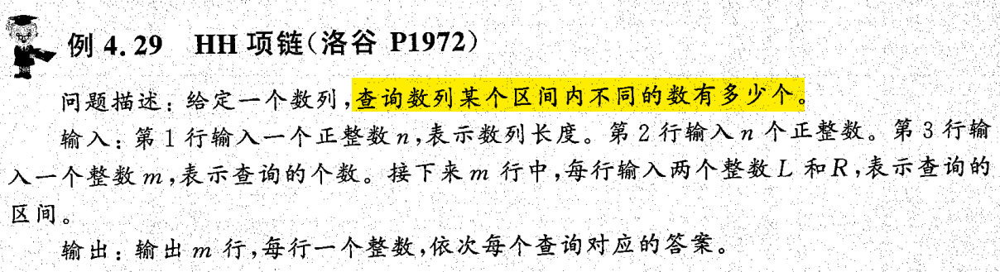
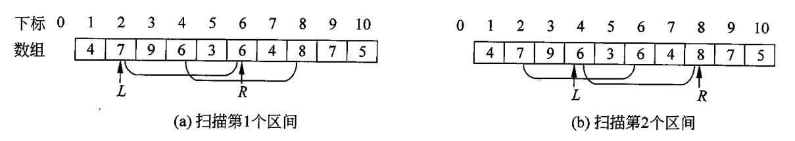
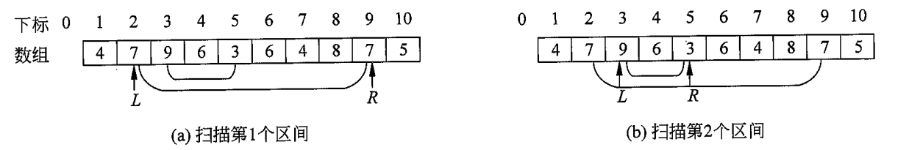
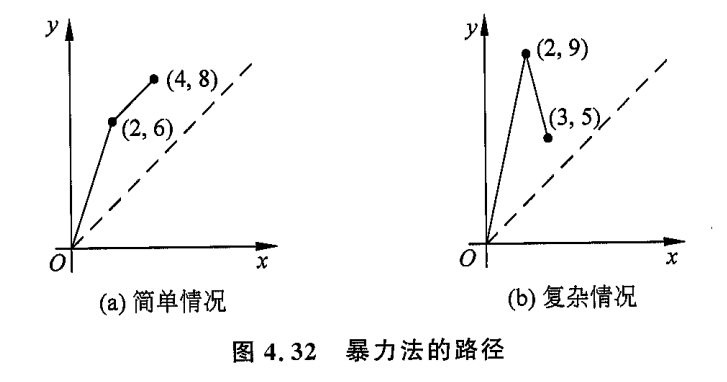
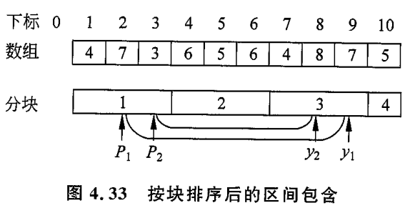
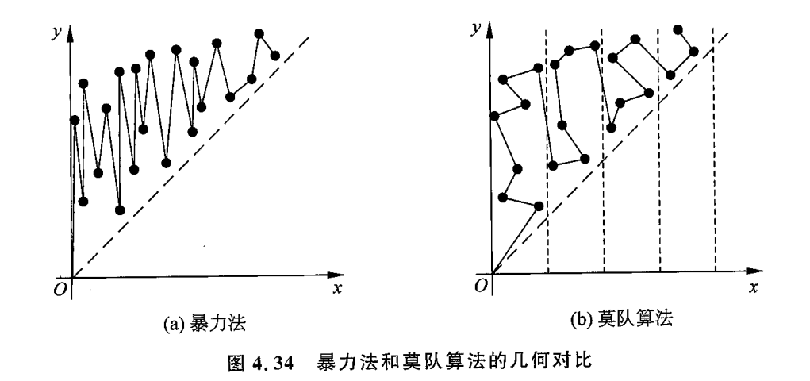
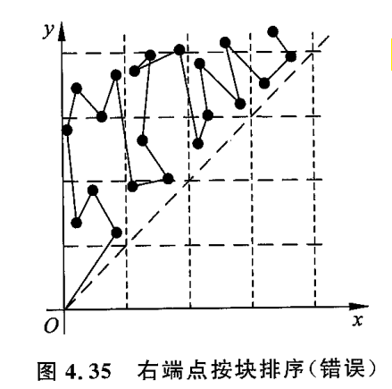

## 4.5 分块与莫队算法

在解决 $n$ 个元素的区间进行 $m$ 次修改与查询的问题上, 暴力法的效率是 $O(mn)$, 效率很低, 但代码很简单.

树状数组和线段树用**二分**的思想给出了效率 $O(m \log_2n)$ 的算法. 在前面两节介绍.

而另一种优化思路, 称为****分块**** 代码简单, 同时也比暴力法快, 效率为 $O(m\sqrt n)$.

### 思路

长度为 $n$ 的数组, 将它分为 $t$ 个块, 每块长度为 $n/t$.  

通常取块的长度是 `block = sqrt(n)`, 这样效率最高.

维护每个块的起点和终点 : `st[i], ed[i]` 表示第 $i$ 个块第1个元素和最后1个元素的位置.

同时维护每个元素对应的块号 `pos[i]`.

----

开始读取数组数据 : 

- `a[j]` 数组中存储的第 $j$ 个数据. $1\leq j \leq n$. 注意是从 `a[1]` 开始存储.
- `sum[i]` 表示第 $i$ 个**块** 的区间元素和.
- `add[i]`表示对第 $i$ 个块中的**元素增量**. 若直接对整个块进行修改, 只需要对 `add` 操作即可.

----

下面进行 $m$ 次查询和修改操作.

1. 修改 `[L,R]` :
   1. 若 $[L,R]$ 被某个块 (不妨设第 $i$ 个 ) 包含, 则直接对 $a[L]$ ~$ a[R]$ 逐个修改, 同时修改 $sum[i]$.
   2. 若 $[L,R]$ 跨越多个块, 对于那些**被区间完全包含的块**, 直接修改 $add[i]$, 且此时不修改 $sum[i]$. 除此以外其他的块 (例如区间两端的) 按第一种情况处理. 
2. 查询 `[L,R]` 内所有数的和 :
   1. 若 $[L,R]$ 被某个块 (不妨设第 $i$ 个 ) 包含, 直接暴力累加. 最终将结果加上 $(R-L+1) \times add[i]$.
   2. 若 $[L,R]$ 跨越多个块, 对于被区间完全包含的块, 直接用 $sum[i]$ 获取区间和. 除此以外的其他块按第一种情况处理.

总结而言, ****整块打包维护, 碎片逐个枚举****.

### 复杂度

前面说分块大小取 $block = n/t$ 向下取整. 在 $t = \sqrt n$ 时效率最高.

一次修改或查询操作的计算次数分别为 $n/t$ 和 $n/t+k$. 当 $t = \sqrt n$ 复杂度较好, 为 $O(\sqrt n)$. 

- 注意到 $t$ 较大时, 会导致 $k$ 增大. 若取极端值 $t = n$, 则退化为暴力法 $O(n)$. 所以需要找一个平衡点.
- 时间复杂度为 $O(m\sqrt n)$.

空间复杂度 : 需要分配以下数组 :

- 长度为 $\sqrt n$ 的数组 : `st[], ed[], sum[], add[]`
- 长度为 $n$ 的数组 : `a[], pos[]`. 

空间约为 $O(3n)$. 这个值比线段树的 $O(9n)$ 好. 但是线段树效率更高, 能处理 $m=n=10^6$ 规模的问题. 

而****分块只能解决 $O(10^5)$****.

### 莫队算法

莫队算法是一种**离线, 暴力, 分块**的算法.

它用于解决**仅有某一类区间的查询问题**.

书上的一道例题能体现**离线**算法的思想. 

这道例题的需要优化暴力法的 $O(mn)$. 作者先讲了**暴力法**的**离线优化**思想.

- ****离线**** 指的是**一次性读取所有查询, 然后根据所有查询的需求, 规划算法**. 通常能获得比"在线"算法一对一交互更好的效率.

先看看**暴力法查询一个区间的情况**. 这里并不是直接统计区间中的不同数.

维护两个指针 $L,R$ 以及元素的个数数组 $cnt[]$. 初始时, $L = 1, R = 0$. 然后两个指针都向右进行扫描, $L$ 扫过元素 $x$,  则`cnt[x]--`. $R$ 则相反, 执行 `cnt[x]++`. 这样, 当 $L$ 和 $R$ 最终落在查询区间 $[L,R]$ 时, 统计所有 `cnt[x] > 0` 的元素 $x$ 个数, 就是答案 `ans`了.

这个思想可以拓展到**多区间上**, 并优化成**离线算法**.

正如上图, 对所有要查询的区间按左端点排序, 左端点相同则按右端点排序. 

这样我们就可以使得 $L$ 和 $R$ 尽可能不回头, 一遍扫过区间. 每当扫到待查询区间时, 就记录 `cnt[]` 中的答案.

这种想法会遇到一个麻烦的情况 : 

被查询区间若有包含关系, 那么 $R$ 是没办法不回头的. 此时算法最坏的复杂度能达到 $O(mn)$.

### 几何解释

上述算法有直观的几何解释. 

- 将 `(L,R)` 视为二维平面上的坐标. 每一次移动指针, 都是从一个点到另一个点的转移. 点与点之间只能通过上下左右平移实现, 所以距离使用 **曼哈顿 距离**. 

一个离线算法规划查询的次序会影响算法的效率. 相当于在平面坐标上**找一条Hamilton路径,** 使得这条路径的 曼哈顿距离最短. 

上图中的 (b) 情况, 对应了上一小节中的**区间包含**的复杂情况. 此时直接根据**区间左端点排序(也就是 x 坐标排序)** 所得到的解不一定最小

而求解一条 最短的 Hamilton 路径是一个 NP难问题, 没有多项式复杂度的解. 

****莫队算法**** 给出了一种解决方案.

### 莫队算法

莫队算法对**排序的规则**进行了修改, 就将 $O(mn)$ 优化为了 $O(n\sqrt n)$. 

- 将数组分为 $\sqrt n$ 块. 然后根据**被查询区间的左端点所在的块序号进行排序**. **若前者相同, 则再按右端点大小(**注意是右端点本身, 不是右端点所在的块**) 排序**.

为何这能达成优化效果?

直接看复杂的**区间包含**情况 :

此时, $P_1 = P_2, y_2\leq y_1$. 所以第二个区间会先进行查询. 

先查2再查1, 则$L$ 指针需要回退. 与暴力法不同的是, 这里 $L$ 的回退被限制在 $O(\sqrt n)$ 大小. 总复杂度被控制在 $O(n\sqrt n)$, 相当于用 $\sqrt n$ 限制 $m$.

在比较极端的情况下, $P_i \neq P_j$, 此时莫队算法与暴力法无异. 但是想要达成前提条件, $m$ 与 $\sqrt n$ 的量级相当, 因此也不会比暴力法差.

**直观的几何解释如下** :

可以看出, 

- 暴力法路径是**纵向震荡**, 振幅为 $O(n)$.
- 莫队算法路径是**横向震荡**. 但震荡范围在 $O(\sqrt n)$ .

从而莫队算法实现了较低的复杂度.

书中也介绍了**为什么第二层排序不是按照右端点所在的块序号**. 下图是直观的解释

另外, 莫队算法也可以改进成**奇偶性排序**, 即奇数块按 $y$ 坐标升序, 偶数按降序排列, 犹如将**扫描算法**改进为**电梯算法**.

### 单点修改 + 区间查询情形

简单的单点修改是可以融入莫队算法的. 

思路是 : 在前述的 $(L,R)$ 表示一个状态的基础上, 添加一个维度 $(L,R,t)$, $t$ 表示在查询 $(L,R)$ 之前进行的修改次数. 然后按以下方法进行排序

- 对数组分块, $L$ 落在的块号从小到大排序
- 若前一步相同, 则对 $R$ ****落在的块号****从小到大排序. 
  - 与莫队算法不同了.
- 若前一步相同, 则对 $t$ 排序.

其过程 为 : 先对同一个 $x-y$ 方块中的所有 $t$ 进行遍历, 然后进行下一块 $x-(y+1)$ 进行遍历.

关于复杂度, 由于有时间 $t$ 的加入, 分块的大小需要重新考虑. 设为 $B$. 

对于**一个方格**, 

- 在 $x$ 和 $y$ 方向上进行的 $m$ 次操作, 总代价为 $2mB$. 
- $z$ 方向上进行单向移动, 总共是 $O(m)$.

总共有 $(n/B)^2$ 个方格, 所以总代价为 $O(mn^2/B^2)$, 取 $B = n^{2/3}$ 时复杂度为 $O(mn^{2/3})$.

倘若按 $B = \sqrt n$ 分块, 则复杂度退化为 $O(mn)$.

### 树上莫队

这一节介绍**其他能转换为一维区间查询的问题**. 典型例子是**树形结构上的路径问题**.

建议看书.

