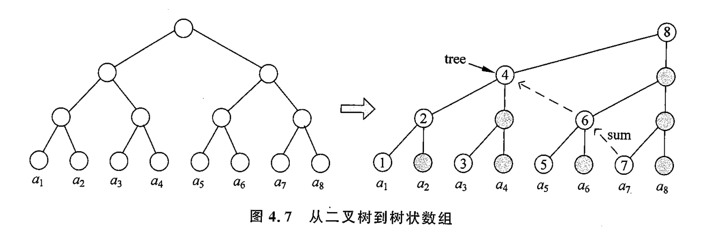
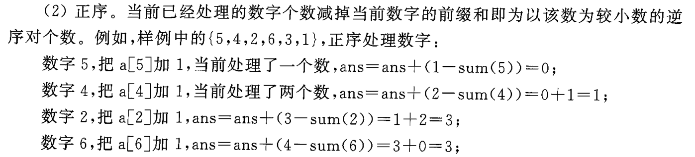

## 4.2 树状数组

### 组织思路

本节的数据结构的来源, 是==**利用二分/二进制的思想**来**维护数组的前缀和**.==

假设有一个数组 : $a[1..8]$, 下标 1 起始. 其前缀和数组记为 $S[1..8]$, 通常会补充 $S[0] = 0$ 方便编码.

问题 : 当我们面临**多次数组修改 + 查询**的问题时, 前缀和数组需要将修改处之后的所有元素重新计算, 一次更新的复杂度为 $O(n)$, $m$ 次总复杂度为 $O(mn)$. 难以满足一些算法的限制.

树状数组是**原数组**与**前缀和数组**的一个中间的辅助数组, 记为 $T[1..8]$. 

利用树状数组可以将上述过程用二分的思路优化为 $O(m\log n)$.  它的原理基于以下观察 :

- 假设现在要求 $S[7]$, 利用二进制独有的特性, $7 = 4 + 2 +1$, 我们只需要保存 左边这 3 项 的"**部分前缀和**"信息即可, 这样我们就把 $7$ 次运算压缩为 $3$ 次. 

- 具体一些, 我们把 $S_7$ 的表达式按二进制的个数这样分划 :
  $$
  S_7 = a_7 + (a_5 + a_6) + (a_1 + \cdots + a_4)
  $$
  并分别记这三项为
  $$
  S_7 = T_7 + T_6 + T_4
  $$
  这就是树状数组组织的思路, 而具体的组织过程, 下图十分清晰 :

  

上图的右侧二叉树, 每个下标 $1,2,\cdots, 8$ 所在列的**最高结点**, 就是 $T[]$ 中存储的元素.

- $T_1 = a_1$,
- $T_2 = a_1 + a_2$,
- $T_3 = a_3$,
- $T_4 = a_1 + a_2 + a_3 + a_4$.
- $T_5 = a_5$ 
- ...

----

### 应用 : 前缀和查询 / 区间和查询

随意给一个索引 $j$, 要查询 $S_j$ , 怎么<u>通过编程</u>确定要取哪几项 $T[]$ 来计算? 从二进制的角度出发, 仍然看 $j = 7$ 的例子 :
$$
S_7 = S_{111_2} = T_{111_2} + T_{110_2} + T_{100_2}
$$
再看 $ j = 6 $ :
$$
S_6 = S_{110_2} = T_{110_2} + T_{100_2}
$$
归纳一下, 当 $j = 7$ 时, 可以通过以下步骤求得 $S_j$ :

- 初始化结果`ans = 0`, 算法开始时 $i = j = 111_2$, `ans`加上 $T_i$.
- 随后, **将 $i$ 最右边的 $1$ 抹为 $0$**, 得 $i = 110_2$, `ans`加上 $T_i$. 
- 重复上一步, 直到 $i$ 归零, 此时 `ans` 即 $S_j$.

对 $ j = 6 $ 也是一样的, 可以自己尝试.

实现上述算法的核心在于, **找到 $i$ 的最低位的 $1$**. 此处先按下不表.

若要找到某个区间 $[L, R]$ 的和, 可以转换为两个前缀和查询 $S_R - S_{L-1}$.

----

### 应用 : 单点修改

除了区间前缀和查询以外, 我们有时还需要修改 数组 $a[]$ 的值, 并同步更新 $T[]$ 中的信息. 

设修改 $a_j$, 哪几项 $T[]$ 会被影响, 从而同步更新?

举个例子, 

- $ j = 6 = 0110_2$, 相关的 $T[]$ 从小到大的排列为 :

  - $T_6 = T_{0110_2} = a_5 + a_6$

  - $T_8 = T_{1000_2} = a_5 + a_6 + a_7 + a_8$.

- $j = 1 = 0001_2$ :

  - $T_1 = T_{0001_2} = a_1$, 
  - $T_2 = T_{0010_2}  = a_1 + a_2$,
  - $T_4 = T_{0100_2} = a_1 + a_2 + a_3 + a_4$;
  - $T_8 = T_{1000_2} =  a_1 + \cdots + a_8$.

- $j = 3 = 0011_2$ :

  - $T_{3} = T_{0011_2} $;
  - $T_4 = T_{0100_2}$
  - $T_8 = T_{1000_2}$

归纳算法如下, 以 $j = 3 = 0011_2$ 为例 :

- 设 $i = j = 0011_2$. 修改 $T_{i}$. 
- 找到 **$i$ 最右侧的 $1$ 所在位置**, 构造 $d = 0001_2$, 并让 $i = i+d$. 修改 $T_i$.
- 重复上一步, 直到 $i$ 的值大于数组的长度 $1000_2$.

所以实现的核心仍然在于**找到最右侧的 1**.

----

### lowbit 函数

**如何找到某个整数 $x$ 的二进制最右侧的 1 所在的位置?** 这是前两个小节的应用都会用到的算法.

答案是 : 使用这样定义的 lowbit 函数 :
$$
\mathrm{lowbit}(x) = x \& (-x)
$$
分析一下为什么它能做到. 

首先 C++ 的 `int` 采用补码存储. 而补码存储的 $x$ 有**重要的恒等式** :
$$
x + (!x) = -1 = (1111\;1111_{补})
$$
因此, 对上式简单移项即得 $(-x)$ 的逻辑运算表达式为 $(!x) + 1$.

再看 $x \& (-x)$ , 取几个具体的数看看 :

- $x = 6 = 0110$;  $-x = 1001 + 0001 = 1010$.
  - $lowbit(x) = 0010$
- $ x = 7 = 0111$; $-x = 1000 + 0001 = 1001$;
  - $lowbit(x) = 0001$.

观察可以归纳 :

$-x$ 是取反  + 1, 原本 $x$ 右侧的连续 $0$ 会被取反后变成连续 $1$, 再通过 $+1$ 进位到 $x$ 第一个非 $0$ 的位置.

- $x = \underleftrightarrow{0100}\ 1\underline{000}$, $!x = \underleftrightarrow{1011}\ 0\underline{111}$, $-x = \underleftrightarrow{1011}\ 1\underline{000}$.

  - $\leftrightarrow $ 的部分因为互为逻辑非 $!$, 相与后会成为全 $0$.

  - 下划线部分因为 $-x$ 恒为 $0$, 所以 $lowbit(x)$ 也为 $0$.

  - **唯一一个非零的位, 就是 $x$ 的最低位 $1$ 所在的位置.**

### 应用 : 区间修改 + 单点查询

前面树状数组的叶节点指代 $a[]$, 这种结构可以**高效更新前缀和**, 完成**单点修改 + 区间查询**.

若将叶节点改为指代**差分数组** $D[]$, 就可以将问题转为**区间修改 + 单点查询**.

### 应用 : 区间修改 + 区间查询

能不能修改和查询都是区间? 此时**一个树状数组一定不够用**.

区间查询需要我们高效计算出 $S[]$, 区间修改需要我们能高效更新 $D[]$.

那就看看 $S$ 与 $D$ 之间是否存在什么关系. 先明确定义 :

- $S_n = a_1 + \cdots + a_n$;
- $D_k = a_{k} - a_{k-1}$. (补充定义 $a_0 = 0$.)
  - $a_k = D_1 + \cdots + D_k$.

融合两式得
$$
S_n = D_1 + (D_1 + D_2) +\cdots = \sum_{k=1}^n \sum_{i=1}^k D_i
 = \sum_{i=1}^n (n-i +1) D_i
$$
即 :
$$
S_n = n \cdot D_1 + (n-1) \cdot D_2 + \cdots + 2 \cdot D_{n-1} + D_n
$$
这个公式是它们的关系, 尝试将其**改写为前缀和格式** (以应用树状数组). 注意到
$$
S_n = n(D_1+\cdots + D_n) - (D_2 + 2D_3 + \cdots + (n-2)D_{n-1} + (n-1)D_n)\\
= n \sum_{i=1}^nD_i - \sum_{i=1}^{n} (i-1) D_i
$$
我们只需要**用两个树状数组分别维护两个前缀和**即可 :
$$
\sum_{i=1}^n D_i ,\quad \sum_{i=1}^n(i-1)D_i
$$

- 查询数组 $a[]$ 的区间 $[L, R]$ 时, 直接按照上述公式计算 $S_R $ 和 $S_L$.
- 修改区间 $[L, R]$ 时, 等价于修改 $ D[R] $ 和 $D[L-1]$. 

### 二维树状数组

### 应用 : 求解逆序对个数

逆序对是指一个数组 $a[]$ 中, 满足 $a_j < a_i$ 却 $j > i$ 的组合.

求解逆序对的标准解法有两种 : **归并排序**, **树状数组**.

前者需要复制数组, 空间复杂度稍高, 性能略差于树状数组.

树状数组的求解十分简单巧妙. 不过树状数组通常用于**优化前缀和**. 所以先看看转换过程.

首先, 将**求解逆序对问题转换成了单点修改+前缀和查询问题**.

给定一个序列 $\{5,4,2,6,3,1\}$, 初始化一个全0数组 `int a[6] = {0};`. 

**从右向左**遍历 :

- 当遍历到**数字 $i$**  (而非下标) 时, 将 $a[i]$ 增 $1$. 
- 此时, 查询 $S_{i-1}$, 就能**直接统计出 $i$ 为较大者的逆序对个数**. 

也可以**从左向右**, 多了一次减法. 过程有点绕 :

- 遍历到 $i$ 时将 $a[i]$ 增 1.
- 此时, **查询 $S_i$** 就能找到 $i$ 为较大者的**正序对** + 1 ($S_i$ 中包含了 $a_i$.). 
- 假设已经处理 $k$ 个数字, 减去被处理的 $i$ 本身, 用 $k - 1 - 正序对个数$  即为统计的逆序对个数.

而查询 $S_i$ 的数据结构可以使用树状数组.

这种方法对于具体数字较大的数组, 需要应用**离散化**技巧保留相对顺序.

### 应用 : 区间最值查询

树状数组常用来优化**前缀和**. 但其实略微修改一下编码, 可以让它查询更多结构. 其中之一就是把前缀和改为最值.

比如现在的问题为 **单点修改 + 区间最值查询**. 虽然有更好的方法, 但是这里仍用**树状数组**来更好理解它.

给定一个区间 $[L, R]$, 试着查询区间的**最大值.** 首先树状数组中存储的肯定不再是前缀和. 但我们仍需要保留前缀和查询问题中, **聚合部分项的信息**, 沿用 $S_7 = (a_1 + \cdots + a_4) + (a_5 + a_6) + a_7$ 这种分组存储的思想.

我们所查询的最值公式为 :
$$
\max_{L \leq k \leq R}(a_i)
$$
或者写开一点 : 
$$
\max(\max(\max(a_L, a_{L+1}), a_{L+2})\cdots , a_R)
$$
"取最大值"运算与"加法"都是二元运算, 优化思路是相近的. 唯一不同的是, $[L, R]$ 的最值查询无法通过分解为 $[1, L]$ 和 $[1, R]$ 的最值查询来解决.

我们这样组织 树状数组的内容 : 

- $T_1 = a_1$ : 即 $[1,1]$ 的最值
- $T_2 = \max(a_1, a_2)$ ; 即 $[1,2]$ 的最值
- $T_3 = [3,3]$ 的最值
- $T_4 =$ $[1,4]$ 的最值

 总的来说, $T_x = [x - lowbit(x) + 1, x]$ 的最值.

查询 $[L, R]$ 的思路为 : **将该区间分解为一系列不相交的子区间/单点元素`a[i]`的并, 其中的每一个子区间都可以通过树状数组直接读出最值.**

我们可以在递推过程中**逐步分解区间**, 重点关注**区间的右边界**.  

- 查询 $[1, 6]$ : 
  - 由于 $[5, 6]$ 的最值被存储在 $ T_6$ , 所以只需继续往下查询 $[1,4]$ 的最值即可. 
  - 该最值保存在 $T_4$. 
  - 答案是 $\max(T_4, T_6)$. 
- 查询 $[4, 7]$ :
  - $T_7$ 保存的是 $a_7$. 
  - 继续查询 $[4, 6]$ : $ T_6$ 保存的信息是 $[5,6]$ 的最值.
  - 继续查询 $[4,4]$ : 比对 $a_4$.
  - 答案是 $\max(a_7, T_6, a_4)$.
- 查询 $[2, 5]$ : 
  - $5$ 的信息单点存储在 $T_5 = a_5$ 中. 
  - 继续查询 $[2,4]$ : $4$ 所蕴含的信息为 $[1,4]$ 的最值, 无法使用. 只能单点查询 $a_4$. 
  - 继续查询 $[2,3]$ : $3$ 也是单点存储的. 只能比对 $a_3$.
  - 继续查询 $[2,2]$ : 比对 $a_2$.
  - 答案是上述被比对值的最大值.

用更严谨的叙述如下 :

- 查询区间为 $[L, R]$. 关注右边界, $T_R$ 中包含的是 $[R - lowbit(R) +1, R]$ 的信息, **这个区间的长度是 $lowbit(R)$.**
  - 若 $R - L \geq lowbit(R)$, 则**说明 $T_R$ 聚合的区间是 $[L, R]$ 的一部分**, 可以使用 $T_R$, 下一步继续查询 $[L, R-lowbit(R)]$.
  - 若 $R - L < lowbit(R)$, 则**说明 $T_R$ 的值不能用**, 只能单点查询 $a_R$. 下一步继续查询 $[L, R-1]$.
- 重复上述查询直到查询区间缩减至 $[L, L]$ 时终止.

一次查询的复杂度是 $O(m \log_2n)$.