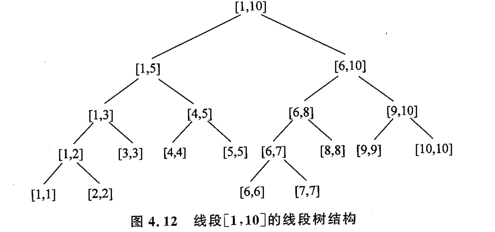

## 4.3 线段树

### 基本结构

线段树是一种十分灵活的数据结构. 其思想包括**分治 + 二叉树 + Lazy-tag**.

前一节的**树状数组是个数组**, 本节的**线段树是个二叉树**. 

线段树的特点是 : **每一个结点都表示一个区间的信息**. 且**大区间的信息可以通过小区间的信息计算得来**见下图 :

具体的信息可以根据题目灵活定义. 既可以是**区间和**, 也可以是**区间最值**.

### 应用 : 区间查询

设要查询区间 $[L, R]$ 的信息, 以上图为例, 查询 $[4,9]$ 的最小值.

- 从根结点开始, 判断查询区间是否与当前结点相同, 若是则直接返回查询结果. 若否, 判断两个子节点是否与 $[4, 9]$ 相交.
  1. 左子结点 $[1,5]$ 与 $[4,9]$ 相交. 则递归到左子结点, 并将查询区间改为二者的交集 $[4, 5]$.
  2. 右子节点同理, 递归查询区间 $[5, 9]$.
- 重复上述过程, 直到所有区间都返回结果, 统一合并.

### 应用 : 区间操作

先看看**单点修改**在线段树中怎么进行. 仍然使用上面的线段树结构. 要修改 单点 $[4,4]$ 的信息,  线段树会不断递归到 $[4,4]$ 的结点, 且路径上的结点都要进行更新. 复杂度为 $O(\log n)$. 

现在转到**区间修改**, 如果直接按照区间内的元素不断单点修改, 则显然复杂度会十分大, 为 $O(k\log n)$, $k$ 为区间长度. 更不要说区间修改还有多次.

为了解决这个问题, 线段树使用**Lazy-Tag(延迟标记/懒惰标记)技术**.

举个例子, 当修改区间 $[4,5]$ 整体 + 3 时, **线段树不再遍历到 $[4,4]$ 和 $[5,5]$ 结点**. 而是在另外一个与**线段树结构相同的`tag`树中**, 将 $tag[4,5]$ 这个区间打上一个修改标记 $3$.  

- 在后续**区间查询**时, 如果查询的区间为 $[4,5]$, 则直接综合 $tag[4,5]$ 和线段树中该结点的信息即可查询到正确结果.
- 在后续**区间修改发生冲突时**, 线段树内部会执行`push_down()` 函数, 其逻辑是将 $[4,5]$ 的 tag 传递给子节点 $[4,4]$ 和 $[5,5]$, 并清零 $tag[4,5] = 0$.
- 在后续**区间查询与tag冲突时**, 也会执行 `push_down()` 函数将 tag 传递, 并同时执行查询.

这种操作极大发挥了线段树的优势. 它不必将区间全部打碎成单点进行操作. 

区间操作的lazy-tag, 只将有必要的tag往下传递, 从而降低了整体复杂度.

### 关于编码时数组大小的声明

**对于一个有 $n$ 个元素的区间, 线段树以及`tag`数组通常需要声明 $4n$ 个元素位置.**

二叉树的特点是 : **下一层的节点数是上一层的两倍.**  下面的分析基于此.

1. $n$ 个元素, 意味着有 $n$ 个叶子结点. 我们假设最好的情况下, 它们刚好全部排列在最后一层. 此时有 $n = 2^k$.

   1. 此时, 最后一层有 $n$ 个结点, 前一层是 $n/2$. 依此类推, 整个线段树的结点数为

      $$

      2^k + 2^{k-1} + \cdots + 2 + 1 = 2^{k+1} - 1 = 2n -1

      $$

2. 但事实是, 我们需要考虑到不是所有叶子结点都存在最后一层. 最坏的情况下, **最后一层只有一个叶子结点, 其他全在上一层**. 那我们不得不在上述 $2n-1$ 的空间以外, 再开辟下一层 $2n$ 个结点的存储空间. 尽管其中大部分结点都被浪费了.

最终, $n$ 个元素的线段树要想不越界访问, 必须声明 $4n$ 个元素的数组.

