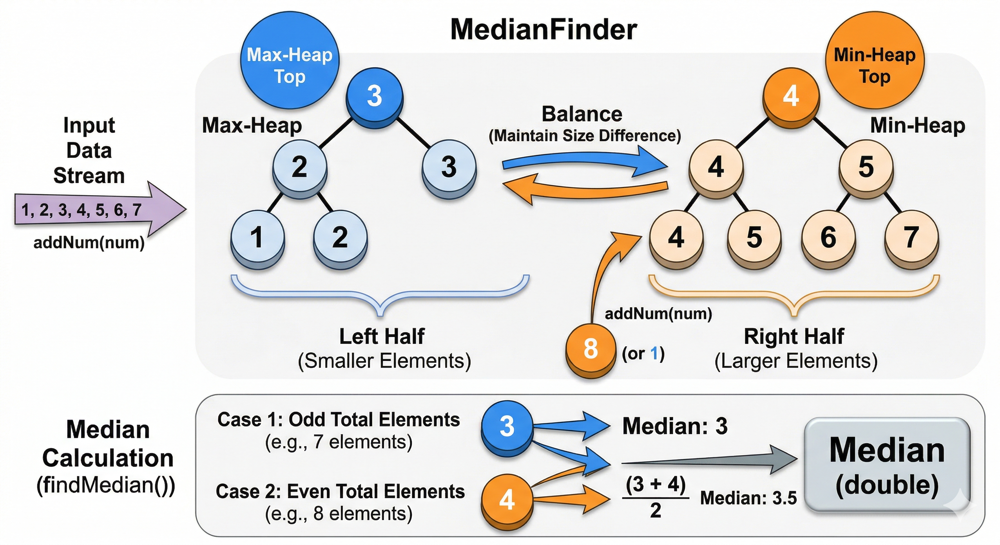

# 图形学精选

[427. 矩阵压缩四叉树](../leetcode/427.%20Construct%20Quad%20Tree.md)

[236. 二叉树最近公共祖先](../leetcode/236.%20Lowest%20Common%20Ancestor%20of%20a%20Binary%20Tree.md)

# 日常

[215. 数组 topK 大元素](../leetcode/215.%20Kth%20Largest%20Element%20in%20an%20Array.md)

## 295. 数据流的中位数

本题要实现一个能随时取数据流的中位数类 `MedianFinder`.

第一想法, 取中位数就是求 $size/2$ 大的元素问题. 也就是 TopK 大元素问题的特殊情况.

不一样的是, $k$ 需要随着 数组大小 $size$ 的变化而变化.

基于这个想法, 自然想到**用小根堆**维护**数组的最大 $k$ 个 (一半)元素**.  

- 我们总是存储最大的那部分元素, 使得**计算中位数时可以直接取top (或者两次 top)**.

但另一个问题来了, 插入元素`addNum(num)` 时, 我们如何维护这个小根堆? 

>  在经典的数组 TopK 大元素的解法中, 对于后续数据流的整数输入`num`, 处理方法是将`num` 与 小根堆顶元素比较.
>
> - 若 `num <= heap.top()`, 则说明 `num` 比前 $k$ 个最大整数更小, 不可能是 $k$ 大整数的一员.
> - 若 `num > heap.top()`,  则用 num 替换堆顶元素, 重新维护堆.

这道题仍然是使用 `num` 与 堆顶比较吗? 其实不然. 首先, 小根堆的窗口大小 $k$ 是动态变化的, 也就是说我们随时需要**将不在小根堆中的元素(包括待处理的`num`)中<u>最大的那一个</u>推入小根堆**.

现在就容易想到, 用另一个**大根堆维护剩余的所有元素**, 在小根堆需要扩容时, 随时取出最大的那一个, 与 `num` 作比较, 将较大者插入小根堆, 较小者留在大根堆. 

具体可视化请参考如下示意图. (From Gemini)



我们可以保证大小根堆元素最多相差1, 这样处理的话, 在计算中位数`findMedian`时, 

- 若 $size$ 为奇数, 则返回小根堆堆顶元素即可. 
- 若 $size$ 为偶数, 则返回大根堆顶与小根堆顶的平均数.

同时, 当引入双堆以后, 我们在`addNum` 中维护小根堆的大小也简单了很多. 当要插入`num`时 :

- 若 `大根堆.size < 小根堆.size`, 则最终大根堆.size + 1.
- 若 `大根堆.size == 小根堆.size`, 则最终小根堆.size + 1

至于它们插入了什么元素, 就需要根据上面所说的逻辑去判断了. 完整代码如下 :

```cpp
class MedianFinder {
public:
    priority_queue<int, vector<int>, greater<int>> min_heap;
    priority_queue<int> max_heap;
    int size;
    // 注 : 需要时刻保持小根堆的最小比 大根堆的最大要更大.
    MedianFinder() {
        size = 0;
    }
    void addNum(int num) {
        size++;
        if (max_heap.size() < min_heap.size()){
            // 插大根堆 (能过判断说明min_heap一定非空)
            int buf = min_heap.top();
            if (num < buf){
                // 新元素无法插入小根堆, 则插入大根堆
                max_heap.push(num);
            }
            else{
                min_heap.pop();
                min_heap.push(num);
                max_heap.push(buf);
            }
            return;
        }
        // 插小根堆 (注意top前要判断非空)
        if (max_heap.empty() || num >= max_heap.top()){
            min_heap.push(num); 
            return;
        }
        min_heap.push(max_heap.top());
        max_heap.pop();
        max_heap.push(num);
    }
    double findMedian() {
        if ((size & 1) == 1){
            // 奇数
            return min_heap.top();
        }
        // 偶数
        return ((double)min_heap.top() + (double)max_heap.top()) / 2.0;
    }
};
```


# 牛客

## 网易互娱2020游戏研发测试题2 : 水平线

伞屉国是一个以太阳能为主要发电手段的国家，因此他们国家中有着非常多的太阳能基站，链接着的基站会组合成一个发电集群。但是不幸的是伞屉国不时会遭遇滔天的洪水，当洪水淹没基站时，基站只能停止发电，同时被迫断开与相邻基站的链接。你作为伞屉国的洪水观察员，有着这样的任务：在洪水到来时，计算出发电集群被洪水淹没后被拆分成了多少个集群。

由于远古的宇宙战争的原因，伞屉文明是一个二维世界里的文明，所以你可以这样理解发电基站的位置与他们的链接关系：给你一个一维数组a，长度为n，表示了n个基站的位置高度信息。数组的第i个元素a[i]表示第i个基站的海拔高度是a[i],而下标相邻的基站才相邻并且建立链接，即x号基站与x-1号基站、x+1号基站相邻。特别的，1号基站仅与2号相邻，而n号基站仅与n-1号基站相邻。当一场海拔高度为y的洪水到来时，海拔高度小于等于y的基站都会被认为需要停止发电，同时断开与相邻基站的链接。

时间限制：C/C++ 1秒，其他语言2秒

空间限制：C/C++ 64M，其他语言128M

输入描述：

```
每个输入数据包含一个测试点。

第一行为一个正整数n，表示发电基站的个数 (0 < n <= 200000)

接下来一行有n个空格隔开的数字，表示n个基站的海拔高度，第i个数字a[i]即为第i个基站的海拔高度，对于任意的i(1<=i<=n),有(0 <= a[i] < 2^31-1)

接下来一行有一个正整数q(0 < q <= 200000)，表示接下来有q场洪水

接下来一行有q个整数，第j个整数y[j]表示第j场洪水的海拔为y[j],对于任意的j(1<=j<=n),有(-2^31 < y[j] < 2^31-1)
```

输出描述：

```
输出q行，每行一个整数，第j行的整数ans表示在第j场洪水中，发电基站会被分割成ans个集群。标准答案保证最后一个整数后也有换行。
```

示例1

输入例子：

```
10
6 12 20 14 15 15 7 19 18 13 
6
15 23 19 1 17 24
```

输出例子：

```
2
0
1
1
2
0
```

----

## 网易互娱2020游戏研发测试题4 : 幸运 N 串

小A很喜欢字母N，他认为连续的N串是他的幸运串。有一天小A看到了一个全部由大写字母组成的字符串，他被允许改变最多2个大写字母（也允许不改变或者只改变1个大写字母），使得字符串中所包含的最长的连续的N串的长度最长。你能帮助他吗？

时间限制：C/C++ 1秒，其他语言2秒

空间限制：C/C++ 64M，其他语言128M

输入描述：

```
输入的第一行是一个正整数T（0 < T <= 20），表示有T组测试数据。对于每一个测试数据包含一行大写字符串S（0 < |S| <= 50000，|S|表示字符串长度）。

数据范围：

20%的数据中，字符串长度不超过100；

70%的数据中，字符串长度不超过1000；

100%的数据中，字符串长度不超过50000。
```

输出描述：

```
对于每一组测试样例，输出一个整数，表示操作后包含的最长的连续N串的长度。
```

示例1

输入例子：

```
3
NNTN
NNNNGGNNNN
NGNNNNGNNNNNNNNSNNNN
```

输出例子：

```
4
10
18
```

### 思路 : 

初看以为是预处理 + 动态规划, 但是思路很难想且很绕. 关键在于状态的定义 :

`dp[i][j]` 定义为 : 前 $i$ 个字符, 允许修改次数为 $j$ 时的最大长度.

由于题目要求**最多允许修改2个**, 且问题与"最长连续个..."有关. 一个常用思路是**双指针滑动窗口**.

Gemini 总结 :

> 在接下来的面试准备中，如果再遇到“**求满足某条件的最长连续子串/子数组**”且“**只有正向增益（即数组长度越长，条件越容易超标, 触发限制）**”的问题，可以第一时间把滑动窗口模板套上去试试。
>
> 前一个指针在没有触发限制时, 直接一条路走到底. 触发限制后, 后面的指针再跟上.

