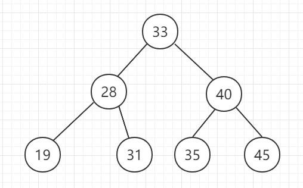
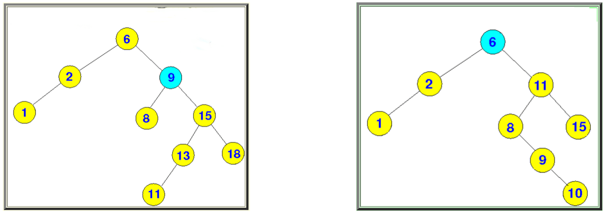
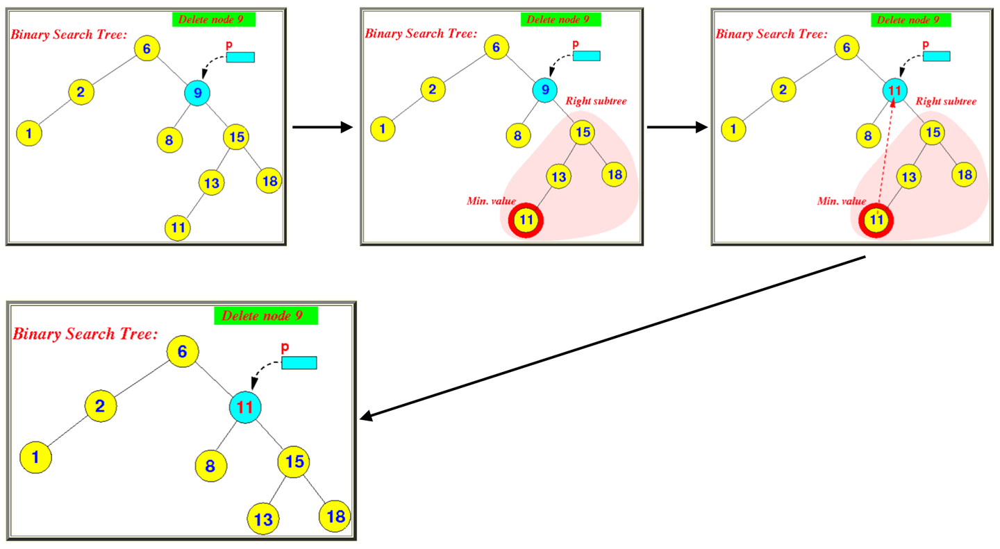
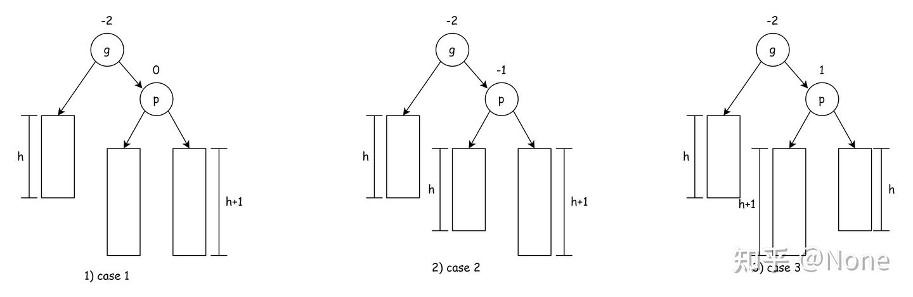
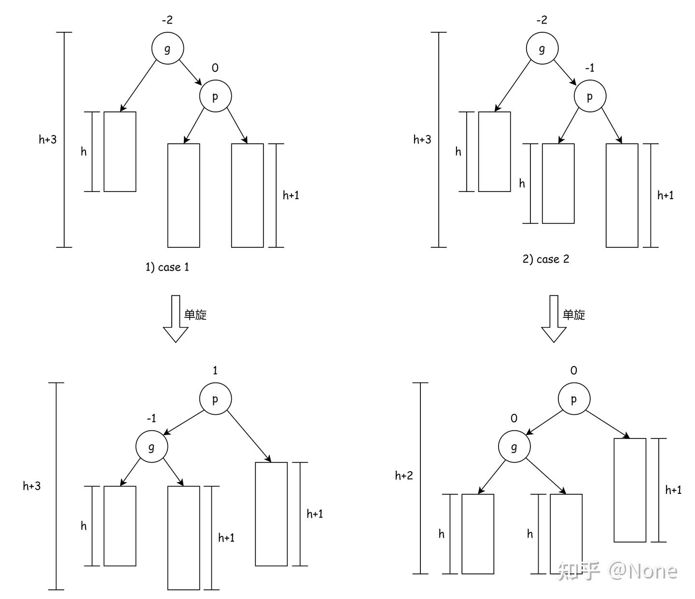
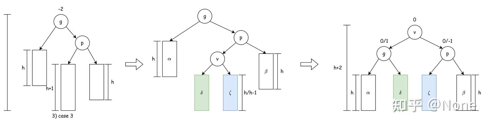
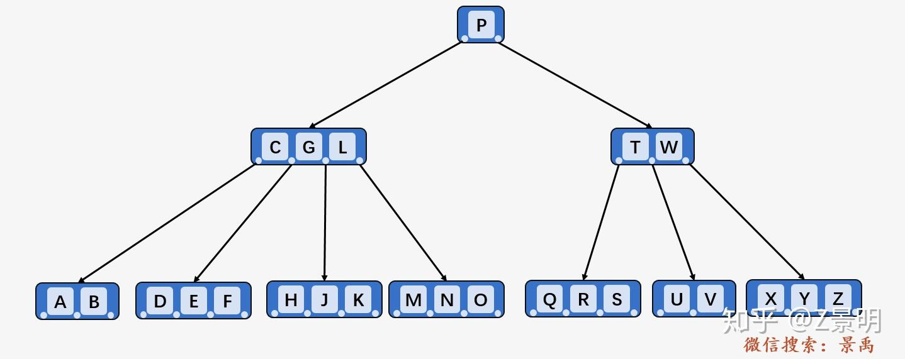
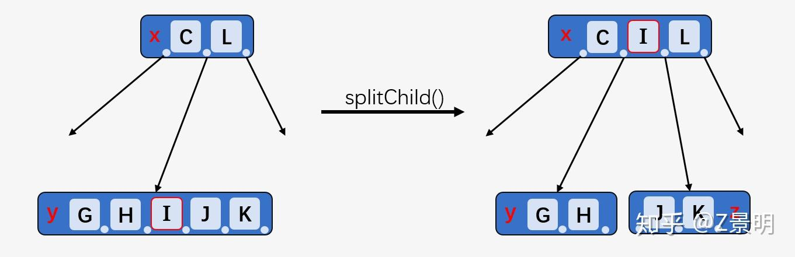
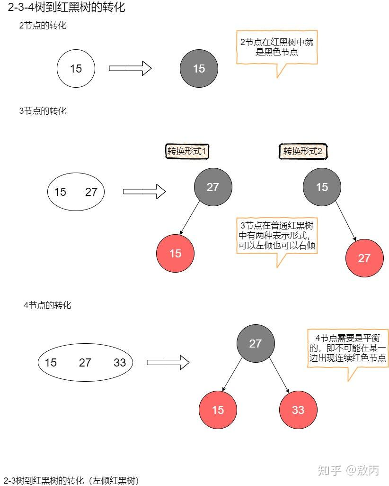
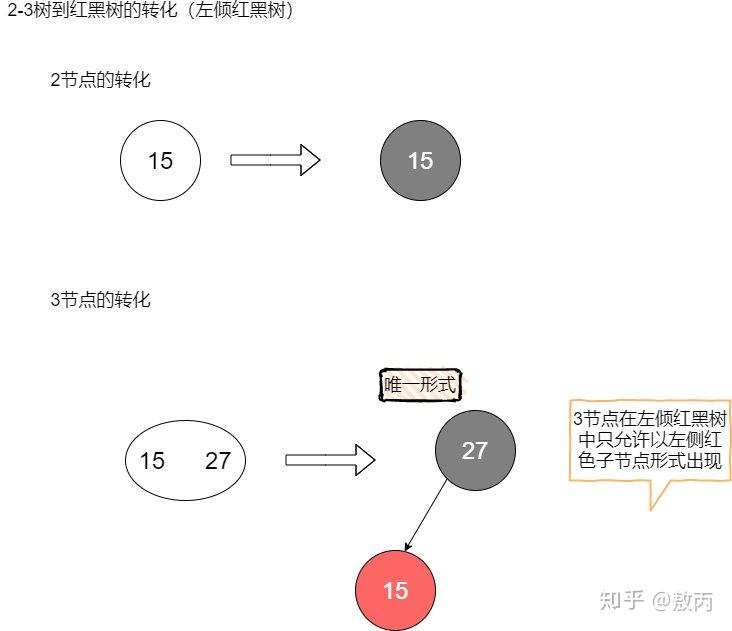

# 总述

一道经典的面试难题就是 "手撕红黑树". 了解过红黑树的人都知道其难度有多大. 但其实面试官自己也无法但当场给出完美的红黑树定义和实现. 它更多在考验面试者对于高阶数据结构的理解.

当你第一次看到红黑树的插入, 删除操作的具体步骤, 你会被它复杂且难以记忆规律的方法给吓到, 尤其是删除操作.

比起一股脑记忆**旋转, 变色**的逻辑, 将二者分开理解的方式更不容易劝退初学者.

红黑树最基本的结构来源于__平衡二叉树AVL__

- 红黑树的__插入, 旋转__操作, 背后的原理都是 AVL 中的插入与旋转. 所以需要先确保

随后, 红黑树还引入了**红色与黑色结点,** 并且在维护过程中包含了复杂的__结点变色__逻辑.

- 而要理解红黑树为什么引入该特性, 我们需要知道红黑树__是 2-3-4 树这个逻辑结构的具体实现__. 这是一个__4阶B树(平衡多路查找树)__. 所以理解颜色, 需要先理解 B 树, 然后再理解 4阶 B 树到红黑结点的对应关系.

# 二叉搜索树 BST

首先, **平衡二叉树AVL**是一种__特殊的二叉搜索树BST__. 什么是二叉搜索树?

1. __任何一个节点的值都大于它的左子节点的值__.
2. __任何一个节点的值都小于它的右子节点的值__.

基于上面两条, 可以证明 : 根节点的左右子树也都是二叉搜索树.

注意二叉搜索树与堆的区别. 堆是根节点的值大于/小于左右子节点的值.

__有序数组的二分查找, 就相当于遍历这样一颗二叉搜索树__. 

在二叉搜索树上有__查找, 插入, 删除__三种操作.

1. 平均情况下, 二叉搜索树可以在对数时间 $O(\log n)$ 内完成**查找.**

   在最坏情况下, 这棵树会退化为一个__链表__. 查找时间退化为 $O(n)$.

2. 普通二叉搜索树的__插入__方法 : 逐步与当前树中的节点值比较, 并最终插入成为某个节点的左/右子节点.

   平均复杂度为 $O(\log n)$.

__删除操作__相比于插入, 要复杂得多. BST 必须保证插入和删除以后的树, 仍然是一颗 BST.

- 若删除的是__叶子节点__ : 直接删了就行
- 若删除的节点是非叶节点, 且__只有一棵左子树 或 右子树__ : 也很简单, 直接让被删节点的父结点指向其子树即可.
- 若删除的节点是非叶节点, 且__有两颗非空子树__ : 情况有些复杂, 下文详述.

删除操作需要先找到节点位置, 所以复杂度与__查找__相当为 $O(\log n)$.

## BST 删除操作--后继节点

本节处理上一节的遗留问题 : 如何删除具有两颗非空子树的节点 ? 此时我们不能像单子树情形一样, 将父节点指针直接指向某个子树. (可以自行试试)

需要引入__后继节点__的概念. 

一个节点的**后继节点**, 是指__在中序遍历下, 遍历到该节点后, 下一个将要遍历的节点__.

在 BST 中, 我们注意到, __中序遍历__会返回一个__升序数组__. 所以寻找被删除节点 $v$ 的__后继节点__, 就是寻找 BST 中, 比 $v$ 值大的节点中, 值最小的那个.

看下面的两个例子 (图片取自[这](https://zhuanlan.zhihu.com/p/99949110))

经简单推理可知 : 

1. $9$ 节点的后继节点是 $11$.
2. $6$ 节点的后继节点是 $8$.

我们找到了比 $9$ 大, 且数值离 $9$ 最近的节点.

接下来, 我们直接用__后继节点的值覆盖被删除节点__ : 

可以发现除了后继节点, 树的其余部分仍然是一颗 BST. 剩下的问题就转为了删除原来的__后继节点__. 

而多举一些例子后, 能够注意到, __拥有两颗子树的节点, 其后继节点一定满足以下条件 : __

- **要么是叶子节点, 要么是单子树非叶节点.**

对于这两种节点的删除, 前一小节已经叙述过了.

至此完成了 BST 中任意节点的删除与维护过程.

# AVL 树

BST 在最坏情况下会退化为 $O(n)$, 这源自于__树的不平衡__. 

当节点数量一定时, 树的左右子树节点分配越均匀, 树的查找效率越高.

在 BST 的基础上, 添加了__左右子树深度(Depth决定二叉树的最大遍历次数)平衡的维护__, 因此得名**平衡二叉树 AVL.**

> AVL 源自于平衡二叉树的提出者 **A**delse-**V**elskil 和 **L**andis 的姓名首字母.

在 BST 的定义基础上, AVL 添加了另一个限制 :

- __任意节点的左右子树深度/高度相差不超过 1__.

某个节点的__$(左子树深度 - 右子树深度)$__ 称为该节点的__平衡因子__.

AVL 的__查找__ 与 BST 一致, 但 __插入和删除__操作可能**破坏树的平衡性.** 所以需要额外维护.

## 插入操作

从新插入的节点往上寻找, __第一个找到的失衡子树__称为__最小失衡子树__.

假设 在执行插入操作后, 最小失衡子树为 $A$, $A$ 的左节点为 $B$, 右节点为 $C$.

插入操作会以__4种方式破坏以 $A$ 为根的树平衡__ : 

1. LL 型 : 插入 $A$ 的左节点 $B$ 的左子树中.
2. LR 型 : 插入 $A$ 的左节点 $B$ 的右子树中.
3. RR 型 : 插入 $A$ 的右节点 $B$ 的右子树中.
4. RL 型 : 插入 $A$ 的右节点 $B$ 的左子树中.

其中, 

- LL 和 RR 型可以通过对 $A$ 为根的子树进行 __右旋__ / __左旋__操作一步完成.  统称为__单旋__操作.
- LR / RL 型先对 $B$/$C$ 为根的子树通过一步__左旋/右旋__ 转变为 LL / RR 型, 然后再对 $A$ 进行一次旋转调平, 方法同前. 统称为__双旋__操作.

具体旋转的步骤和动图演示见[这](https://zhuanlan.zhihu.com/p/56066942). 建议上手画一画.

比较关键的是 : 插入前, $A$ 的子树高度为 $h$, 在插入并调平后, $A$ 的高度仍然是 $h$. 所以, $A$ 的所有祖先都能保持原来的平衡性. 不需要继续更新 $A$ 的祖先.

## 删除操作

本节图示摘自[这篇文章](https://zhuanlan.zhihu.com/p/635375714). 作者将AVL的插入与旋转都写得很清晰, 强推.

删除操作与插入操作是类似的, 都需要通过旋转调平. 不同的是, 删除的维护需要遍历 最小失衡子树及其所有祖先.

假设 $g$ 是最小失衡子树根, 当删除节点后, 一定是 $g$ 的某一个子树的高度 - 1, 导致了失衡. 这里假设是左子树高度 - 1, 右子树节点为 $p$,  于是有以下三种情况 :

对于 case1 和 case2, 只需要进行一次__单旋__操作, 将 $p$ 旋为根节点即可. 原理与插入操作是一致的.

对于 case3, 则需要**双旋.**

维护后, 失衡子树被调平. 但是整棵树是否调平是不确定的.

从上图看, 在删除前, 树的高度是 $h+3$ . 但是 **case2 和 case3 中**, 完成旋转调平后, 树的高度减为 $h + 2$.

与插入操作不同, $g$ 树在调平后, 局部的高度减少了 1. 

此时我们**没法保证原来 $g$ 的祖先仍然平衡,** 所以需要在初始遍历过程中, 将 $g$ 的所有祖先入栈, 并依此出栈执行**旋转调平.**

# B 树

推荐先观看[可视化视频](https://www.bilibili.com/video/BV1tJ4m1w7yR/?spm_id_from=333.337.search-card.all.click). 详细图解见[这](https://zhuanlan.zhihu.com/p/146252512)

BST 和 AVL 都是__二叉树__, 而实际的数据库索引等, 更常用的都是__B树__. 也叫做__多路平衡查找树__.

已经有了 AVL 为什么还要有 B 树? 

AVL 的一个缺点在于常常需要对__插入和删除操作进行维护__. 树的高度为 $h$ 时, 维护的时间复杂度为 $O(h)$. 如果在数据库这种包含亿万级别数据的场景, 我们不可能将所有数据都放入主存维护, 只能在磁盘上进行操作. 

B 树的目的就在于__减少__磁盘IO 的次数. 它允许我们调整 $h$ 的值 (一般远小于 $\log n$, $n$ 为树的节点个数).

B 树具有以下特征 (算法导论版定义) :

1. 所有**叶子节点出现在同一层**. 

2. 每个节点中包含多个 key 值. 若有 $k$ 个 key值, 则该节点拥有 $k+1$ 个子节点. 

   **key 值数量需要限制在某个上界和下界中.** 

   定义 B 树的**最小度数**为 $t\geq 2$, 是一个**固定整数**.

   1. 在非空B树中, 除了根节点至少包含 $1$ 个 key 以外, __每个节点都必须至少包含 $t-1$ 个key (下界)__. 也即每个节点至少有 $t$ 个子节点 (这也是为什么 $t$ 称为最小度数的原因).
   2. 所有节点**最多包含 $2t-1$ 个 key (上界).** 也就是最多包含 $2t$ 个子节点.
      - 如果不好记, 想想当一个节点 key 数量在插入后达到 $2t-1$ 时, 它可以提走其中一个key, 剩下的 $2n-2$ 可以分裂为两个合法的 $t-1$ 个 key 值的节点.

3. 一个节点中的__所有 key 值是升序排列的__. 

   两个相邻的 key 值 $k_1, k_2$ 中**包含指向子节点的指针**, 子节点的 key 值范围落在 $(k_1, k_2)$ 中.

下图是 $t = 2$ 时的 B 树 (4 阶 B 树).

部分教材介绍 B 树时, 会用 **B 树的阶**来作为定义. $m$ 阶 B 树表示**非叶节点最多只能有 $m$ 个孩子**.

B 树的阶 $m$ 并不与最小度数 $t$ 一一对应.

最小度数为 $t$ 的 B 树正好对应 $2t$ 阶 B 树. 它只能表示 $m$ 为偶数的情况.

用 最小度数 $t$ 的定义方法, 编码方式会更清晰简单. 

- $m$ 阶 B 树中, 节点中 key 个数的下界为 $ \lceil m/2 \rceil-1$, 上界为 $m-1$.
- 孩子个数下界为 $\lceil m/2 \rceil$, 上界为 $m$.

## B 树的查找

很简单, 从根开始, 将目标值 `target` 与非叶节点中的 key (从小到大) 比较. 若找到了 `target`, 则直接返回. 若没有找到, 则根据 `target` 落在的范围访问非叶节点的子节点.

## B 树的插入

被插入的新 key 值一定会根据序关系, __插入到叶子节点中__.

而这有可能导致部分节点 key 个数超过上界 $2t-1$. 

我们使用__提前拆分策略__. 当我们查找插入位置时, 需要对路径上所有节点进行检查 :

1. 若 key 的个数刚好满了, 为 $2t-1$, 则直接拆分该节点 (注意此时还不是插入阶段), 选取合适的拆分节点查找. 
2. 若否则继续向下遍历查找. **直到找到合适的叶子节点为止.**

__拆分__操作原理如下 : 

__提前拆分__的好处是, 不需要__回溯__. 因为拆分操作将子节点中的key上移到了父节点中. 这同样可能导致__父节点溢出__.

因而, 我们可能需要回溯, 重新遍历根节点多次.

## B 树的删除

删除操作比插入更为复杂. 若被删除的 key 落在叶子节点中, 还比较简单. 但如果落在非叶节点, 我们就需要考虑重新排列的方法了.

### 叶子节点

先考虑叶子节点的情况. 非叶节点的情况会先转为叶子节点, 再进行相同的操作.

当删除一个位于叶子节点 $L$ 的关键字 $K$ 时

- 若没有下溢出, 则直接删除即可.

- 若被删除的叶子节点 $L$ 在删除 $K$ 后, 关键字个数变为 $t-2$, 低于下界 $t-1$, 有以下两种策略

  1. __向兄弟借__ : 若相邻的__左兄弟 / 右兄弟__的关键字个数还未抵达下界, 则向兄弟借一个 key : 

      先将分割 $L$ 与兄弟的父节点key 拉下来, 插入 $L$ 的**最左侧/最右侧** (保持升序)

     然后将兄弟节点的 **最右侧/最左侧** key 替换原来父节点的 key. (保持序关系)

  2. __合并__ : 若两侧的兄弟关键字个数都达到了下界 $t-1$, 则选择一侧兄弟进行__合并__ :

     兄弟包含 $t-1$ 个 key, $L$ 包含 $t-2$ 个 key, 再加上父节点分割它们的 key, 全部合并起来后刚好是 $2t-2$ 个, 没有达到上界. 

     此时, 父节点的分割 key 被拉到叶子节点中, 父节点的 key 个数 - 1, 也可能发生下溢出. **所以需要继续向祖先借用关键字或合并.**

### 非叶节点

回想二叉树中二度节点的删除, 我们用到了__后继节点__的转化. 这里也是一样.

B 树的中序遍历顺序为 : 

- 一个节点中, 对于升序排列的每一个关键字 $k_i$, 先遍历它的左侧子节点
- 遍历 $k_i$
- 遍历 $k_i$ 的右侧子节点, (这同时在遍历 $k_{i+1}$ 的左侧子节点).

那么, 任意 key 值的**后继节点**, 就是中序遍历下, **下一个将要被访问的 key 值.**

当我们要删除 非叶节点 中的 关键字 $K$, 我们利用 $K$ 的**后继**  $N$ 来覆盖掉 $K$ 的值, 然后将问题转换为删除 $N$. 此时 $N$ 一定落在叶子节点上. 

# 红黑树

内容参考 [知乎 : 敖丙](https://zhuanlan.zhihu.com/p/273829162). 该文章的图解做得十分清晰易懂. 

只要一棵树满足以下 5 条性质, 就可以称为红黑树 :

1. 节点颜色有红色和黑色
2. 根结点必须为黑色
3. 所有叶子节点都是黑色.
4. 任意节点到叶子节点经过的黑色节点数目相同
5. 任何路径都不会出现连续的红色节点.

初看时云里雾里, 不知所云. 

总述部分提到, __红黑树是 4 阶 B 树的二叉树实现模型__. 4 阶 B 树中 : 

- 每个节点最多有 4 个孩子, 3 个 key; 
- 每个节点最少有 2 个孩子, 1 个key.

所以, B 树中任意节点的孩子个数, 都只会在 $\{2,3,4\}$ 中取. 这也是为何它也被称为 **2-3-4 树**的原因.

由于 B 树本身是一个__节点有多个值的多叉树__, 数据结构中, 我们知道一棵多叉树是可以被**二叉化**的. 红黑树就是对于 2-3-4 节点的二叉化表示. 映射关系如下 :

至此, 再回头去看红黑树的五条性质 :

> 1. 节点颜色有红色和黑色
>    1. **红节点依附于黑节点, 共同表示 B 树中的一个节点.**
> 2. 根结点必须为黑色
>    1. **因为 B 树中的任何节点都是以黑色节点作为祖先.**
> 3. 所有叶子节点都是黑色.
>    1. 红黑树中的叶子节点并非对应 B 树的叶子节点, 而是对应于 B 树的__空节点__. (也就是叶子节点的各个指针所指的空指针, 用于表示查找失败.) 而空节点就相当于 2 节点, 仅用一个黑色节点表示.
> 4. 任意节点到叶子节点经过的黑色节点数目相同
>    1. **因为 B 树所有叶子节点在同一高度, 搜索到空节点的路径是相同的.**
> 5. 任何路径都不会出现连续的红色节点.
>    1. **红节点依附于黑节点. 共同表示 B 树中的一个节点.**

已经能很好理解其用意.

所以, 对红黑树的__查询, 插入, 删除__操作, 无非就是在研究怎么将 B 树的 查询, 插入和删除, 用 红黑树的语言表示出来.

具体的插入, 删除操作可参考本节开始时推荐的[文章](https://zhuanlan.zhihu.com/p/273829162). 该文提供了另一种__带限制的红黑树__的__插入和删除__操作方法, 相比于更熟知的红黑树要简单许多. 初学时可以从这里开始.

这种红黑树称为__左倾红黑树__, 它对应于 3 阶 B 树, 也称为 2-3 树.

理解了左倾红黑树后, 一般的红黑树就是比左倾红黑树多了几种讨论情况.

