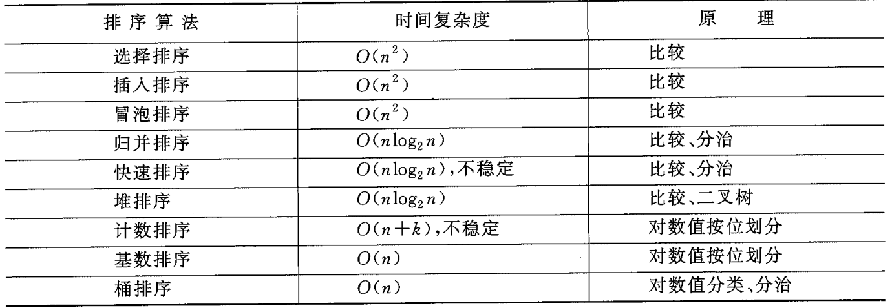

# 排序

所有经典排序算法如下 :



**归并, 快速, 堆排序**是十分巧妙的算法, 需要重点记忆其思路和大致的代码实现模版.

并且能够基于这三种算法的思路, 针对特定的问题对算法进行改造. 作为概述, 这里可以提前列举 :

1. 快速排序拓展 : 用**快速选择**算法解决 Topk 问题. 
2. 归并排序拓展 : 在归并算法的流程中间步骤计算**逆序对个数**.

 


## 1. 快速排序

推荐 B站 算法可视化 [数据结构合集 - 快速排序(算法过程, 效率分析, 稳定性分析)](https://www.bilibili.com/video/BV1y4421Z7hK/?spm_id_from=333.337.search-card.all.click&vd_source=926f35ee948b6b5a7a58cc9ad3cd3153)

[菜鸟教程](https://www.runoob.com/w3cnote/quick-sort-2.html) 中包含了具体代码

快排是一种**基于比较, 分治**思路的算法. 在实际应用中, 处理乱序数组的效率非常高.

建议在[排序模版题](https://www.nowcoder.com/practice/40bf74658879460bbf5f1bfe772e8580?tpId=385&tqId=2032996&sourceUrl=%2Fexam%2Foj%3Fpage%3D1%26tab%3D%25E7%25AE%2597%25E6%25B3%2595%25E7%25AC%2594%25E9%259D%25A2%25E8%25AF%2595%25E7%25AF%2587%26topicId%3D389)中自行实现一次快排, 体会其核心思路.

代码如下. 可记忆大致模版 :

```C++
#include <array>
#include <iostream>
using namespace std;

array<int, 100002> A;

int Partition(int low, int high){
    // 返回值 : 在处理完后, pivot 的索引在哪. 母函数需要据此构造递归子函数.

    // 注 : 这一行已经备份了 A[high] 的值, 现在它相当于一个可以被安全覆盖的"洞".
    int pivot = A[high];
    while(low < high){
        while(low < high && A[low] <= pivot){
            low++;
        }
        // 若退出循环, 则意味着遇到了 A[low] > pivot 的情况. 于是就左填右
        A[high] = A[low];
        
        // 开始查找右填左
        while(low < high && A[high] >= pivot){
            high--;
        }
        A[low] = A[high];
    }
    // 当 low = high 时, 上述整体循环会退出. 且 A[low] 与 A[high] 相互赋值没有任何影响.
    A[high] = pivot;
    return high; 
}

void quickSort(int low, int high){
    // 递归, 母函数.
    if (low < high){
        int pivot = Partition(low, high);       // 选取 A[low] 为支点
        // 分治处理子序列.
        quickSort(low, pivot-1);
        quickSort(pivot+1, high);
    }
}

int main() {
    ios::sync_with_stdio(false);
    cin.tie(NULL);
    
    int n = 0;
    cin >> n;
    for(int i = 0; i < n; i++){
        cin >> A[i];
    }
    quickSort(0, n-1);     // [0, n)
    for(int i = 0; i < n; i++){
        cout << A[i] << ' ';
    }
}
// 64 位输出请用 printf("%lld")
```

上述 `Partition` 的写法是 Lomuto 划分. 一个性能更加优秀但更难读的代码是 Hoare 双指针写法 :

```C++
int Partition(vector<int>& nums, int low, int high) {
    // 引入随机化避免复杂度退化为 O(n^2)
    int randomIndex = low + rand() % (high - low + 1);
    int pivot = nums[randomIndex];
    swap(nums[low], nums[randomIndex]); // 把 pivot 藏在左边

    int i = low + 1, j = high;
    while (true) {
        while (i <= j && nums[i] > pivot) i++; // 寻找比 pivot 小的
        while (i <= j && nums[j] < pivot) j--; // 寻找比 pivot 大的
        if (i >= j) break;
        swap(nums[i++], nums[j--]);
    }
    swap(nums[low], nums[j]); // 把 pivot 放回中间
    // 可以思考为什么是 j 而不是 i. 这与函数开始时把随机选择的 pivot 放到了数组开头有关.
    return j;
}
```

这种方法的优点 :

- 能更优地处理**包含大量元素的情况**, Hoare 能把相等的元素平分到两侧中, 维持树的平衡, 维持 $O(n\log n)$ 的复杂度.
- `swap` 的次数上, Hoare 更少. 平均交换次数为 $N/6$, Lumuto 的平均次数是 $N/2$.
- Hoare 内部的两个循环对 Cache 更友好.

缺点 :

- 极易写错, 不建议手撕时写.


## 2. 堆排序

堆排序原理建议看可视化视频 : [数据结构合集 - 堆与堆排序(算法过程, 效率分析, 稳定性分析)](https://www.bilibili.com/video/BV1HYtseiEQ8/?spm_id_from=333.337.search-card.all.click&vd_source=926f35ee948b6b5a7a58cc9ad3cd3153)

手搓 : [排序模版题](https://www.nowcoder.com/practice/40bf74658879460bbf5f1bfe772e8580?tpId=385&tqId=2032996&sourceUrl=%2Fexam%2Foj%3Fpage%3D1%26tab%3D%25E7%25AE%2597%25E6%25B3%2595%25E7%25AC%2594%25E9%259D%25A2%25E8%25AF%2595%25E7%25AF%2587%26topicId%3D389). 具体代码可参考 [菜鸟教程](https://www.runoob.com/w3cnote/heap-sort.html)

```C++
#include <array>
#include <iostream>
using namespace std;

array<int, 100002> A;
int n;
void max_heapify(int root, int end){
    // 注 : 此函数只将 root 放到 end 前的正确位置, 且假设 root 以后的结点全部满足大根堆
    int par = root;
    int son = par * 2;
    while(son <= end){  // 存在子节点
        if (son < end && A[son + 1] > A[son]) son++;
        if (A[par] >= A[son]) return;
        swap(A[par], A[son]);
        par = son;
        son = par * 2;
    }
    return;
}

void heapSort(){
    // 建堆
    // 只需对"最后一个非叶结点 (n / 2) 操作即可"
    for(int i = n/2; i >= 1; i--){
        max_heapify(i, n);
    }

    // 排序
    for(int e = n; e >= 2; e--){
        // e 是 end
        swap(A[e], A[1]);
        max_heapify(1, e-1);
    }
}

int main() {
    ios::sync_with_stdio(false);
    cin.tie(NULL);

    
    cin >> n;
    for (int i = 1; i <= n; i++) {
        cin >> A[i];
    }
    // 视 A 为完全二叉树, 构建大根堆
    heapSort();
    for (int i = 1; i <= n; i++) {
        cout << A[i] << ' ';
    }
}
// 64 位输出请用 printf("%lld")
```


## 3. 归并排序

归并排序的思路基于这样一个算法题 :

> 给定两个升序排列的数组, 将它们合并为一个整体升序的数组.


**递归版代码如下** :

```C++
#include <iostream>
#include <vector>
using namespace std;

vector<int> A(100002);
vector<int> B(100002);		// 合并辅助数组

int n;

void merge(vector<int>& arr, int start, int mid, int end){
    // 注 : [start, mid] 和 [mid + 1, end] 各自升序.
    int i = start, j = mid + 1;
    int k = start;
    
    while(i <= mid && j <= end){
        if (arr[i] <= arr[j]){
            B[k++] = arr[i++];
        }
        else{
            B[k++] = arr[j++];
        }
    }
    while(i <= mid) B[k++] = arr[i++];
    while(j <= end) B[k++] = arr[j++];
    // 复制回原数组
    for(int ind = start; ind <= end; ind++){
        arr[ind] = B[ind];
    }
    return;
}

void mergeSort(vector<int>& arr, int start, int end){
    // 递归版
    // 将原数组割成两半, 每一半分别操作, 然后再合并.
    if (start >= end) return;
    int mid = start + (end - start) / 2;
    mergeSort(arr, start, mid);
    mergeSort(arr, mid+1, end);
    merge(arr, start, mid, end);
    return;
}

int main() {
    ios::sync_with_stdio(false);
    cin.tie(NULL);

    cin >> n;
    for (int i = 1; i <= n; i++) {
        cin >> A[i];
    }
    mergeSort(A, 1, n);
    for (int i = 1; i <= n; i++) {
        cout << A[i] << ' ';
    }
}
// 64 位输出请用 printf("%lld")
```

迭代版代码修改 `mergeSort()` 的合并逻辑为自下向上即可 : 

```C++
void mergeSort(vector<int>& arr, int start, int end){
    // 迭代版 : 以 2 的幂次合并
    int len = end - start + 1;
    for(int seg = 1; seg  < len; seg += seg){
        for(int st = start; st <= end; st += seg + seg){
        // 合并结果为 [st, st + seg/2 - 1] + [st + seg/2, st + seg - 1] = [st, st + seg - 1];
            merge(arr, st, min(end, st + seg-1), min(end, st + 2 * seg - 1));
        }
    }
}
```

----

归并排序过程中, 最经典的拓展是**求整个数组的逆序对**. 这种问题中, 数组元素不重复.

很简单. 看一个例子


假设有一个逆序对不为 $0$ 序列为 $[1,3,5,2,4]$, 求出其中的**逆序对总数**.

考虑以下归并问题 :
$$
A = \{1,3,5\},\quad B = \{2, 4\}
$$
这两个子数组是升序的. 可以按照归并排序中的 `merge` 函数合并为 $[1,2,3,4,5]$. 但是注意其中双指针的移动 :

- $i$ 从 $1 \to 3$ , 随后是 $j$ 移动 $2 \to 4$.

算法中判断, 右侧的 $2$ 比左侧的 $3$ 小, 这已经可以计入**一个逆序对**. 但是事情还没结束, $A$ 本身是升序的, **这意味着 $A$ 中 $3$ 后面的元素也都比 $2$ 大**, 这时候我们就可以通过 $length(A) - i + 1$  直接算出与 $2$ 相关的逆序对的个数. 

- $(3, 2), (5,2)$.

继续这个过程, 同样可以算出 $j$ 从 $4$ 移到指针末尾时, 左侧的 $i$ 还没走到头, 存在比 $4$ 大的元素. 

此时可以计算 $i$ 到结尾的距离直接算出 $(5,4)$ 这个逆序对.

所以添加一个全局的变量 `cnt`, 然后稍微调整上面的 `merge` 算法, 补充 `cnt` 的计算逻辑就可以获取逆序对总数了.

```C++
int cnt = 0;			// 逆序对总数
void merge(vector<int>& arr, int start, int mid, int end){
    // 注 : [start, mid] 和 [mid + 1, end] 各自升序.
    int i = start, j = mid + 1;
    int k = start;
    
    while(i <= mid && j <= end){
        if (arr[i] <= arr[j]){
            B[k++] = arr[i++];
        }
        else{
            cnt += mid - i + 1;		// 添加逆序对计算.
            B[k++] = arr[j++];
        }
    }
    while(i <= mid) B[k++] = arr[i++];
    while(j <= end) B[k++] = arr[j++];
    // 复制回原数组
    for(int ind = start; ind <= end; ind++){
        arr[ind] = B[ind];
    }
    return;
}
```


## 4. 计数排序

这种方法与前面不同, 它不基于**元素值之间的比较**.

它的核心思路是 : **把待排序的数组元素看作另一个count统计数组的下标**, 统计每个下标出现的次数, 并重新生成结果.

例如 数组 $a = [4, 2, 2, 8, 3, 3, 1]$, 

1. 元素的范围在 $1\sim8$, 所以我们开一个全零数组`int count[9] = {0};` , 保证索引范围是 $0 \sim 8$.
2. **遍历数组 $a$, 当遍历到元素值为 $a_i$ 时,   则 `count[a_i]++`.**
   1. 遍历完成后, $count = [0,1,2,2,1,0,0,0,1]$
3. 根据 `count` 中统计的每个数组出现频率, 重新生成排序后数组 `output`. 

在生成`output`的步骤, 容易想到一种方法是 **用两个指针扫描 `count`  和 `output` 数组.**

但是这样没办法保证**稳定性** (保留 $a$ 中相同元素的先后次序).

所以另一种做法是 : 

- 先计算 `count` 中, 每个整数在`output` 中**最后出现的位置下标**. 
  - 通过**前缀和**计算. `count` 的前缀和为 $S = [0,1,3,5,6,6,6,6,7]$.
- 然后, **从后向前**扫描原数组 $a$. 
  - 当扫描到 $a_i$ 时, 将 该数值存入 `output[S[a_i]]` 中, 然后 `S[a_i]--`.


复杂度 :

- 时间 : $O(n + k)$. $k$ 是`count`数组的大小. 也就是原数组的最大值.
- 空间 : $O(n + k)$.

## 5. 桶排序

这是**计数排序的****升级版**.

计数排序是将元素**一一映射到具体的下标**, 那桶排序就是将**多个元素映射到同一个区间**.

比起每个元素对应一个下标, 当我们需要排序范围为 $0 \sim 39$ 的数据时, 可以分划出区间 $0\sim 9, 10\sim 19, 20\sim 29, 30\sim39$. 然后将数组中的元素都映射到其中.

随后, 在每个区间内, **使用其他排序方法进行排序**. (根据**是否需要稳定性或空间复杂度**, 选择快排, 堆或归并, 甚至是计数排序).


