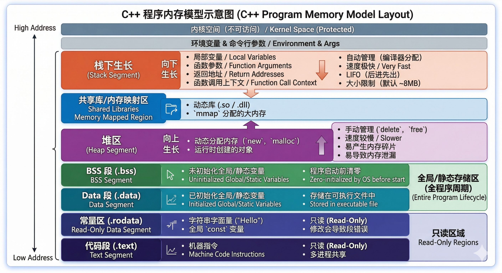
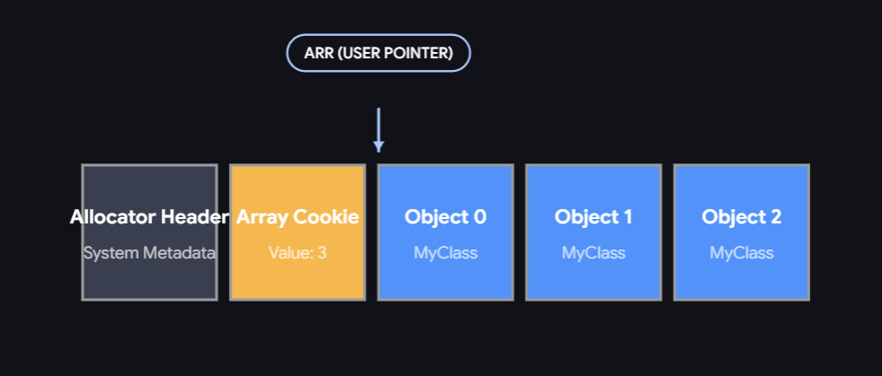

# 深挖底层

来源 : 从牛客网面经中搜集的 C++ 八股 / 底层题目, 以及自己总结时选取的必看题.

## C++内存模型中包含哪些段?

此部分内容建议仔细看, 后文涉及内存布局的话题常常需要引用. 

C++内存模型中, 地址__从高到低__分别是 

1. 栈段 : 存储__局部变量, 函数参数, 函数的返回地址__.
   1. 从高地址向低地址扩展.
   2. 栈空间较小; 递归过深, 局部变量过多会导致**栈溢出.**
   3. 变量自动回收, 速度快.
2. 内存映射区 / 共享库 : 存储__动态链接的共享库文件__ (`.so`, `.dll`) 
   1. 位于栈和堆之间
3. 堆段 : 程序运行时**向操作系统申请内存 (new, delete, malloc, free)**的位置. 存储__动态分配的对象/数组__.
   1. 从低地址向高地址扩展.
   2. 程序员需要手动释放. 否则会__内存泄露__.
   3. 申请和释放速度较慢 
   4. 空间比栈大很多
4. 静态段 : 分为两个子段
   1. BSS 段 : 存储__未初始化 (没有显式非零初始化) 的全局/static变量__.
      1. 程序执行前会将这部分变量中的__所有内存都清零__. (所以有了默认值的说法)
   2. 数据段 : 存储__已初始化 (非零初始化) 的全局/static变量__.
      1. 需要在可执行文件中存储真实的数值, 是需要占用空间的.
      2. 重要 : **如果初始化的值与默认值相同**, 编译器会从 `.data` 段优化到 `.bss` 段.
5. 常量区 : 存储程序中的__常量数据__. (字符串字面量, 常量数组等)
   1. 只读 (`.rodata`/ `.rdata`)
6. 代码段 : 存储程序的__机器指令__, 包括__函数代码__.
   1. 只读 `.text`




## .cpp 文件到 二进制可执行文件 经历了哪些过程

1. **预处理 (Preprocessing)** : 此阶段主要处理源代码中以 `#` 开头的预处理指令
   1. 将 `#define` 宏定义展开, `#include` 直接复制粘贴替换, `#ifdef` 系列指令过滤掉不需要的代码, 实现__条件编译__.
   2. 生成预处理文件 `.i`  (GCC)
2. **编译 (Compilation)** : 是最耗时的一个步骤
   1. 编译器进行__词法和语法分析__, __语义分析__, __根据编译选项进行代码优化__, __生成汇编代码__. (GCC :`.s`)
3. **汇编 (Assembly)** : 汇编器 (Assembler) 将上一步生成的汇编代码逐行翻译成机器可识别的**机器指令**
   1. 生成的文件包含 : __机器码, 数据段, 用于链接的符号表__. 
   2. 该文件还不能直接运行, 不过是__可重定位的__. (GCC : `.o` )
4. **链接 (Linking)** : 链接器 (Linker) 的任务是将目标文件 (前一步的 `.o`) 以及**依赖的第三方库**组合成一个完整的**可执行文件**。
   1. 将每个目标文件中的符号引用（比如调用了另一个文件中的函数）与其唯一的符号定义绑定在一起。如果找不到定义，就会报经典的 `LNK2019: unresolved external symbol` (无法解析的外部符号) 错误。
   2. 负责__重定位__ : 由于各个目标文件在编译时起始地址都是从 0 开始的，链接器需要为所有代码和数据重新分配最终的内存地址，并将代码中所有对地址的引用修改为正确的绝对地址。
   3. 对于库文件, 将静态库直接 copy 到可执行文件中 (静态链接), 或者将动态链接库（`.dll` / `.so`）的导出信息写入文件，推迟到运行时再进行真正的内存映射。

## 系统执行二进制可执行文件时, 经历了怎样的步骤 ? 

### 1. 进程创建 (Process Creation)

当你在终端输入命令或双击运行程序时，操作系统（Shell 或 GUI 外壳）会发起系统调用。

- **Linux 下**：通常是通过 `fork()` 创建一个子进程，然后使用 `execve()` 替换子进程的上下文。
- **Windows 下**：直接调用 `CreateProcess()` API。
- **分配核心结构**：操作系统为新进程分配一个**进程控制块 (PCB / EPROCESS)**，用于记录进程状态、PID、权限等信息。
- **创建虚拟地址空间**：OS 为该进程分配独立的虚拟内存空间（通过设置页表结构），但此时尚未分配实际的物理内存。

### 2. 加载器解析与映射 (Loader Mapping)

操作系统的加载器 (Loader) 接管控制权，开始解析二进制文件的头部信息（Windows 的 PE 头，Linux 的 ELF 头）。

- **读取 Header**：检查魔数 (Magic Number) 确认文件类型，读取程序入口地址 (Entry Point)、目标架构等信息。
- **内存映射 (Memory Mapping)**：加载器根据 Header 中的段表 (Section/Segment Table)，将文件中的各个段（如代码段 `.text`、初始化数据段 `.data`、未初始化数据段 `.bss`）映射到虚拟地址空间中。
  - *注：此时通常只建立了虚拟内存到磁盘文件的映射关系，并未将数据真正搬入物理内存。实际加载是依靠后续 CPU 执行时的**缺页中断 (Page Fault)** 按需加载的 (Demand Paging)。*

### 3. 动态链接 (Dynamic Linking)

如果程序依赖了动态链接库（`.dll` 或 `.so`），操作系统必须在运行前将它们加载并链接。

- **加载动态链接器**：OS 将控制权短暂交给动态链接器（如 Linux 的 `ld-linux.so`，Windows 的 `ntdll.dll`）。
- **依赖解析与映射**：递归查找程序依赖的所有动态库，并将它们映射到进程的虚拟地址空间。
- **符号重定位**：更新代码中对动态库函数的调用地址。
  - Linux 下通常使用 GOT (全局偏移表) 和 PLT (过程链接表) 进行延迟绑定（Lazy Binding），即第一次调用时才解析真实地址。
  - Windows 下则通过 IAT (导入地址表) 进行函数地址修补。

### 4. 运行时环境初始化 (CRT Initialization)

在进入你编写的 `main` 函数之前，需要先执行 C/C++ 运行时库 (C Runtime, CRT) 的启动代码。

- **栈初始化**：在用户栈区准备好命令行参数 (`argc`, `argv`) 和环境变量 (Environment Variables)。
- **堆初始化**：建立进程的默认堆 (Heap) 空间，用于后续的 `malloc` / `new` 分配。
- **全局/静态对象初始化**：对于 C++ 程序，此时会遍历并调用所有全局变量和静态变量的**构造函数**。

### 5. 进入主函数 (Execution)

- **跳转到入口**：CRT 启动代码完成所有环境配置后，将指令寄存器（如 x86 的 EIP/RIP）指向 `main` 函数的起始地址。
- **开始执行**：CPU 开始逐条读取代码段中的机器指令并执行。

### 6. 进程终止 (Termination)

当 `main` 函数执行完毕返回，或程序主动调用 `exit()` 时：

- **执行析构**：CRT 接管流程，调用所有全局/静态对象的**析构函数**。
- **资源回收**：操作系统关闭该进程打开的所有文件描述符 (句柄)，释放分配的物理内存和虚拟内存页表。
- **销毁进程**：将进程状态标记为终止，父进程如果调用了 `wait()`，则回收其退出状态码，最后彻底销毁 PCB。

## `std::vector` 和 `std::array` 的区别?

1. 功能上 : `vector` 可以在运行时动态扩容, 长度可变. 而 `array` 只是 C-style 数组的封装, 表示一块连续的内存.
2. 内存存储方式上 : 局部声明的 `array` 本身就是数组的数据, 与 C-style 对象一致, 存在栈区上 (与普通变量一样, 若用 `new` 则在堆上). 而 `vector` 对象本身仅在__栈上__包含 3 个指针 (begin, end, capacity), 其对应的动态数组**数据存在堆上**. 类中的 `vector` 对象占用 24 字节, `array` 占用数组本身占用的字节数.
3. 内存分配上 : `vector` 涉及 `mallo/free`. `array` 与变量一样几乎无开销.

除了上面两个以外, 值得注意的还有 `std::deque`. 它是分段连续

## new / delete 与 malloc / free 的本质区别?

在对象的内存分配这个话题上, 包括四种操作 :

1. 分配空间 allocate
2. 构造对象 constructor
3. 析构对象 destrcution
4. 释放空间 free / release

标题中两组操作符的核心区别在于 : 

- `new` 同时完成了 1, 2. `delete` 同时完成了 3, 4.
- `malloc` 仅完成 1, `free` 仅完成 4.

而更细致的区别如下 :

| **特性**       | **new / delete**                                           | **malloc / free**                                 |
| -------------- | ---------------------------------------------------------- | ------------------------------------------------- |
| **属性归属**   | C++ 语言内置的**运算符** (操作符)                          | C/C++ 标准库中的**函数**                          |
| **构造与析构** | 分配内存后**自动调用**构造函数；释放前**自动调用**析构函数 | 仅负责分配/回收内存，**不调用**任何构造或析构逻辑 |
| **类型安全**   | 返回具有严格类型的指针 (例如 `int*` 或 `Ray*`)             | 返回 `void*` 指针，需要程序员手动强制类型转换     |
| **大小计算**   | 编译器自动推导并计算所需内存大小                           | 需要开发者手动使用 `sizeof()` 计算字节数          |
| **失败反馈**   | 内存分配失败时，默认抛出 `std::bad_alloc` 异常             | 内存分配失败时，返回 `NULL` 空指针                |
| **定制化**     | 可以被**重载** (Overload)，适用于实现自定义内存分配器      | 是标准库函数，不允许重载                          |


## new[] 和 delete[] 的底层实现?

核心问题 : **程序怎么知道 `delete[]` 所需要析构的对象数组有多长?**

在调用 `new[]` 时, 编译器为了解决上面的疑问, 会在**分配的内存块最前面** **记录数组的长度. (占用 4B 或 8B)**  `new[]` 返回的地址仍然是第一个元素的地址. 也就是说, 长度信息保存在负索引区域. 

这种机制称为 __Array Cookie__. 那个长度就是 __Cookie__.



当使用 `delete[] ptr;` 时, 默认 `ptr` 是第一个元素的首地址, 程序会去**读取负索引区域获取长度.** 并依次堆每个对象执行析构防止资源泄露. 

当完成 数组对象的析构后, delete 会交给更底层的 `free()` 逻辑, 根据 Allocator Header 中存储的内存长度信息, 依次释放掉整块内存.

注 : Array Cookie 的主要作用是保证数组的每个对象都被__析构__. 内存释放的长度是由 Allocator Header 中决定的.

## new[] 得到的指针用 delete 替代 delete[], 一定会内存泄露吗?

首先这是未定义行为 Undefined Behavior, 实际代码中一定不能出现. 本题仅讨论底层原理.

答案是不一定. 

当使用 `MyClass* ptr = new MyClass[3];` 申请内存时, 堆中的内存布局如下 :


`ptr`指针指向 `Object 0` 的首地址. 

前一个问题中我们了解到 ArrayCookie 机制. 使用 `delete[]` 操作符, 程序会读取 Cookie 值, 依次对每个 Object 0,1,2 执行析构. 然后由底层根据 Allocator Header 释放整块数组内存.

倘若此时用的是 `delete`,程序仅将传入的 `ptr` 视为单个对象(而非数组). 此时流程如下 :

1. 析构 Object 0.
2. 底层的内存释放函数向 `ptr` 的负偏移位置读取 Allocator Header, 但是因为 Array Cookie 的存在产生了错位, 直接导致经典的__Heap Corruption(堆破坏)__问题, 程序直接终止运行.


但存在例外. 

- 若 `Myclass` 类型是**基本数据类型**或者满足平凡性的**Trivial类型**, <u>部分编译器</u>注意到其不需要执行析构函数释放其他资源, <u>可能</u>会直接不生成 Array Cookie, 使得 `delete` 操作符的底层能正确回收对应内存的同时, 不产生内存泄漏.


## 数组名与指针的区别是?

设讨论对象为 `int a[5]` 和 `int* p`. 

- `a` 与 `p` 确实都有**指向一个内存单元的地址**. 

核心区别在于 :

- `a` 是一块__连续的内存__.
- `p` 是一个__变量__. 变量的值是另一个内存单元的地址.

其他能体现上述两点的区别是 : 

1. __空间大小的占用数 (sizeof)__ : `a` 的大小是 20, `p` 是 8 (指针占 8 字节).
2. __取地址操作 (&) 的表现不同__ : 
   - `&a` 返回一个"**指向 长度为5的`int`数组的指针**". 表达式 `&a + 1`  会直接跳跃整个数组
   - `&p` 返回变量 `p` 自己的首地址.
3. __可修改性__ : 
   - `a` 是不可修改的左值.
   -  `p` 是可以修改的左值.

在函数参数中, 可以用 `int*` 来接受 `int a[5];`. 

这是因为 C++ 存在__数组$\to$ 指针的隐式转换__.

我们常常觉得二者相似, 就是因为存在隐式转换.


有一个特殊情况. 在函数参数定义中 :

```C++
void func1(int *p);
void func2(int a[]);
void func3(int a[10000]);
```

这些定义在编译器眼中是__完全等价__的. 它们都会被统一处理成 `void func1(int *p);` 的形式. 

这是因为, 当__数组名作为函数形参时, 它一定会退化为指针__. 

保留 `func2` 和 `func3` 写法只是出于__为程序员区分语义__的目的. 


那数组名不作为形参, 而是作为__引用参数__呢? 这样确实有效, 可以阻止数组退化为指针.

```C++
void func4(int (&arr)[10]);
```

这样声明后, `func4` 确实就只能接受 长度为 10 的 `int` 数组名了.

更现代的防止数组退化的方法是`std::array` 数组模版, 或者更新的`std::span` (C++20).

## 虚函数表 / 虚函数指针 是什么时候生成的?

每一个包含虚函数的__类__, 都有一个/(多继承下可能有)多个虚函数表, 是在__编译阶段由编译器生成的__. 

- 存储位置 :  只读数据段 `.rodata` / `.rdata`
- 个数 : 虚表是相对__类__, 而不是__实例对象__而言的. 


进一步, __虚函数指针 vptr__ 是什么时候生成的?

- 编译器在含有虚函数的__类的Constructor__中, 插入一段代码 : **将编译器额外添加的 `vptr` 成员变量指向该类的虚函数表.** 随后才开始真正进入用户写的构造逻辑.

由于派生类的 Constructor 之前会先执行基类的 Constructor, 所以在**构造函数中调用虚函数无法实现多态.**


## 如何在 `main` 函数之前再插入一段逻辑?

核心思路 : __全局对象/静态变量的初始化在 main 函数之前发生__.

1. 利用__全局对象的 Constructor__ : 全局范围中定义一个类对象, 则类的 Constructor 会先于 main 执行.
2. 利用__全局对象的初始化__ : 例如 `int a = initializer();`, `a` 的初始化在 `main` 前, 必须先执行 `initializer` .


## CPU 一次读入Cache块长度是多少字节?

现代主流 CPU（包括大多数 x86-64 和 ARM 架构）的 Cache 一次能存入的内存单元数据长度是 **64 字节 (Bytes)**。(注意不是 64 位 (4B). )


## 构造函数或析构函数中可以调用虚函数吗？

>  如果调用了会发生什么？为什么编译器要这样设计？

二者中都可以调用虚函数. 但

是程序只会调用当前类的那个虚函数版本, **不会展现**__多态性质__.

为什么要这样设计 ?

1. Constructor : 一个类体系中, 构造函数是__先基类后派生类__. 若执行基类构造函数时, 调用派生类的函数, 很可能访问到派生类中的未初始化内存.
2. Destructor : 析构函数的顺序是__先派生类后基类__. 若执行到基类的析构, 却调用派生类的虚函数, 很可能访问已经被回收的内存.

在构造与析构的过程, `vptr` 会从基类到派生类/派生类到基类 逐步赋值. 退出当前类的Constructor/Destructor, `vptr` 就会被赋值为下一个执行者的虚函数表.


## 内联函数（inline）可以是虚函数吗？

`inline` 是一种__编译期行为__, 它给编译器一个建议, 建议直接去除函数体调用的开销. `virtual` 是一种__运行期行为__. 从语法上, 二者可以共存.

当通过**对象实例**访问inline虚函数 `obj.vfun();` 时, 编译器可以正确执行内联功能.

但若通过__基类的指针或引用__调用inline虚函数, `ptr->vfun()` 编译器无法确定实际运行时会调用哪个版本, 也就无法正确内联.

## 静态成员函数（static）可以是虚函数吗？

`static` 成员函数__不能是__ `virtual` 函数. 编译器会直接报错.

用基类指针/引用访问虚函数时, 程序依赖于对象的`this`指针去定位`vptr`, 进而定位 vtable. 但是静态成员函数与__对象__无关, 是属于整个类的成员, 它不存在 `this` 指针. 自然无法找到 `vptr` 和 vtable.


## C++ 的 RTTI（运行时类型识别）机制是什么？

> 建议先熟悉虚函数表和虚函数指针的底层实现和内存布局.

概述 : 这个是**多态对象**的**身份证**, 用来**判断两个对象的类型是否严格相同**. 它**依赖于虚函数表**. 会带来不小的**性能开销**

内存布局 : (以 64 位系统和 GCC/Clang 为例)

- 在包含虚函数的类中有 `vptr` 成员, 指向 虚函数表 vtable __中的第一个虚函数__. 相对于 `vptr`, 负偏移区包含了其他的信息

  在 -16 字节偏移处, 存储的是__多继承中this指针偏移值__. 这里不多说.

  在 -8 字节偏移处则是本节的主角. `std::type_info*`

| **内存偏移 (Offset)** | **表项内容 (Content)** | **说明**                                              |
| --------------------- | ---------------------- | ----------------------------------------------------- |
| `-16` 字节            | `offset_to_top`        | 当前子对象指针相对于完整对象起始地址的偏移量          |
| `-8` 字节             | `typeinfo*`            | **指向当前类 `type_info` 结构体的指针 (RTTI 的核心)** |
| `0` 字节              | `vfunc[0]()`           | 第一个虚函数的地址 ( **`vptr` 实际上指向这里** )      |
| `+8` 字节             | `vfunc[1]()`           | 第二个虚函数的地址                                    |

介绍一个关键字 : `typeid`. 

对一个基类指针`obj`所指向的对象使用该关键字,  `typeid(*obj)` 时, 编译器会在底层访问上述 `typeinfo` 结构体, 代码类似于 `*(obi->vptr-1);`.

- `std::type_info` 结构体中包含 :
  1. `.name()` : 返回类型名称, 通常是经过编码的字符串
  2. `operator==` 和 `operator!=` 判断两个类型是否相同.

通常, `type_info` 会结合方法 : `dynamic_cast` 运算符.

`dynamic_cast` 的作用是, __让一个基类指针/引用安全地转换为派生类__.

- __安全__体现在 : 若指针转换失败会返回 `nullptr`. 引用转换失败会返回 `std::bad_cast`.
- 使用该运算符的前提是类体系具有虚函数.

一个使用示例如下 :

```C++
Base* ptr = new Derived();
// 尝试将 ptr 从 Base* -> Derived*
Derived* d_ptr = dynamic_cast<Derived*>(ptr);

if (d_ptr){
    // non-null
    cout << "转换成功" << endl;
}
else{
    cout << "转换失败" << endl;
}
```

注意模版参数中是__目标类型指针__. 

`dynamic_cast` 的应用场景 :

- __向上转换__ : 派生类转为基类指针/引用, 此时不需要检查类型.
- __向下转换__ : 安全性价值所在, 程序会检查该转换是否真的合法. 

你可能听过与之类似的 `static_cast` 方法. 该方法运行在__编译期__, 且不要求有 RTTI 机制, 也就不要求类有虚函数.

它可以用来 :

1. __基本数据类型的安全转换__. 相比于 C-style 的 `(int)x`, 编译期会检查转换是否合法.
2. __类体系结构中的转换__. 但是不包含多态行为. 
   1. __向上转换__ : 即使没有虚函数也可以进行.
   2. __向下转换__ : `static_cast` 不会检查该转换是否正确.  基类的指针 `ptr` 即使没有指向一个派生类, 转换依然会发生.
3. __将`void*`指针转换为特定类型的指针__.

`static_cast` 是零开销的. 当转换失败时可能会编译报错, 也可能会带着逻辑错误执行程序.


## nullptr 和null的区别？

-  `nullptr` 是__空指针的字面量, 它表示一个指针__. 
- `NULL` 是一个__整数__. 是被宏预定义的整数.

`NULL` 是整数而不是指针, 会在涉及编译器类型推导时会有很大的影响.


## C++和C有什么区别？

答案来源于 Gemini.

设计理念 :

- **C 语言**的设计哲学是“高级的汇编语言”。它提供对硬件和内存最直接、最透明的控制，所见即所得。代码怎么写，汇编大概就是什么样。
- **C++** 的设计理念是**“零成本抽象” (Zero-overhead Abstraction)**和“你不使用的东西，你不需要为之付出代价”。它允许你使用极其高级的抽象（如面向对象、泛型编程），但编译器会在编译期将其优化，使其运行效率不亚于手写的 C 代码。

编程范式 :

- **C 语言**是纯粹的面向过程语言。
- **C++** 是一门多范式语言：包括__面向对象__, __泛型编程__, __函数式编程__.

类型约束 :

- C 类型检查较弱。高度依赖宏定义（`#define`）来实现常量和代码复用，宏只是简单的文本替换，不进行类型检查，难以调试。
- C++ 强调强类型安全。用 `const` 和 `constexpr` 替代宏常量（提供类型检查和编译期计算），用 `inline` 函数替代宏函数，用 `static_cast` 等四种安全的类型转换替代 C 风格的隐式转换。

内存管理

- **C 语言：** 依靠 `malloc/free` 手动管理堆内存，极易出现内存泄漏或悬空指针。没有任何自动化的资源释放机制。
- **C++：** 除了 `new/delete`，C++ 的核心灵魂在于 **RAII（资源获取即初始化）**。通过构造函数获取资源，析构函数释放资源。结合智能指针（`std::unique_ptr`, `std::shared_ptr`），能够在对象生命周期结束时确定性地、自动地释放内存。

## 拷贝构造函数作用及用途？什么时候需要自定义拷贝构造函数？

拷贝构造函数是一种特殊的构造函数, 它接受 `const myClass& other` , 也就是另一个对象作为参数. 意在构造一个与传入的对象参数值相同的对象.

- 默认情况下, ==编译器会自动生成一个__浅拷贝__构造函数.==
- 若类中包含指针等涉及**动态分配的资源**, 必须__自定义Copy构造函数__以实现深拷贝.
  - 若仍使用默认版本, 会产生 Double Free (二次释放) 或 Dangling Pointer (悬空指针) 的问题.

通常, 需要自定义 Copy Constructor 的场景也会需要自定义 Destructor 和 `operator=` 赋值运算符.

也可以使用 Smart Pointer 来管理动态分配的资源的生命周期.


在某些类型中, __拷贝__操作是没有道理的. 例如互斥锁类. 

此时应显式禁用 :

```C++
myClass(const myClass&) = delete;
myClass& operator=(const myClass&) = delete; 
```


## `private`构造函数有什么应用场景和限制?

当 Constructor 被声明为 private 时 : 

- 外部过程无法通过 `new myClass()` 或 `myClass obj();` 来直接实例化该类.
- 若类的所有 Constructor 都是 private 的, 则类无法被继承, 因为派生类构造必须调用基类构造函数.

Private Constructor 可以通过两种方法来调用, 也分别对应了不同的应用场景 : 

- 友元 `friend` 中调用. 
  - 例如将对象池类 Object Pool 声明为友元, 只能通过对象池进行初始化. __受限实例化__.
- 外部过程调用 public 的类 `static` 函数成员, 在其中调用构造函数.
  - 用这种方法, 可以实现**重命名构造函数**的技巧.
  - 也可以实现__单例模式__. 

若设计的类本身就不应该拥有实例, 那将 Constructor 设为 private 也是一种方法.


## vector 的 1.5 倍和 2 倍扩容有什么优劣?

2 倍扩容 :

- 优点 : 扩容次数更少.
- 缺点 : 即使底层堆（Heap）分配器完美地将之前释放的所有 `vector` 内存块在物理地址上合并，它们的总和也**永远不够**满足下一次扩容的需求。分配器只能不断向操作系统**申请更高地址的全新内存页**，导致严重的**内存碎片化 (Memory Fragmentation)**。

1.5 倍 与 2 倍完全相反. 实际中, 它对 OS 的内存分配器更加友好.
