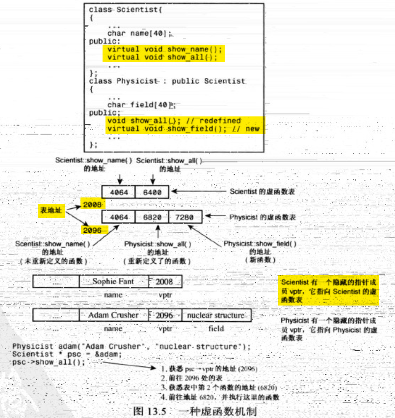

# 4. 数组

普通数组 :

- 大多数情况下, 数组名 等价于 **第一个元素的地址**. 例外 :
  - `sizeof` 数组名, 会返回整个数组的长度
  - `int a[32]`, 则 `a` 是第一个元素的地址, `&a` 是整个数组的地址 (二者的值是相同的, 但是它们的含义不同. 不同的含义会影响指针运算的结果)


`vector` 和 `array` 是 普通数组的替代品.

- `vector` 是 C++ 标准库中的一个模版类, 在 C++ 98 引入
  - 长度可变, 且安全
  - 但是开销, 代价很大
- `array` 是 `C++ 11` 引入的
  - 与普通数组的开销类似
  - 长度不可变
  - 特点 : 比普通数组安全

`vector`  :

- 其在内存中的位置是 **堆heap** 区, 底层是用 `new`, `delete` 管理的向量.
- `vector` 对象的 `begin()` 和 `end()` 可以视为智能的指针. 定义方法是**超尾** 的. 即 `end()` 指向最后一个元素**的下一个位置**. `begin` 指向第一个元素没有问题.


`array` 的初始化 :

```cpp
#include<array>

array<double, 4> a; // array<类型, 数组元素数>
    
```

- `array` 可以用列表初始化
- `array` 可以在初始化后, 对数组对象进行复制操作


`vector` 和 `array` 都可以使用 `.at()` 方法, 捕获非法的索引.

- C++ 不会检查 `a[-2]` 这种越界访问 (因为其本质上是移动指针), 而 `at()` 能避免这一点.


# 7. 函数

关于函数 与 数组参数 :

```cpp
int sum(int arr[], int n);
```

在函数声明, 函数头中, 上面的写法**完全等价于** `int sum (int * arr, int n)`.

其含义都表示 **指向 int 的指针**.

- `int arr[]` 通常暗示了另一个关系 : 这个指针指向的是数组的第一个元素.


另外, 数组传递本质上是指针传递, 节省了**形参复制的开销**. 当然也增加了不安全性.

- 可以改进为 `int sum(const int  arr[], int n)` , 这个写法会**将传入的指针视为常量 (即不可以通过这个指针修改指针指向的内存值)**

----

函数想传递二维数组的时候会更复杂.


# 13. 类继承

## 派生类对基类的访问权限

先以 public 继承为例. 派生类不能直接访问基类的**私有成员private**. 

但派生类的**构造函数** 需要承担为基类传承下来的private成员初始化的任务.

所以对于基类中的 private 成员, 需要调用**基类的public构造函数**来进行. 这也是构造函数总是声明为public的方便之处.


## 虚函数表

虚函数是实现多态/动态联编的重要方法. 动态联编更灵活, 但相比静态联编需要付出更多的开销.

编译器这样处理一个类的虚函数 : 

- 为每个类的**对象** 添加一个**隐藏成员** : 这个隐藏成员中, 保存了一个指向内存中的**虚函数表(virtual function table)**的**指针**, 告诉这个对象, 在调用虚函数时, 实际应该执行哪个函数.
- 虚函数表实际上是**函数地址的数组**




## 虚函数注意事项

1. **构造函数不能是虚函数**.
   1. 派生类的构造函数本身就不能完全继承基类. 声明为 virtual 没什么意义.
2. **析构函数必须是虚函数** (除非该类一定不作为基类)
   1. 若使用 `BaseClass* ptr` 指向 `Derivedclass` 对象, 当使用 `delete p;` 时, 若析构函数不是虚的, 则会基类的析构函数, 此时可能导致内存泄漏.
   2. 无论基类是否需要显式的析构函数, 总是将其声明为virtual.


## 关于 Const 方法

一个成员函数被声明为 const :

```cpp
class myClass{
    //...
public:
    void func() const;
};
```

其含义是 : **该函数承诺不修改非静态的对象的数据成员**.

一个巨大的作用是 : const 对象只能调用 const 方法, 在const 方法的承诺下, const 对象可以满足**对象值不修改这一条件**.

