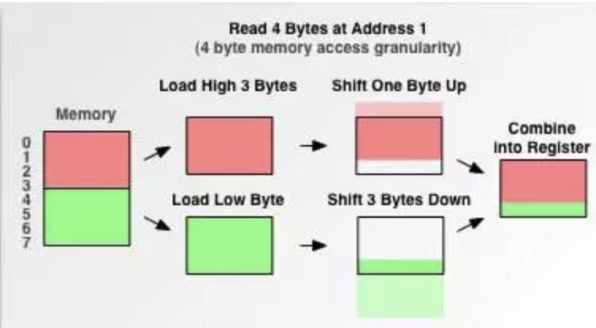

# 虚函数表

2026-3-23 Mer

本文的主要介绍对象是**虚指针, 虚函数表**的**内存布局**, 以及在 (单或多) 继承关系中, <u>基类指针访问子类对象虚函数</u>的底层逻辑.

同时, 也介绍了**内存对齐**机制, 以及常见的 C++ 现象与问题, 深入分析动机和解决方案.

## 1. 基本类型数据成员

先看比较好理解的**数据成员**. 重点是==**内存对齐** Memory Alignment== 机制.

```C++
struct A{
	char a;						// 1B
    char b;						// 1B
	int i;						// 4B
}

struct B{
    char a;						// 1B
    int i;						// 4B
    char b;						// 1B
}

int main(){
    printf("%d\n", sizeof(A));	// 输出结果为 8
    printf("%d\n", sizeof(B));	// 输出结果为 12
}
```

注意到

- 结构体 `A` 中的成员仅占用 $6$ 个字节, 但实际对其使用 `sizeof` 运算符得到的结果 (下文统称"大小") 为 $8$, 这是内存对齐的结果. 
- 结构体 `B` 中的成员与 `A` 一样, 仅仅是**声明顺序不同**, 却导致 `B` 的大小增大到 $12$.

==计算机系统**要求存储对象的首地址满足某种限制**==, 通常是 $k$ 的倍数, 这就是所谓的**内存对齐**. $k$ 实际中常取 $4$ 或 $8$. 

具体而言, 内存对齐有以下两个基本规则 

1. **自身对齐** : 每个成员变量的**首地址**<u>相对于结构体/类的首地址</u>的**偏移量(offset)**, 必须是它**自身的大小的倍数**.
2. **整体对齐** : **结构体或类的总大小**必须是其**最大成员变量大小的倍数**.
3. (其实还有更多情况需要考虑, 例如嵌套结构体). 这里先省略.

仅靠前两条, 我们已经可以推理出为什么上面的例子中 `A` 是 $8$, `B` 是 $12$ 了. 

看看 `B` 中数据成员的内存布局情况 :

| **偏移量 (Offset)** | **占用情况** | **说明**                                       |
| ------------------- | ------------ | ---------------------------------------------- |
| 0                   | `char a`     | 占用 1 字节                                    |
| 1, 2, 3             | **Padding**  | 填充 3 字节，确保 `i` 从地址 4 开始 (自身对齐) |
| 4 - 7               | `int i`      | 占用 4 字节                                    |
| 8                   | `char b`     | 占用 1 字节                                    |
| 9, 10, 11           | **Padding**  | 填充 3 字节，确保总大小是最大成员 (int) 的倍数 |


> - 现代的 CPU 在读取内存时, 并**不是按字节读取的**, 而是**按块(多个字节, 通常是 4B 或 8B)**读取. (猜测这取决于 CPU 是 32 位还是 64 位架构).
> - 如果一个 4B 的 `int` 对象, 跨越了块的边界, 那么 CPU 读取这个对象就需要读取两次, 并且之后还有拼接的开销, 十分影响效率. 某一些架构平台 (ARM) 遇到该情况甚至直接**抛出硬件异常**终止程序.
>
> 


## 2. 虚函数指针 vptr

本节内容参考 : [Smith](https://www.inlighting.org/archives/c-plus-plus-virtual-table)

下面进入有关虚函数的内存布局讨论. 首先☝️需要提前明确一件事情 :

> C++ 标准从来没有规定过如何实现虚函数，都是由编译器自行实现。

下文所介绍的是 ABI (Application Binary Interface 应用二进制接口) 的实现方法.

在前一节的基础上, 尝试往仅有数据成员的结构体中**引入虚函数** :

```C++
struct C{
	virtual bool foo();	// ?
    int x;				// 4B
}
```

一旦一个类中声明了虚函数, 编译器就会往其中偷偷**加一个数据成员** `vptr` , 称为**虚函数指针**, 效果如同 :

```C++
struct C{
	VirtualTable* __vptr;		// 8B (64 位系统)
    int x;						// 4B
}
```

这个成员的作用是**指向类的虚函数表**, 也就是今天的主角. 它是用来实现继承与多态的, 后文详述.

注 : 

- `vptr` 对所有子类可见. 相当于 `public` 成员.
- 加入 `vptr` 后, 类 `C` 的最大成员大小为 $8$, 类整体大小必须是 8 的倍数. 所以使用 `sizeof(C)` 会得到 16 的结果.
- `vptr` 是所有成员中第一个声明的. 


用一个例子来验证 : (From Gemini)

```C++
#include <iostream>

struct Base {
    virtual void func() { std::cout << "Base::func" << std::endl; }
    int data = 0x12345678; // 一个容易识别的十六进制数
};

int main() {
    Base b;
    std::cout << "Size of Base: " << sizeof(b) << " bytes" << std::endl;

    // 1. 获取对象的首地址
    long long* vptr_pos = (long long*)&b;

    // 2. 打印 vptr 指向的地址（虚函数表的地址）
    std::cout << "vptr points to (vtable address): 0x" << std::hex << *vptr_pos << std::endl;

    // 3. 验证数据成员的偏移
    int* data_pos = (int*)(vptr_pos + 1); // 跳过 8 字节的 vptr
    std::cout << "Data member value: 0x" << *data_pos << std::endl;

    return 0;
}
```

运行结果为 :

```
Size of Base: 16 bytes
vptr points to (vtable address): 0x7ff6fef3bcb0
Data member value: 0x12345678
```

## 3. 虚函数表

 `vptr` 所指向的 ==**虚函数表位于程序的只读段**==.

**虚函数表**中的内容是啥? 其实是一个**函数指针数组**. 假设定义函数类型为 `void funcType()`. 虚函数表相当于一个数组 : `array[];`, `vptr` 指向的就是 `array`  的首地址. 

而由于虚函数的函数类型不同, 上面的数组不会有固定的类型. 我们可以理解为`void* array[]`. 存的是一个未知类型解释的**8B的指针**数组. 我们可以在使用时将其强转为对应的函数类型, 进行调用.

假设现在类中有两个虚函数, 按声明顺序分别为 `func1()`, `func2()`. 虚函数表首地址保存在`vtable_addr` 中.

- 用 `*((long long*)vtable_addr)` 可以调用 `func1()`
- 用 `*((long long*)vtable_addr + 1)` 可以调用 `func2()`. 前面的 `+1` 表示指针算术.

## 4. 单继承情形

首先说明一下单继承情形下, 派生类的布局. 假设有派生类 `Derived` 继承自基类 `Base`.

其布局结构大致如下 : 

| **偏移量 (Offset)** | **内容**                 | **说明**                                    |
| ------------------- | ------------------------ | ------------------------------------------- |
| 0 - 7               | `vptr`                   | 指向 `Derived` 针对 `Base` 的虚表           |
| 8 - 11              | `Base` 数据成员          | 如果有成员变量的话 (假设为 1 个 `int` 成员) |
| 12 - 15             | Padding                  | 对齐补全                                    |
| ...                 | `Derived` 专属的数据成员 | 派生类自己的成员                            |

有了这个结构, 编译器是如何实现运行时多态的? 先看看单继承的情况

- 每个对象调用虚函数时, **其所调用的方法已知, 即在虚函数表中的索引已知**.
- 具体虚函数表中存了哪个版本的函数, **每个类都有自己的虚函数表**.
- 当派生类`Derived`调用 `override` 后的虚函数`vfun()`时, 编译器会找到`Derived` 的虚函数表, `vfunc()` 对应的函数指针指向的就是重写后的版本的代码.

`Derived` 继承 `Base` 中的虚函数的具体过程是 :

1. **拷贝**：首先完整拷贝一份父类 `Base` 的虚函数表。
2. **覆写（Override）**：检查派生类中重写了哪些函数。如果 `Derived` 重写了 `func1`，编译器就会把表中原本指向 `Base::func1` 的地址替换为 `Derived::func1` 的地址。
3. **保持**：对于没有重写的 `func2`，表中的地址依然保留指向 `Base::func2`

如果 `Derived` 类中追加了一个全新的, 基类没有的虚函数, 其行为是 :

- 在` vtable` 的**末尾**追加一个新的指针. 
  - 为什么不在其他地方追加? 因为要保证基类的指针`Base *basePtr;` 指向派生类时, 其访问的是正确的函数地址. 在末尾追加可以保证兼容性. 若在开头增加, 则 `func1`, `func2` 将无法正确访问. 

> 写到这里我想到一个问题 : **基类的 `vptr` 是被派生类重新使用, 还是派生类自己又会生成一个新的 `vptr`?**
>
> 答 : 单继承情况下, 派生类会继续使用基类的 `vptr`. 
>
> Gemini 给出了另一个问题 : `Derived` 类**对象**的`vptr` 是什么时候指向`Derived`的虚函数表的?
>
> 当创建一个派生类对象时, 有两个过程
>
> 1. 执行**基类的构造函数** :  此时 `vptr` 指针一定**指向基类的虚函数表**. (目的是让基类**构造函数中可能调用的虚函数**能正确执行基类版本的.)
>2. 执行**派生类的构造函数** : 进入派生类的构造函数代码前,  让 `vptr` 指向派生类的虚表地址.

## 5. 多继承情形

C++ 支持**多继承**, 那对于多继承类 `class Derived : public Base1, public Base2`, 且 `Base1`, `Base2` 中都包含虚函数, 那`Derived`的 `vtable` 是如何布局的? 或者说 多继承派生类是如何管理虚函数的? 

简单的合并两个基类的 `vtable` 不太合适. 至少需要知道某个基类的虚函数, 在 `Derived` 的` vtable` 中的首地址, 然后才能实现多态访问. 这个问题没这么简单.

我们看看 这个派生类的对象实例在内存中都保存了什么?

假设某个类体系结构如下：

- `Base1`：包含一个 `int x`成员, 有一个虚函数 `vf1()`。
- `Base2`：包含一个 `int y`成员, 有两个虚函数 `vf2(), vf3()`。
- `Derived`：继承两者，并重写了 `vf1()` 和 `vf2()`。

那么 `Derived` 实例的内存布局如下 : 

| **偏移量 (Offset)** | **内容**       | **说明**                                    |
| ------------------- | -------------- | ------------------------------------------- |
| 0 - 7               | `vptr1`        | 指向 `Derived` 针对 `Base1` 的虚表          |
| 8 - 11              | `Base1` 数据   | 如果有成员变量的话 (假设为 1 个 `int` 成员) |
| 12 - 15             | Padding        | 对齐补全                                    |
| 16 - 23             | `vptr2`        | 指向 `Derived` 针对 `Base2` 的虚表          |
| 24 - 27             | `Base2` 数据   | 如果有成员变量的话 (假设为 1 个 `int` 成员) |
| ...                 | `Derived` 数据 | 派生类自己的成员                            |

注意到, 两个基类的`vptr` 指针都被保存了下来. 

- `Base1` 的虚指针 `vptr1` 与单继承的情况一致. 
  - 若使用 `Base1* pB1 = new Derived();` 和 `pB1->vf1()` 来访问 `Derived` 覆写的虚函数, 逻辑与单继承完全一样. 
  - 具体而言, 先访问 `vptr1` 找到 `Base1` 对应的虚表, 编译器会提前静态定位到 `vf1()` 在虚表中的索引, 然后再访问函数指针来调用函数.
- 但 `vptr2` 就不一样了. 它排在了 `Base1` 的**子对象 (上表中的0-15偏移量)**后面. 这导致了许多奇怪的现象发生. 在后文会有进一步说明.
- 我们可以确定, `vptr2` 指向了内存中的另一个虚表, 它是由 `Base2` 继承来 (并可能被覆写过) 的. 这个虚表称为==**次虚表**==. 对应的, 上述的第一个基类的虚表称为==**主虚表**==.

次虚表与主虚表有何不同? 下面来详细分析.


### 5.1 `this` 指针的偏移

由继承关系 `class Derived : public Base1, public Base2`, 我们可以让基类的指针指向派生类. 定义以下几个指针 : 

```c++
Derived d();		// 生成一个派生类实例
Base1 *pB1 = &d;
Base2 *pB2 = &d;
Derived *pD = &d;
```

为了简便, 假设 `d` 的首地址为 `0x1000`.

若我们尝试输出 3 个指针的值, 我们会得到以下结果 :

- `pB1 : 0x1000`;
- `pB2 : 0x1016`;
- `pD : 0x1000`;

值得注意的是 `pB2` . 它并不是指向 `d` 的首地址, 而是==**`d` 继承自 `Base2` 的子对象的首地址**==. (对照上面列出的内存布局表.)

----

为什么是这样的? 我们先回到一个更简单的例子中, 看看**类的指针访问实际上做了什么**.

设想一下当我们用 一个 `Base2 *ptr`  指向实例 `Base2 b2;` , 并通过指针访问其数据成员 `y` 时, 最底层的指令发生了什么?

1. `ptr` 先指向了 `b2` 的首地址 `0x2000` 
2. 随后进行访问 `y` 的动作. 该动作被翻译为 相对于 `ptr` 偏移 $8$ 个数据单元, 即定位到 `0x2008`.
   1. 进一步解释 : `b2` 包含虚函数, 所以它有一个隐藏的数据成员`vptr` 和整数成员`y`. 二者相对于 `b2` 首地址的偏移量分别是 $0$ 和 $8$.
3. 然后以 `int` 型去访问 `0x2008`, 读取 $4$ 个字节, 获得 `y` 的值.

这是一个简单的指针访问类对象的指令序列.

----

现在我们迁移回最初的场景, 用 `Base2 * pB2` 指向派生类实例 `Derived d;`.

我们希望通过 `pB2` 去访问 `d.y` (继承自 `Base2`).

现在, 有两种选择 :

1. `pB2` 指向的是 `d` 的首地址 `0x1000`
2. `pB2` 指向的是 `d` 的 `Base2` 子对象的首地址 `0x1016`.

如果我们选择了第二种方案, (也是实际采用的方案), 底层的指令序列完全可以**照搬前一个例子**. 因为 `pB2->y`  所期望的 `pB2` 值正是  `Base2` 对象的首地址.

倘若选择第一种, 则需要多加一步偏移.

>  这就是多继承语境下的第一个重要变化 : ==**每一个基类的指针, 都指向其在派生类实例中子对象的首地址**==

即使是 `Base1`, 也遵循这个规则. 只不过因为 `Base1` 的成员**排在第一个**, 所以其**子对象首地址**与**派生类实例首地址**相同罢了.


### 5.2 次虚表 与 Thunk 代码

因为有 `this` 指针的偏移, 在通过基类指针调用派生类虚函数时会出问题.

在用 `pD` 调用 `d` 的 non-static 成员函数, 例如 `vf2()` 时, 编译器会将它处理为 ` vf2(const Derived* this);`, 即要将调用的对象的首地址 `pD` 作为 `this` 指针传进去.

那如果是用 `pB2` 调用 `d.vf2()` 呢? 编译器会将其解释为 `vf2(const Base2* this)`. 一个严重的问题是, **如果不作任何处理, 传入的 `this` 指针的值是 `pB2`**. 也就是 `0x1016`.

但是 `vf2()` 已经被 派生类 `Derived` override 过了... 如果现在 `Derived::vf2()` 要访问`Derived` 类中新添加的数据成员, 例如 `int z`, 通过 `this` 指针访问 `this->z` 就会导致**偏移量的值错误**, 进而引发内存异常.

从另一个角度来说这个问题 : 

- 只要 `vf2()` 已经被派生类覆写, **<u>它就存在访问除 `Base2` 以外, 其他成员的可能.</u>** (可能是来自 `Base1` 或 `Derived` 自己的成员.) 定位到这些非 `Base2` 的成员需要从 `d` 的真实首地址 `0x1000` 开始定位. 但是通过 `pB2 = &d; pB2->vf2();` 的方式调用虚函数会导致 `this` 指针从 `0x1016` 开始定位. 

> 这个问题在所有的 **次基类 (虚表为次虚表的基类, 方便叙述的自创词)** 中都会出现. 

解决方案是引入 **Thunk代码**. 

- 这是一段**极简的汇编代码**, 通常在 5 行以内.
- 它的任务是, 将校正的 `this` 指针的偏移量.

如何做到 ?

上面的例子中, 当使用 `pB2->vf2()` 访问一个被覆写过的虚函数时,

1. CPU 会先去访问 `pB2` 所指的 `vptr2`, 找到次虚表中对应于 `vf2()` 的索引.
2. **关键** : 次虚表中对应位置的函数指针, **实际上存储的是 Thunk 代码的地址**, 访问后会==**先跳转到一段Thunk代码段**, 校正指针的偏移量, 随后再次跳转到 `vf2()`的真正代码段==. 

Thunk 的汇编代码写起来大致如下 :

```C++
sub ecx, 16				// 校正指针偏移
jmp Derived::vf2		// 跳转到真正的代码段.
```

这就是 C++ 中处理多继承的底层逻辑.

每一个虚函数都会包含一个 Thunk 代码. 例如上述 `vf2()` 的代码会被命名为 `Thunk_vf2()` 之类的来区分 Thunk 中跳转的目标地址.

> 请注意, **Thunk代码只需要对 `Derived` 中覆写 (override) 的基类虚函数 进行处理**.
>
> `Base2` 中有两个虚函数, `vf2()` 被 `Derived` 覆写, 但 `vf3()` 并没有. 
>
> 当我们用`pB2->vf3()` 时, 因为 `vf3()` 没有被覆写, **它不会访问除了 `Base2`以外的成员**, 并且 `vf3()` 对于 `this` 指针的处理,  同样是认为 `pB2` 指向 `Base2` 对象的首地址. 这种情况下就没有必要插入一段 Thunk 来纠正 `this` 指针的偏移了.


## 6. 虚函数对性能的影响

虚函数为程序带来了以下两方面影响 :

1. **指针解引用带来的多级跳转开销**.
   1. 显然, 访问虚函数需要 a. 访问对象内存得到 `vptr`; b. 访问 `vptr` 得到虚函数表`vtable`; c 访问 `vtable` 的某个元素得到函数指针; d. 最后再调用函数指针指向的代码段.
   2. 上述过程产生了许多跳转. 但这在一些大规模场景时, 带来的积累效应是不可忽视的.
2. **破坏内联优化**
   1. Inline 函数是指编译器对于**小型函数**直接嵌入到调用位置中, 以**避免跳转调用函数带来的开销**. (函数调用开销比函数本身的开销要大)
   2. **虚函数** 要在 **运行时才能确定用哪个版本**, 编译器无法提前内联. 这在一些 `get`, `set` 方法中比较容易发生.
3. **破坏流水线分支预测, 缓存不友好** : 若有多个派生类继承同一个基类的虚函数,  例如 (`Sphere`, `Cube` 继承自 `Shape`, 后者包含一个虚函数`draw()`). 若多个乱序的 `Sphere` 和 `Cube` 对象重复调用 `draw()`, 会导致 CPU 难以预测跳转分支. 性能急剧下降.


优化方向 : (仅列举)

1. 去虚拟化 / 虚函数消解 Devirtualization : 编译器优化
2. **final 关键字** : 告诉编译器 **这就是继承链的终点，不会再有子类去重写它了**
3. 用合适的设计模式避免使用虚函数.


## 7. 虚继承

考虑这样一个类体系结构

```c++
class A{
};
class B : public A {
};
class C : public A {
};
class D : public B, public C{
};
```

这种**菱形继承**的结构会带来一个经典问题 : **`D` 的对象中包含两个 `A` 的子对象, 一份来自 `B`, 另一份来自`C` **.

说白了, 内存结构分布从小到大, 分别存储 :

1. 来自 `B` 的 `A` 的子对象
2. `B` 自己的新数据成员
3. 来自 `C` 的 `A` 的子对象
4. `C` 自己的新数据成员
5. `D` 自己的新数据成员

这不仅占用了更多的空间, 且对 `A` 的数据访问**有歧义**.

C++ 中, 使用**虚继承Virtual Inheritance**机制来解决这种情况. 我们需要将上面的代码改为 :

```C++
class A{
};
class B : virtual public A {
};
class C : virtual public A {
};
class D : virtual public B, virtual public C{
};
```

虚继承机制, 能让  `D` 中仅包含一份 `A` 的子对象副本. 

但是不太友好的地方在于 : **虚继承打乱了内存布局**. 我们前面所讨论的内存布局将产生翻天覆地的变化.

先看 `D` 对象的内存布局 : 

| **区域**        | **内容**     | **说明**                          |
| --------------- | ------------ | --------------------------------- |
| **B 部分**      | `vptr_for_B` | 其虚表(负索引)包含到 `A` 的偏移量 |
|                 | `B` 的成员   |                                   |
| **C 部分**      | `vptr_for_C` | 其虚表(负索引)包含到 `A` 的偏移量 |
|                 | `C` 的成员   |                                   |
| **D 部分**      | `D` 的成员   |                                   |
| **共享 A 部分** | `vptr_for_A` | **仅此一份**                      |
|                 | `A` 的成员   |                                   |

注意到==`A` 的子对象被放在了整个`D`对象的**末尾**==, 保证 `A` 仅有一份. 但是**为了让 `B` 和 `C` 的成员函数能够通过`this`指针正常访问到 `A` 的成员**, 它们的`vtable` 都需要保存 `vptr_for_B / C`指针与 `vptr_for_A` 的距离.

根据编译器不同, 有两种方案 :

1. 在 `vtable` 中的**负索引位置**保存距离信息.
2. 引入一个新的**虚基类指针`vbptr`** , 指向了**虚基类表**, 来保存距离信息.

可见不论如何, 虚继承所带来的时空性能开销都是十分巨大的. 更不用提 CPU 的缓存友好性了.

实际中, 例如大规模渲染的情景, 都应当**避免使用虚继承**.

