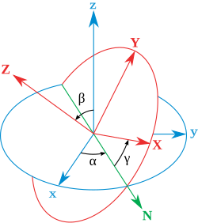
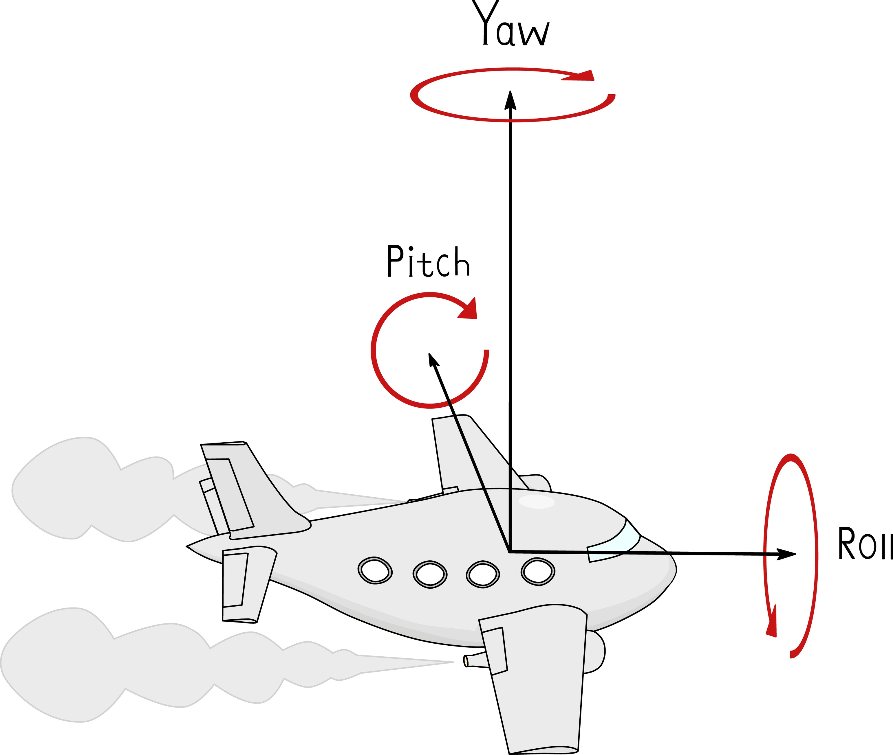
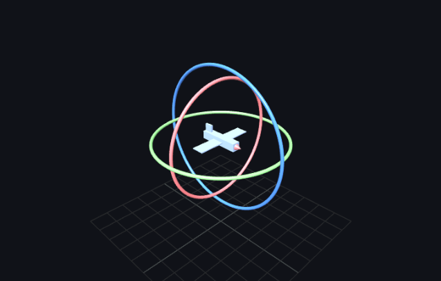
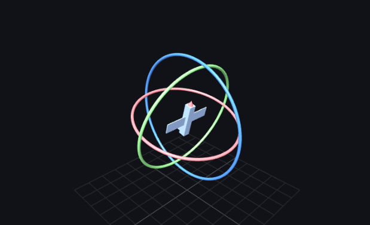
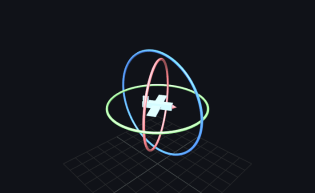
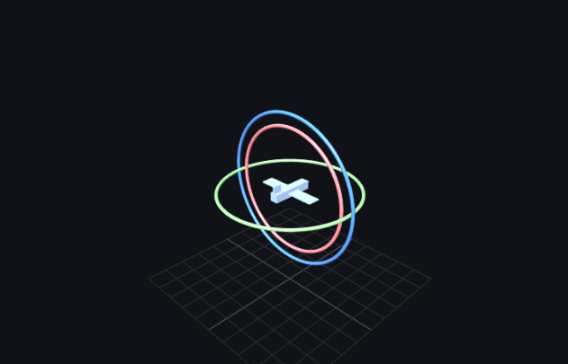

# 欧拉角

欧拉角是指用三个角度 $(\alpha,\beta,\gamma)$ 来表示物体在 3D 空间中的"朝向", "姿态" 或 "旋转". 

科学界并没有对欧拉角有一个严格的定义. 所以当使用 Euler Angles 时, 需要明确叙述三个角度的定义方式.

[维基百科](https://zh.wikipedia.org/wiki/%E6%AC%A7%E6%8B%89%E8%A7%92)中给出的一种定义如下 :

总而言之, 可以用三个角度值 $(\alpha, \beta, \gamma)$ 来确定物体自身坐标系, 与参考坐标系的位置差异.

图形学中, 最常用的欧拉角定义是 **Tait-Bryan 角**. 

从直观上理解 :

- $\alpha$ 表示物体自身坐标系绕 $x $ 轴旋转的角度 Pitch
- $\beta$ 表示物体自身坐标系绕 $y$ 轴旋转的角度 Yaw
- $\gamma$ 表示物体自身坐标系绕 $z$ 轴旋转的角度 Roll

绕坐标轴旋转变换的矩阵十分简单 :
$$
R_x(\alpha) = \begin{bmatrix} 1 & 0 & 0 \\ 0 & \cos\alpha & -\sin\alpha \\ 0 & \sin\alpha & \cos\alpha \end{bmatrix}

$$

$$
R_y(\beta) = \begin{bmatrix}
\cos\beta & 0 & \sin\beta \\
0 & 1 & 0 \\
-\sin\beta & 0 & \cos\beta
\end{bmatrix}
$$

$$
R_z(\gamma) = \begin{bmatrix}
\cos\gamma & -\sin\gamma & 0 \\
\sin\gamma & \cos\gamma & 0 \\
0 & 0 & 1
\end{bmatrix}
$$

我们可以通过上述三种旋转的复合, 来表示 3D 空间中朝任意一个方向的旋转. 

请注意, **矩阵乘法不满足交换律**. 而这里的旋转矩阵也没有交换律的良好性质. 所以旋转的先后次序会影响最终的旋转结果. 一种顺序的定义是 $Z$-$Y$-$X$ 式
$$
R = R_z(\gamma)R_y(\beta)R_{x}(\alpha)
$$
代入并展开 :
$$
R = \begin{bmatrix}
\cos\gamma\cos\beta & \cos\gamma\sin\beta\sin\alpha - \sin\gamma\cos\alpha & \cos\gamma\sin\beta\cos\alpha + \sin\gamma\sin\alpha \\
\sin\gamma\cos\beta & \sin\gamma\sin\beta\sin\alpha + \cos\gamma\cos\alpha & \sin\gamma\sin\beta\cos\alpha - \cos\gamma\sin\alpha \\
-\sin\beta & \cos\beta\sin\alpha & \cos\beta\cos\alpha
\end{bmatrix}
$$
这就是最终的旋转矩阵.

## 万向节死锁 Gimbal Lock

令上述矩阵 $R$ 中, $\beta = \pi/2$ :
$$
R = \begin{bmatrix}
0 & \cos\gamma\sin\alpha - \sin\gamma\cos\alpha & \cos\gamma\cos\alpha + \sin\gamma\sin\alpha \\
0 & \sin\gamma\sin\alpha + \cos\gamma\cos\alpha & \sin\gamma\cos\alpha - \cos\gamma\sin\alpha \\
-1 & 0 & 0
\end{bmatrix}
$$
变形 :
$$
R= \begin{bmatrix}
0 & \sin(\alpha-\gamma) & \cos(\alpha-\gamma) \\
0 & \cos(\alpha-\gamma) & -\sin(\alpha-\gamma) \\
-1 & 0 & 0
\end{bmatrix}
$$
注意到 :

- 矩阵的值仅与 $\alpha-\gamma$ 这个整体有关系. 只要 $\alpha - \gamma$ 是常数, 无论二者分别是多少, 最终旋转的效果都一样.
- 两个独立的变量现在融合到了同一个 $\alpha-\gamma$ 中.
- 此时, 绕 $x$ 和 $z$ 轴的旋转代表的是**同一个平面内的旋转**, 我们丢失了一个**旋转自由度**.

我们这样可视化上述过程 :

- 想象有一个**地球仪**, 外面分为三个环, 分别控制 $x$, $y$, $z$ 轴的转动.

- 根据 $R$ 中**旋转顺序**的定义方式来定义**外环, 中环, 内环**. 

  - 在 $Z$-$Y$-$X$ 顺序中, $Z$ 为外环 (蓝), $Y$ 为中环 (绿), $X$ 为内环 (红). **下图是标准情况** $\alpha = \beta = \gamma = 0$.

    

- 环与环之间会有某些影响 :

  1. **外环的旋转时, 中环和内环同步旋转** : 下图是 $(0,0, 75^\circ)$ 的位置. 可见中环与内环会同步旋转.

     

  2. **中环旋转时, 内环同步旋转**. 下图是 $(0, 30^\circ, 0)$ 的位置. 可见中环旋转时, 外环不动, 内环跟随旋转.

     

  3. **内环旋转不会影响其他两环**. 下图是 $(60^\circ, 0, 0)$ 的位置. 内环旋转时, 外环和中环都会跟随旋转.

     

- 而万向节死锁发生在 $(\alpha, \pm 90^\circ, \gamma)$. 

  - 位置如下

    

此时, 红环与蓝环所在的平面是重合的, 也就是说, 二者对于最终旋转 $R$ 的贡献都是绕同一个轴进行的.

这两个奇点, 是欧拉角最致命的缺点. 

工业中使用**四元数**来替代.

# 四元数

## 复数的推广

四元数是**复数在4D空间上的拓展**.

先看看复数 $\zeta = x + iy$ , 我们知道它能表示一个 2D 平面中的旋转. 因为 $i^2 = -1$ 的性质, $i$ 作乘法被解释为 2D 平面中旋转 $90^\circ$.

而欧拉角的定义启发了我们 : **3D 空间中的旋转可以用 $3$ 个相互正交的 2D 平面上的旋转来表示.**

由此, 我们定义包含 3 个复数的**四元数** :
$$
q = w + xi + yj + zk
$$
其中

- $x, y, z, w\in \R$.
- $i,j,k$ 是虚数单位, 满足以下关系 :
  - $i^2 = j^2 = k^2 = ijk = -1$.
  - $ij = k, jk = i, ki = j$
  - $ji = -k, kj = -i, ik = -j$.

也可以将其记为 $q = [w, \vec v]$, $\vec v = (x,y,z)$. 这是更常用的形式.

## 运算规则

想要在四元数的语境下讨论它与 3D 点坐标 $P(x,y,z)$ 的乘法, 需要先将 $P$ 映射为四元数.

方法与**齐次坐标**类似, 一个 3D 坐标 对应的四元数是 :
$$
p = 0 + xi + yj + zk = [0, \vec v]
$$
与 $0 + iy$ 被称为**纯虚数**一样, $p$ 也被称为**纯四元数**.

现在可以看看两个四元数 $q_1 = [w_1, \vec v_1], q_2 = [w_2, \vec v_2] $ 的乘法规则了. 这里不加推导给出 **Grassmann 乘积** 公式 :
$$
q_1q_2 = [w_1 w_2 - \vec{v}_1 \cdot \vec{v}_2, \quad w_1 \vec{v}_2 + w_2 \vec{v}_1 + \vec{v}_1 \times \vec{v}_2]
$$
注意第二项末尾的 $\vec v_1 \times \vec v_2$, 我们知道叉乘没有交换律, 这直接反映了**四元数乘法没有交换律.**

## 从虚数旋转到四元数旋转

在前文所述的运算规律下, 有以下重要的事实 :

- 对于任意的**三维单位向量** $\vec u$, 补 0 映射到四元数空间后 $[0, \vec u]$, 满足 $ [0, \vec u]^2 = -1$.

  证 : 由四元数 Grassmann 乘积公式, $[0, \vec u][0, \vec u] = [-\vec u \cdot \vec u, \vec u \times \vec u] = -\vec u \cdot \vec u + (\vec u\times \vec u )\cdot[i,j,k]^T $.

  由 $\vec u$ 是单位向量, $-\vec u \cdot \vec u = -1$.

  任何向量与自己作叉积都为 $\vec 0$. 综上得证. 

也就是说, 3D 单位向量 $\vec u$ 在四元数空间中, 满足 $\vec u ^ 2 = -1$ 这种类似**虚数**的性质. 

在代数操作上, **任意单位向量 $\vec u$ 都可以被当做是一个虚数单位来操作.** 对于 $i$ 成立的代数性质对于 $\vec u$ 也同样成立.

我们可以通过级数定义 $\mathrm e^{\vec u\theta}$, 并依此求得与欧拉公式相似的结论.

这里省略严格叙述. 直接以任意方向(单位向量) $\vec u = u_x i + u_yj + u_z k$ 代替上述 $i$, 代入欧拉公式 :
$$
\mathrm e^{\vec u\theta} = \cos\theta + \vec u \sin\theta
$$
得到四元数空间中的欧拉公式

- 左边 $\mathrm e^{\vec u \theta}$ 的语义为 : 绕 $\vec u$ 旋转 $\theta$ . ($\vec u$ 是旋转平面的法向量)
- 右边的 $\cos\theta + \vec u \sin\theta$ 就是一个四元数, 记为 $q' = [\cos\theta, \sin\theta\cdot \vec u]$

在2D复平面上, 我们表示绕 (隐含的) $z$ 轴旋转 $\theta$ 是通过左乘 $e^{i\theta}$ 来实现的. 

我们比较希望这个性质对于 $q' = \mathrm e^{\vec u\theta}$ 同样成立. 

也就是说, 对于任意向量 (纯四元数) $p = [0, \vec v]$,  $q'p$ 的结果**应该是一个向量(纯四元数), 且其含义就是绕 $\vec u$ 旋转 $\theta$ **.

但是计算后发现, 第一个条件无法保证. 上述结果的常数项不一定为 $0$. 
$$
qp = \left[ -\sin\theta (\mathbf{u} \cdot \mathbf{v}), \quad \cos\theta \mathbf{v} + \sin\theta (\mathbf{u} \times \mathbf{v}) \right]
$$
从中可以发现原因 :

- $\vec u \cdot \vec v$ 不一定为 $0$ $\iff $ 旋转轴 $\vec u$ 不一定与被旋转向量 $\vec v$ 垂直 $\iff $ $\vec v$ 不一定完全落在旋转平面中.

我们将 $\vec v$ 沿着 $\vec u$ 的方向正交分解为两部分  $\vec v = \vec{v}_{\parallel} + \vec{v}_{\perp}$. 

如果 $\vec{v}_{\parallel}$ 分量不为 $0$, 那么直接左乘 $q' = e^{\vec u \theta}$ 会使得其四元数的实数部分非零, 产生不期望的结果.

而对于平行于 $\vec u$ 的分量, "旋转"操作不应该对其产生任何动作.

所以我们放弃直接左乘的想法, 引入**共轭三明治操作**来解决上述问题.

## 共轭三明治操作

目标仍然为找到 $\vec v$ 绕轴 $\vec u$ 旋转 $\theta$ 角度的乘法公式.

- 注 : 本节的所有符号都表示**四元数**, 包括向量的符号 $\vec v, \vec u$.  它们应被视为纯四元数.

我们能不能将上一节中的 $q'$ 拆成两部分, $q_1 $ 和 $q_2$, 使得它们对 $\vec v_{\parallel}$ 的作用互相抵消, 对 $\vec v_{\perp}$ 的作用相互叠加? 

完全可以, 我们引入一步精妙的操作 :
$$
\vec v' = e^{\vec u \cdot \frac\theta2} \cdot \vec v \cdot e^{-\vec u \cdot \frac\theta2}
$$
这个操作完成了上面的两个任务 :

1. 作用于与 $\vec u$ 平行的向量 $\vec v$ 时, 在左右乘的相反作用下, 输出值 $\vec v' = \vec v$ 保持不变.
2. 作用于与 $\vec u$ 垂直的向量 $\vec v$ 时, $\vec v$ 落在旋转平面中, 利用**正交向量(纯四元数)乘法反交换性质(此处略)**, 右侧的 $\mathrm e^{-\vec u \frac\theta2}$ 使用欧拉公式展开, 并与 $\vec v$ 运算后会使得 $\vec u$ 前的负号抵消. 
   1. **左右乘操作都会完成绕 $\vec u$ 旋转 $\theta/2$ 的效果.** 
   2. 所以最终, $\vec v'$ 的结果就是由 $\vec v$ 绕 $\vec u$ 旋转 $\theta$ 得来的.
3. 任意向量 $\vec v$ 都可以分解为两部分, $ \vec v_{\parallel} + \vec v_{\perp}$, 根据**线性性**拆成两部分, 能分别按 1., 2. 中情形计算.

