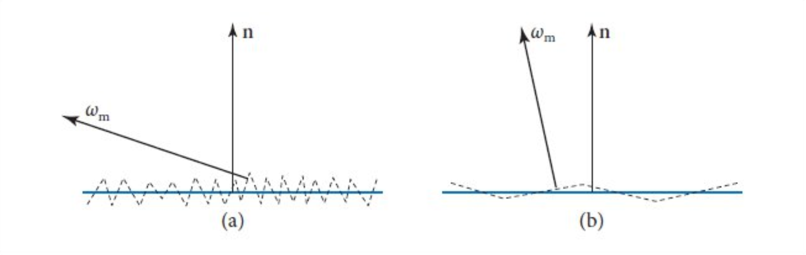
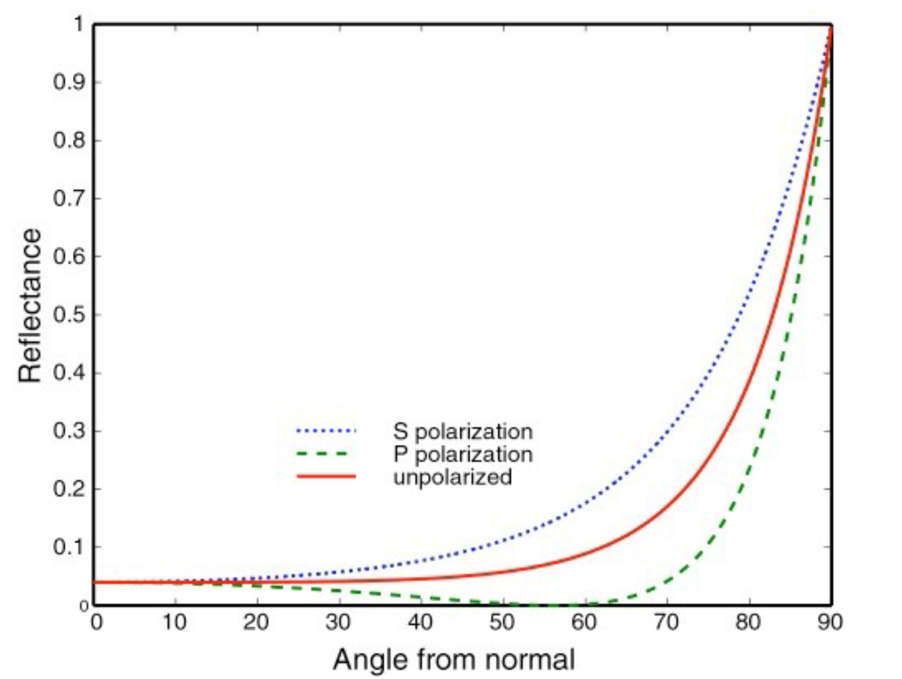
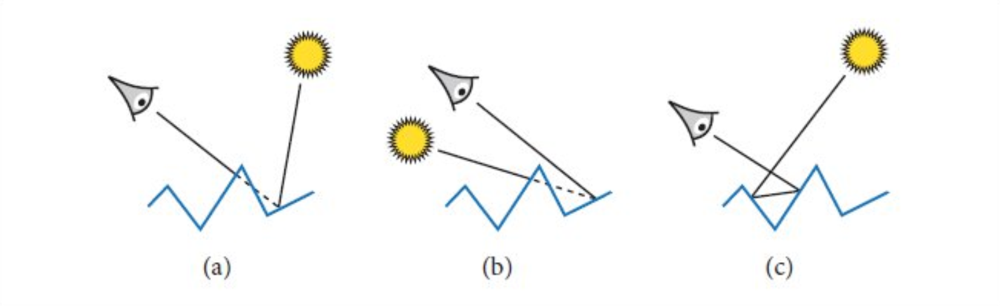
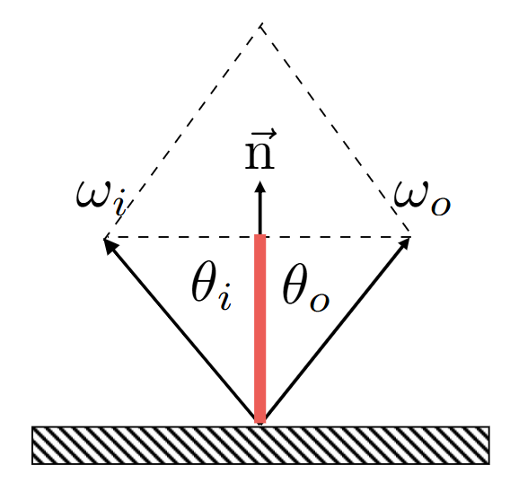
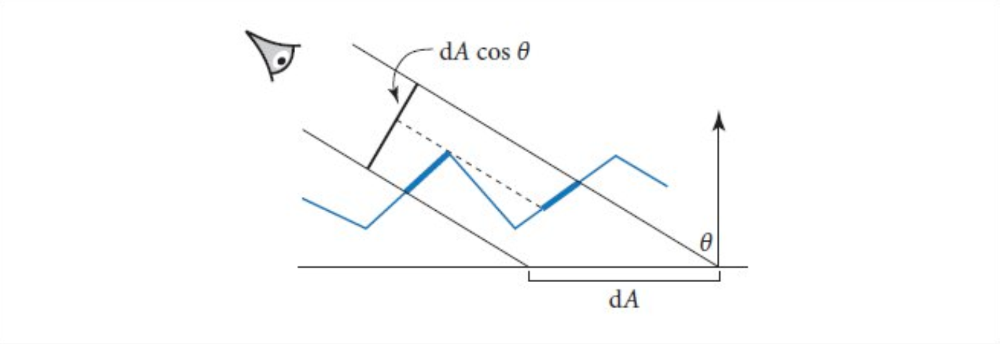

# Microfacet Theory

微表面模型是一种建模光线与物体作用的模型. 核心理论基于一个物理假设 : **“宏观表面是由无数微小的、朝向各异的平坦表面组成的。”** 每一条光线都打在一个极小的微观平面上, 并发生**镜面反射**.

- 这些微平面在宏观角度上十分小, 远小于一个像素的边长.
- 而微平面又远大于光的波长, 使得讨论范围不会涉及波动光学. 对于光线的建模仍然使用几何光学.

 我们可以利用 Microfacet Theory, 描述物体表面的 **粗糙度 (Roughness)** 属性. 如上图, 实线部分是物体的宏观实际模型平面 (Macrosurface), 例如由许多三角形所组成的一个网格体.  $\mathbf n$ 是物体表面上某个宏观平面的法向量. 

用常规的光线追踪算法, 着色点 $\mathbf p$ 及其附近会被渲染为十分光滑的平面, 但这种结果在现实中很难反映部分材质, 例如磨砂表面, 或者 glossy 材质. 而 Microfacet 理论将这种不光滑的性质建模, 以一个(或两个)参数 $\alpha$ ($\alpha_x, \alpha_y$) 控制物体表面的粗糙程度.

上图的虚线部分就是由很多个**微平面** (Microfacet) 相互连接起来的, 虚拟的**微表面** (Microsurface). 在物理假设中, 这些 Microfacet 全都符合镜面反射定律, 微平面的**法向量** (称为 Microfacet Normal) 记为 $\omega_m$. 

利用这个模型进行渲染方程的计算, **模拟所有的微平面与光线的交互是不切实际的**. 

1. 微平面的大小在 $\mu m$ 量级, 而普通的模型的计算是在 $m$ 量级进行的. 储存所有的微平面, 并考虑光线与每一个微平面的相交状况, 计算代价无法接受.

因此, 尝试转入统计学的视角. 我们不再细致地去量化考究微观上光线与 Microfacet 的作用, 而是通过一些观察, 用宏观的统计模型来建模微观行为. 

给定入射光 $\omega_i, \omega_o$, 着色点 $\mathbf p$, 设 Microfacet 理论的 BRDF 为

$$

f_r(\mathbf p, \omega_i, \omega_o)

$$

其大小描述的是入射光 $\omega_i$ 被散射到 $\omega_o$ 的概率. 而我们只需要宏观地研究这个概率会如何受到微平面的影响. 结果如下

$$

f_r(\mathbf p, \omega_i,\omega_o) = \frac{F(\omega_o, \omega_m)G(\omega_i,\omega_o)D(\omega_m)}{4 \cos\theta_i\cos\theta_o} \tag{*}

$$

各项的含义是

- $F()$ 是光线被反射的能量比例
- $G()$ 描述微平面的几何性质, 具体来说是**由于微平面的排几何分布, 而被遮挡(masking) / 阴影(shadowing)** 的光线比例.
  - masking 描述**视线看不见**的部分, shadowing 描述**视线能看见但光源看不见**的部分.
- $D()$ 是 $\omega_m$ 的**类**概率密度函数, 也称为**法线分布函数**.

----

一个十分重要的物理假设是**能量守恒定律**.

(*) 式中的 Fresnel 项 $F()$ 描述的是入射光有多少比例被反射到了出射光方向, 其余部分被吸收或是折射. 物理上有精确的公式, 而图形学中常用且效果较好的近似是 Schlick's approximation :

$$

R(\theta) = R_0 + (1-R_0)(1-\cos\theta)^5

$$

这个公式反映,  反射的比例仅由入射角 $\theta$ 决定, 入射角初始为 $90$ 度 (掠射) $R_0$, 随着 $\theta$ 接近 $0$ (垂直入射), 反射的比例会逐渐趋于 $1$.

公式中 $R_0$ 是基础反射率,  可以由物体本身的颜色 RGB 确定, 也可以自定义. 稍微改写一下符号, Fresnel 项可以确定为

$$

F(\omega_i,\omega_o) = F_0 + (1- F_0)(1- h\cdot \omega_i)^5

$$

----

Microfacet Nomal  $\omega_m$ 决定了微平面各部分的镜面反射规律, 它在宏观平面上的不同位置有不同的取值, 所以它是一个关于实际点 $\mathbf p$ 的函数 : $\omega_m(\mathbf p)$. 这个函数无法显示求得 (因为精确地模拟每一个微平面是不切实际的). 

对于给定的入射, 出射光方向 $\omega_i, \omega_o$, 根据镜面反射定律, 只有当光线打到的平面对应 $\omega_m$ 与 半程向量 $\mathbf h = \omega_i + \omega_o$ 的方向十分接近, 才有可能发生, 所以实际上, 对于一个宏观表面而言, 具体的 $\omega_m$ 的位置并不重要, 我们关心在宏观平面中**有多少比例的 Microfacet Nomal 的方向与 $\mathbf h$ 接近**. 

由于微平面之间有可能**互相遮挡**, 即使 $\omega_m$ 与 $h$ 接近, 不同的入射光线方向会导致一定比例的遮挡, 从而损失能量 (亮度降低). 如下图

假设某束入射角为 $\theta$ 的入射光 $\omega$ 打到宏观平面上 的**微面**为 $\mathrm dA$, (注意光打到面而不是点, 因为微表面模型认为入射光 $\omega_i$ 反射到不同的出射光 $\omega_o$ 方向是许多个微平面作用的结果.)

先考虑一种最简单的情况 : 垂直入射 ($\theta = 0$) 

注意到, 将宏平面 $\mathrm dA$ 中的点**沿着入射方向 $\omega$ 投影到微平面**上时, 有以下积分关系 :

$$

\int_{\mathrm dA}\mathrm d\mathbf p = \int_{\mathrm dA_m}\omega \cdot \omega_m(\mathbf p) \mathrm d\mathbf p 

$$

这正是 Lambertian Cosine Law + 能量守恒定律的体现. 对于角度为 $\theta' = \arccos (\omega\cdot\omega_m)$ 微平面, 它只会吸收 $\cos\theta'$ 比例的能量. 

将上式积分改写为对 $\omega_m$ 积分,  并且将积分归一化, 得到 

$$

\int_{H^2(\mathbf n)} D(\omega_m)(\omega_m\cdot \omega) \mathrm d\omega_m = 1 \tag{2}

$$

这就引出了第一个重要的概念 : **法线分布函数 Nomal Distribution Function, NDF**, 即上式中的 $D(\omega_m)$. 不要被名称混淆, 在统计学上它的类似于 $\omega_m$ 的**概率密度函数 PDF**,  它描述了法向量取值为 $\omega_m$ 的密集程度. 

而 NDF 不是严格的 PDF 的原因也在上面的积分式给出了 : $\int D(\omega_n) \mathrm d\omega_m \neq 1$.

一个常用的法线分布函数可以用两个参数 $\alpha_x, \alpha_y$ 去描绘物体表面的粗糙度.

$$

D(\omega_m) = \frac1{\pi\alpha_x\alpha_y\cos^4\theta_m \left( 1 + \tan^2\theta_m\left( \frac{\cos^2\phi_m}{\alpha_x^2} + \frac{\sin^2\phi_m}{\alpha_y^2} \right) \right)}

$$

若是物体是各向同性, 可以设 $\alpha = \alpha_x = \alpha_y$.

> 上式积分域 $H^2(\mathbf n)$ 是指满足 $\mathbf n \cdot \omega_m \geq 0$ 的方向集合.

现在回到一般的入射角 $\theta$. 根据余弦定律, 

图中可以观察到, Microfacet 上, 沿着 $\omega$ 方向的投影面积为 $\mathrm dA\cos\theta$. 可以观察到三个事实 :

1. 部分微平面**背向(backfacing)入射光** (例如上图与左侧蓝色加粗线右端点相连的那一段), 使得它们不可能被入射光照到. 背光的条件为 $\omega \cdot \omega_m < 0$.  
2. 部分微平面**正向入射光, 但是被其他微平面遮挡**. 
3. 去掉上面两部分法向量的积分贡献, $(2)$ 式左侧的积分值应该没有变化, 这说明**满足上面两个条件的 $\omega_m$ 在积分结果上是互相抵消的.** 

综上3点, 改写 $(2)$ 式.

- 用 $max(0,\omega\cdot\omega_m)$ 过滤掉第一种情况.
- 此时$(2)$ 式左侧积分值显然大于 $\cos\theta$. 但由于无法细致深入到所有微平面的几何分布,  宏观上直接使用 $G_1(\omega,\omega_m)$ 来描述方向为 $\omega_m$ 的微平面被其他微平面遮挡的**比例**.  $G_1()$ 应当使得 $(2)$ 式的积分值不变.

结果为 : 

$$

\int_{H^2(\mathbf n)}D(\omega_m)G_1(\omega,\omega_m) \max(0, \omega\cdot \omega_m) \mathrm d\omega_m =\cos\theta= \omega\cdot \mathbf n \tag{3}

$$

上式理论上可以解出 $G_1(\omega, \omega_m)$, 但是严格的计算必然会导致巨大的开销. 因此我们会进行以下近似 : 

1. **Smith approximation** : $G_1$ 与 $\omega_m$ 在统计学意义上独立. 即微平面的法线方向与 masking 比例独立.

   此时我们可以变形 : 

   $$

   G_1(\omega)\int_{H^2(\mathbf n)}D(\omega_m)\max(0, \omega\cdot \omega_m) \mathrm d\omega_m = \cos\theta

   $$

   从而解出 $G_1(\omega)$ 的表达式. 这种近似方法对于常见的 $D(\omega_m)$ 选择能得到解析解.

2. 引入辅助函数 $\Lambda(\omega)$, 并令 $G_1(\omega) = 1/(1+\Lambda(\omega))$. 在 各向同性的 Trowbridge–Reitz  格式的法线分布函数中, 可以解出

   $$

   \Lambda(\omega) = \frac{\sqrt{1+\alpha^2\tan^2\theta} - 1}{2}

   $$

   其中 $\alpha$ 表示各向同性材质的表面粗糙度. 各项异性的情况可以按以下公式计算出 $\alpha$ :

   $$

   \alpha = \sqrt{\alpha_x^2\cos^2\phi + \alpha_y^2\sin^2\phi }.

   $$

前面提到, 除了 masking, 还有 shadowing 部分需要解决. $G_1$ 是 masking function. 而补充 shadowing 的部分后, 以 $G$ 记录 masking-shadowing function.

masking 可以视为 **出射光线没看到**, shadowing 可以视为**入射光线没看到**.

所以一个简单的直觉, 如果上面两部分是统计学上独立的, 可以猜测有以下形式 :

$$

G(\omega_i, \omega_o) = G_1(\omega_i)G_1(\omega_o)

$$

这种假设在理论推导中比较合理, 但是在实际应用中, 存在**过度估计masking和shadowing的比例**, 导致画面过暗. 所以应用时我们换为另一种较为缓和的形式 :

$$

G(\omega_i, \omega_o) = \frac{1}{1 + \Lambda(\omega_o) + \Lambda(\omega_i)}

$$

## BRDF

前面所述的这个模型怎么联系到我们的渲染方程? 本节叙述的是 Microfacet 材质的 BRDF 的表达式由来.

渲染方程的 MonteCarlo Estimator 如下

$$

L_o(\mathbf p, \omega_o) \approx \frac{f_r(\mathbf p, \omega_o, \omega_i)L_i(\mathbf p, \omega_i)|\cos\theta_i|}{p(\omega_i)}

$$

其中

- $f_r$ 是未知的 Microfacet 模型的 BRDF
- $p(\omega_i)$ 是 $\omega_i$ 的概率密度. 需要注意, 给定 $\omega_o$ 后, 由于存在关系 : $\omega_m = (\omega_i + \omega_o) / \|\omega_i + \omega_o \| $, 而 $\omega_m$ 的密度函数与 $D(\omega_m)$ 正比, 通过变量替换, $p(\omega_i)$ 的密度是**可以计算出来的. **

根据前文所述微表面模型, 我们的出射光应该满足

$$

L_o(\mathbf p, \omega_o) = F(\omega_o \cdot \omega_m)G_1(\omega_i)L_i(\mathbf p, \omega_i)

$$

- $F$ 是菲涅尔项, 是基于**能量守恒**得到的光线剩余比例.
- $G_1(\omega_i)$ 描述的是**入射光线可见**的部分. 乘这一项后相当于将**入射光不可见**的部分排除了.
- 最后根据能量守恒, 入射与出射相等.

于是我们有

$$

\frac{f_r(\mathbf p, \omega_o, \omega_i)L_i(\mathbf p, \omega_i)|\cos\theta_i|}{p(\omega_i)} = F(\omega_o \cdot \omega_m)G_1(\omega_i)L_i(\mathbf p, \omega_i)

$$

得

$$

f_r(\mathbf p, \omega_o, \omega_i) = \frac{D_{\omega_o}(\omega_m) F(\omega_m \cdot \omega_m)G_1(\omega_i)}{4(\omega_o\cdot \omega_m)|\cos\theta_i|}

$$

其中 $D_{\omega_o}(\omega_m)$ 是法线分布函数 $D(\omega_m)$ 根据前述积分 :

$$

\int_{H^2(\mathbf n)}D(\omega_m)G_1(\omega) \max(0, \omega\cdot \omega_m) \mathrm d\omega_m =\cos\theta

$$

进行归一化后的结果 :

$$

D_{\omega}(\omega_m) = D(\omega_m) \cdot \frac{G_1(\omega)}{\cos\theta}\cdot \max(0, \omega\cdot \omega_m)

$$

这样就有 $D_{\omega_o}(\omega_m)$ 在整个半球上积分为 1, 它是真正的**概率密度函数**, 且与 $D(\omega_m)$ 成正比.

将上述定义代入 $f_r$ 就有

$$

f_r(\mathbf p, \omega_o, \omega_i) = \frac{D(\omega_m) F(\omega_m \cdot \omega_m)G_1(\omega_o)G_1(\omega_i)}{4\cos\theta_i\cos\theta_o} = \frac{D(\omega_m) F(\omega_m \cdot \omega_m)G(\omega_o, \omega_i)}{4\cos\theta_i\cos\theta_o}

$$

这就推导出了 BRDF 的 $f_r$ 公式. 

当 $D(\omega_m)$ 取某个解析形式时, 公式中的各部分都可以计算.

----

# Microfacet  BRDF

完整的 BRDF 包含

$$

f_r(v, l) = k_d f_{diffuse} + k_s f_{specular}

$$

记得 Fresnel 项吗, 它描述的是光线被**镜面反射**的比例

## Specular BRDF

这就是著名的 Cook-Torrance 公式所描述的部分 :

$$

f_{specular}(w_o, w_i) = \frac{D(h) F(w_o,h) G(l, w_o, h)}{4 (n \cdot w_i) (n \cdot w_o)}

$$

其中

- $w_o$ : 视线方向
- $w_i$ : 入射光方向.
- $h = (w_o + w_i) / \|w_o + w_i \|$ : 半角向量. 
- $n$ : 着色点宏观法线

上述公式仅是一个框架. 其中各项我们取业界常用的 GGX 体系.

1. GGX NDF : 

   $$

   D(h) = \frac{\alpha^2}{\pi ((n\cdot h)^2(\alpha^2-1)+1)^2}

   $$

   其中的 $\alpha$ 为粗糙度的平方 $roughness^2$.

   注意上式中的点乘需要限制 : 当 $n$ 与 $h$ 逆向时是不可能发生镜面反射的.

2. Fresnel-Schlick 近似 :

   $$

   F(w_o, h) = F_0 + (1-F_0)(1-(w_0 \cdot h))^5

   $$

   一种材质需要规定 $F_0$ : 基础反射率. 金属材质会取金属本身的颜色 (Albedo), 非金属会取较小值.

3. Height-Correlated Smith GGX :

   $$

   G(w_i, w_o, h) = \frac{2(n\cdot w_i)(n \cdot w_o)}{(n \cdot w_i)\sqrt{\alpha^2 + (1-\alpha^2)(n \cdot w_o)^2} + (n \cdot w_o)\sqrt{\alpha^2 + (1-\alpha^2)(n\cdot w_i)}}

   $$

   该形式的 $G$ 代入 Cook-Torrance BRDF 以后, 可以与分母一同抵消为

   $$

   V(w_i, w_o, h) = \frac{G_{correlated}}{4 (n \cdot w_i) (n \cdot w_o)} = \frac{0.5}{(n \cdot w_i)\sqrt{\alpha^2 + (1-\alpha^2)(n \cdot w_o)^2} + (n \cdot w_o)\sqrt{\alpha^2 + (1-\alpha^2)(n \cdot w_i)^2}}

   $$

   同时, Cook-Torrance BRDF 也就简化为 :

   $$

   f_{specular} = D(h) \cdot F(w_o, h) \cdot V(w_i, w_o, h)

   $$

   这也是材质接口中 `eval()` 的参考计算方法.

## Specular : Importance Sampling

本节原理对应材质接口中的 `sample()`.

渲染方程中, 积分变量为 $\mathrm dw_i$. 

在给定了视线方向 $w_o$ 后, $h$ 与 $w_i$ 是一一对应的. 

由

$$

h = \frac{w_o + w_i}{\| w_o + w_i\|}

$$

可以反解

$$

w_i = 2 (w_o \cdot h) h - w_o

$$

所以对 $w_i$ 的采样, 只需要利用上述关系转为对 $h$ 采样 (积分) 即可. 

首先, 不能简单地认为 :

$$

dw_i = 2(w_o \cdot h) dh

$$

因为 $w_i$ 和 $h$ 都是三维向量 (或立体角). 在其上的微分运算并没有一维变量的微分那样良好的性质.

为了表达便捷, 我们设 $w_o$ 指向局部坐标系的 $z$ 轴正方向. 并记 $\theta_h$ 是 $h$ 与 $w_o$ 的夹角. $\theta_i$ 同理. 

这种假设下, 显然有 $\psi_h = \psi_i$.

则

$$

dw_i = \sin\theta_i d\theta_i d\psi_i,\quad dh = \sin \theta_h d\theta_h d\psi_h

$$

然后, 根据 $w_i$ 和 $h$ 的关系, 有 $\theta_i = 2\theta_h$. 因而

$$

dw_i = \sin 2\theta_h \cdot 2 d\theta_h d \psi_h = 4\cos\theta_h \sin\theta_h d\theta_h d\psi_h = 4\cos\theta_h dh = 4(w_o \cdot h) dh

$$

再根据概率测度的恒等 : $p_i(w_i) dw_i = p_h(h) dh$, 有

$$

p_i(w_i) = \frac {p_h(h)}{4(w_o \cdot h) }

$$

要获得 $p_h(h)$, 显然可以通过 $D(h)$ 项. 它是描述半角向量 $h$ 的分布函数. 它在归一化后可视为 $h$ 的概率密度函数, 天然描述了高光反射的趋向性. 

根据 $D(h)$ 的定义, 它满足以下恒等式 :

$$

\int D(h) (n \cdot h) \mathrm dh = 1

$$

这也是它为什么不是概率密度的原因. 令

$$

p_h(h) = D(h) (n\cdot h)

$$

这就是 $h$ 的概率密度. 因而

$$

p(w_i) = \frac{D(h)(n\cdot h)}{4(w_o\cdot h)}

$$

将这些公式全部代入 Cook-Torrance 模型的 MonteCarlo 估计量 (这里省略了 $L_i$ 表示权重) :

$$

\hat W = \frac{F(w_o, h)G(w_i, w_o) D(h)\cdot (n \cdot w_i)}{4(n \cdot w_i)(n \cdot w_o)} / p(w_i)

$$

可得

$$

\hat W = \frac{F(w_o, h)G(w_i, w_o) (w_o \cdot h)}{(n\cdot w_o)(n \cdot h)}

$$

注意到 $D(h)$ 被消去了.

