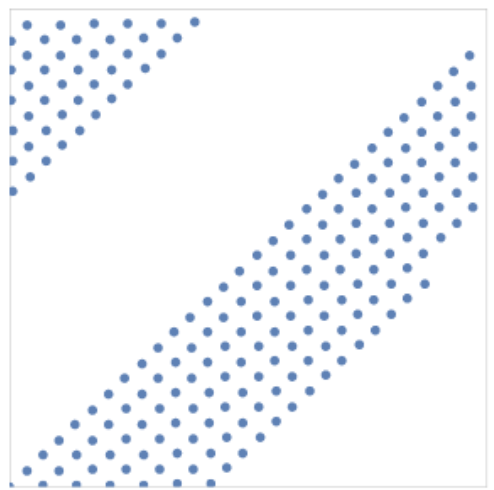

# Sobol 序列 及其使用

背景 : Monte Carlo 积分使用随机采样会导致方差较大. 所以一种替代方案是使用 Low Discrepancy 序列来替代随机数.

**低差异性 Low Discrepancy** : 是一种对采样结果的测度, **差异性越低的采样点分布相对均匀.** 具体定义可以上网查. 下文只研究具有 Low Discrepancy 的序列及其生成方法.

## 1. Van der Corput 序列

首先介绍一种运算 **Radical Inverse**, 下面的许多方法都要使用这个运算.

Radical Inverse 有很多种, 先看最简单的一种能达到什么效果. 

对于任意的整数 $i$, 设其二进制表示为 $i = b_kb_{k-1}\cdots b_1b_0$. 

记 $\Phi_2(i)$ 为**将 $i$ 的二进制串关于小数点进行翻转得到的$[0,1)$小数**.

- $i = 100110 \to \Phi_2(i) = 0.011001$;
- $i = 111000 \to \Phi_2(i) = 0.000111$.

此时再看序列 $(\Phi_2(1), \Phi_2(2), \cdots)$. 转换为十进制分数就是 $(0.5, 0.25, 0.75, \cdots)$. 这样生成下去, 每一个点都会落在当前区间最"空旷"的位置. 这就是一个简单的 **Van der Corput** 序列.

上述 $\Phi_2(i)$ 中是一个特殊的 Radical Inverse, 其一般形式是 $\Phi_b(a)$ , 含义是将 $a$ 的 $b$ 进制序列反转. 以任意 $b$ 基底生成出来的序列都是具有**低差异性**的.

## 2. Halton 序列

Van der Corput 序列的生成方法只能生成 1 维的序列, 若要生成 $n$ 维序列 $\{\vec v_n\}$, 可以使用不同的**互素基底** :
$$
\vec x_n = (\Phi_2(n), \Phi_3(n),\cdots, \Phi_{p_k}(n))
$$
这样的序列就是 **$k$ 维 Halton 序列**. 这种序列同样可以生成无限多个采样点个数.

注意当**基数较大**时 (例如 $p_k = 29$), 而**采样点个数又比较少的情况**时, 会导致比较严重的采样点聚集现象.

- 想象一个 29 进制的数需要 29 个采样点 才能走完一次 $[0,1)$.
- 下图是 $(\Phi_{29}(a), \Phi_{31}(a))$ 序列的二维分布.

一种解决方案是 **Scrambling**, 即**重映射** :
$$
0.d_1d_2d_3\cdots \mapsto 0.P(d_1)P(d_2)P(d_3)\cdots
$$
其中 $P(a)$ 表示一个 置换 **Permutation**. 以底为 $3$ 为例, $d_i$ 可能出现 $[0..2]$. 则可以定义一个 $[0..2]\mapsto[0..2]$ 的双射 $P(\cdot)$, 规则为
$$
0\mapsto 1\\
1\mapsto 2\\
2\mapsto 0
$$
可以简写为 $[1,2,0]$. 

## 3. Hammersly 序列

如果知道采样点个数为 $N$, 那么对上述 Halton 序列稍加改进就得到 **Hammersly** 序列.
$$
\vec x_a = \left( \frac aN, \Phi_{b_1}(a), \Phi_{b_2}(a), \cdots,\Phi_{b_n}(a) \right)
$$
**Hammersly 相比 Halton 会更加均匀**. 实践中也常使用.

- 说严谨点, 是 Discrepancy 测度下降得更快.

## 4. Sobol 序列

我们更希望 Radical Inversion 的底为 $2$, 以便于我们能让 CPU 使用位运算等高效的计算方法. 但是上述序列在更多维度上使用非 2 底的 Radical Inversion. 使得它们没办法通过计算机的位运算提高整体效率.

Sobol 序列的**每一个维度**, 都是使用的 以 2 为底的 Radical Inversion.

而为了保证 Low Discrepancy 性质, **每一个维度**都额外需要一个生成矩阵 $C_j$. 即 $\Phi_b(a)$ 将要扩充为 $\Phi_{b, C_j}(a)$. 称前一种是**标准形式的 Radical Inversion**.

设 正整数 $a$ 的 $b$ 进制序列是 $d_kd_{k-1}\cdots d_1$. 显然有 $d_i \in \{0,1,\cdots, b-1\}, i\geq 1$.

标准形式的 Radical Inversion 运算可以写成以下向量形式 :
$$
\Phi_b(a) = \begin{bmatrix}b^{-1} & b^{-2} & \cdots & b^{-k} \end{bmatrix} \cdot \begin{bmatrix} d_1(a) \\ d_2(a) \\ \vdots \\ d_k(a) \end{bmatrix}
$$
现在加上 $k\times k$ 生成矩阵 $C_j$ . 
$$
\Phi_{b, C_j}(a) = \begin{bmatrix}b^{-1} & b^{-2} & \cdots & b^{-k} \end{bmatrix}  C_j \begin{bmatrix} d_1(a) \\ d_2(a) \\ \vdots \\ d_k(a) \end{bmatrix}
$$
注意 :

- $C_j$ 的元素都落在 $[0..b-1]$ 中.
- 上面的运算都是在 $\mathbb Z_b$ 这个==**环**== 中的. 即所有运算都可以视为在模 $b$ 情况下进行.
- 当 $C_j$ 是单位矩阵时, 就是前面所讲过的标准 Radical Inversion.

考虑到高性能计算, 总是设 $b = 2$. 设 $k$ 为 C++ 中常见的 $32$  (4B).

因为 $C_j$ 的元素要么是 $0$ 或 $1$, ==**可以将 $C_j$ 的每一列都压缩到一个 $k$ 位二进制数去存储.**== 这个数称为**方向整数**. Direct Number
$$
C_j = \begin{bmatrix} m_1 & m_2 & \cdots & m_k \end{bmatrix}
$$
Remark :

- 为什么要**按列压缩**? 看看非标准形式的 Radical Inversion 公式. 前面的向量中所有 $b^{-i}$ 都是固定的, 只影响bit的位置. 我们只需要计算下面这个线性变换 :
  $$
  \begin{bmatrix} c_{11} & \cdots & c_{1k} \\ \vdots & \ddots & \vdots \\ c_{k1} &  \cdots & c_{kk} \end{bmatrix} \cdot \begin{bmatrix} d_1(a)\\ \vdots \\ d_k(a)\end{bmatrix} = d_1(a) m_1 + d_2(a) m_2 + \cdots + d_k(a) m_k
  $$
  其中 $m_i = (c_{1i}, c_{2i}, \cdots c_{ki})^T$. 这样写出来以后, $d_i(a)$ 为 $0$ 的项就直接为 $0$, $d_i(a) = 1$ 则只需要直接将 对应的 $m_i$ 求和即可. 所以上式也等同于
  $$
  = \sum_{i : d_i(a) = 1} m_i
  $$

- **重点注意 :**  $m_i$ 是由 32 位 0-1 向量压缩而来的. 考虑一个 3 位的例子,  $101 + 101$ 应该是 $[1,0,1] +_2 [1,0,1] = [0, 0, 0]$, 结果为 $000$.

  - 这**并不是二进制加法**(结果为 $010$). 而是**逐位异或**. 所以稍作修改, 得到
    $$
    上式 = d_1(a) m_1 \oplus d_2(a) m_2 \oplus \cdots \oplus d_k(a) m_k
    $$

总而言之, $C_j \cdot [d_1(a) , d_2(a), \cdots , d_k(a)]^T$ 所有 满足 $d_i = 1$  的 $m_i$ 的异或求和. 这在 C++ 中十分高效.

如何得到 $C_j$ 使得 Sobol 序列保持 Low-Discrepancy 就不在这里介绍了. 

网上可以找到现有的生成矩阵.

----

Sobol 序列由两个维度构成. 记为 $\{\vec x^{(n)}\}$ 

每一个元素的记号如下 :

- $x_j^{(n)}$ : Sobol 序列中的第 $n$ 个 高维向量 (点) 的第 $j$ 个**维度Dimension / 元素Entry**.

Sobol 序列的生成过程可以写为
$$
x^{(n)}_j = \Phi_2(C_j \cdot n)
$$
上面的 $C_j \cdot n$ 实际运算过程按照前面所述进行. 即 $j$ 写为二进制, $C_j$ 写为 Direct Number 向量, 然后进行 $\mathbb Z_2$ 上的线性运算 (加法为按位异或, 乘法为按位与).

Remark : 请特别注意 **Low-Discrepancy 是关于整个 Sobol 序列的, 即 $x_{j}^{(n)}$ 的 $n$**. 

-  $\vec x^{(1)}$ 只是高维空间的一个点.  
- 只有看多个"点"时, 才有"均匀/不均匀", "低差异性" 的说法.

