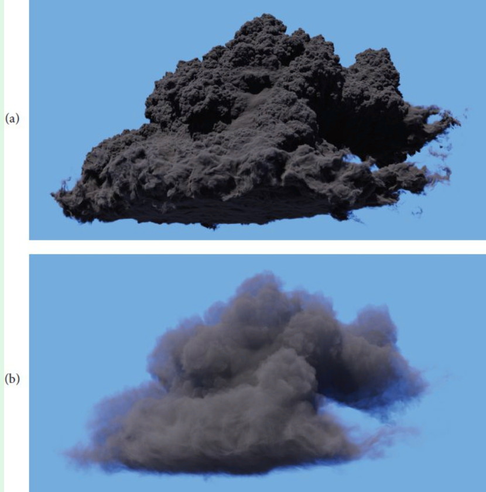
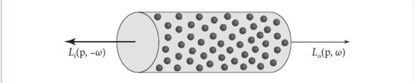

# 11. Volume Scattering

参考 : PBRT - Chapter 11

经典的渲染方程假设整个场景由__表面__构成, 光线在表面与表面之间传播. 这种假设并不能很好的模拟现实中的以下情景 :

- Fog and smoke
- scatter light

体渲染的假设光线会与 participating media (参与介质) 进行交互 (散射等), 而 participating media 是一块 3D 区域, 其中__充满了许多粒子 particles__.

----

## 11.1 Volume Scatering

参与介质 对光线的作用包括三个部分 :

1. **Absorption 吸收** : 光线的 Radiance 被介质削减, 光能被转换为了另一种能量 (例如热能)
2. **Emission 辐射** : 光线的 Radiance 会因为介质/环境中的__发光粒子 luminous particles__  的补充而增加
3. **Scattering 散射** : 光线与介质中的粒子碰撞, 产生了**方向偏移**.

上述性质可能**随空间位置变化而变化**.

- 若上面的性质在某些区域介质中是恒定不变的, 就称为__Homogeneous properties__.
- 否则就是 __Inhomogeneous properties.__

上述性质可能随着__射入光线的波长不同而不同__. 这里先按下不表.

Absorption 和 Scattering 是一个概率性过程. 从物理微观上看, 一个光子与粒子碰撞的过程是随机发生的, 吸收与散射都有可能发生. 但是我们统称这些事件为__Scattering Event__. 也就是说, 当考虑一个光子在某处与粒子发生 Scattering Event 时, 即可能是光线被扭转方向, 也可能是光线被部分吸收.

同时, 本章的所有模型基于一个重要假设 : __粒子与粒子之间的位置不相关 uncorrelated__.  注 : 粒子的密度仍可能是关于空间变化的.

> 这个假设并不总是正确. 例如两个粒子实际上不应该在同一个位置出现, 而在上述假设下可能出现.

### 11.1.1 Absorption

想象火焰燃烧时发出的黑烟, 若黑烟很浓, 则我们很难看清黑烟背后的物体. 

其核心原因是黑烟的 Absorption 性质十分强, 光线穿过这种介质时大部分都被吸收了.

一个介质的 Absorption 能力, 由 __absorption coefficient__ $\sigma_a$ 决定.

$\sigma_a$ 类似于__概率密度__, 描述的是__光线每穿过1单位长度, 其 Radiance 未被吸收的比例__. 但它不必在 $0$ 到 $1$ 之间取值.

$\sigma_a$ 这通常与光的波长相关, 但是本章不讨论这一特点.

综上,  $\sigma_a$ 被描述为 $\sigma_a(p, \omega)$. 其中

- $p$ 是介质位置
- $\omega$ 是光线入射方向.

----

现在考虑介质中一个充满 Absorping Particles 的微圆柱体 :

那么一个入射 Radiance $L_i(p, -\omega)$ 与出射 Radiance $L_o(p, \omega)$ 的关系按照这个方法描述 : 

