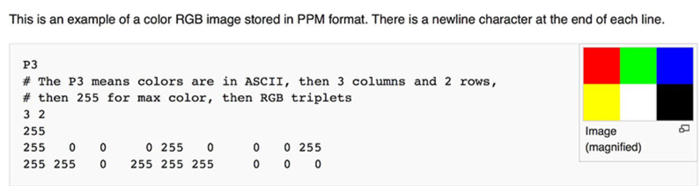
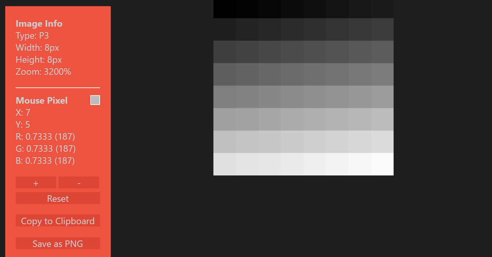

# PPM 格式文件

[参考教程](https://blog.csdn.net/qq_38350702/article/details/123215310)

PPM 通过 RGB 三种颜色显现图像, 也称为__pixmap__.

另外两个类似的文件是 PGM, PBM. 

这些文件开头都通过__2个字节__ (Magic number) 表明

- __文件格式类型__ (PGM / PBM / PPM)
- __编码方式__ (P1, P2, P3, P4, P5, P6)

其中, P3 和 P6 指明的是 PPM 格式文件, 前者的编码方式是 ASCII, 适合人类阅读. 后者的编码方式是二进制 binary, 占用的存储空间更少.

----

一个 PPM 格式的文件的头部分为 3 行

1. P3 / P6 
2. 图像的宽度`width`和高度`height`.
3. 最大像素值, 常用 255. 可以取 0 ~ 255 的值.

随后的 width*height 行用来指明每个像素的 RGB 值. (图片中为了方便展示RGB向量与右侧图片的位置关系, 没有全部换行.)

----

WSL2 + Vscode 开发环境下查看 PPM 文件, 需要安装扩展插件

1. __PBM/PPM/PGM Viewer for Visual Studio Code__

然后打开 .ppm 文件就可以显示图像了

可以将图片存为 PNG 或者查看各个像素值.