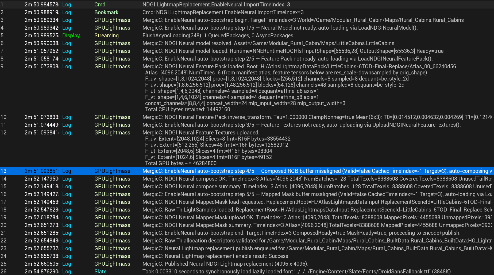
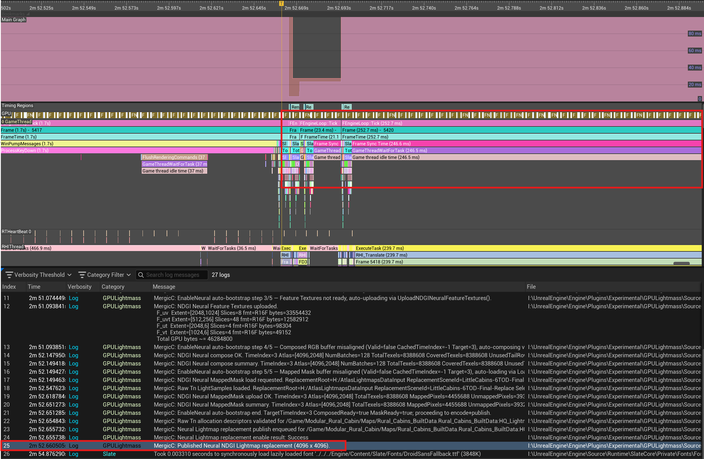
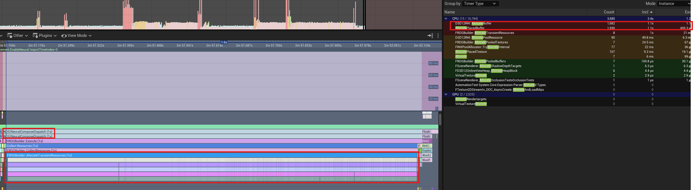
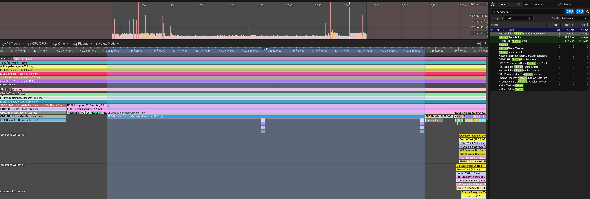
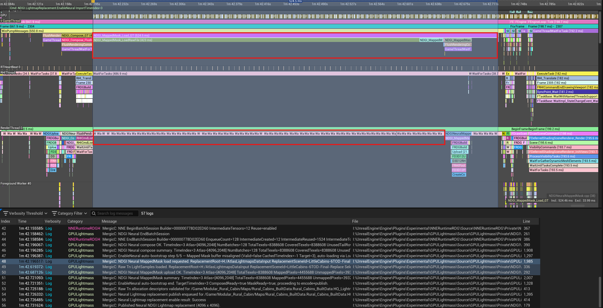
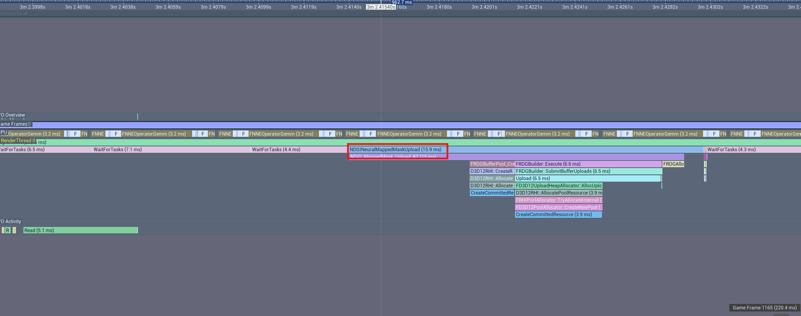
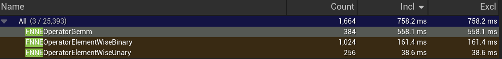
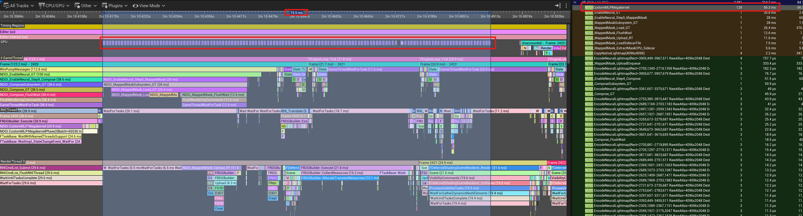

# NDGI 性能分析与优化

工具 : Trace + Unreal Insight

分别在两种场景下进行了测试 : 

- HomeInterior : 小场景, 单 Atlas (2048 * 1024)
- RuralCabins : 大场景, 通过覆写 LightmapRes 压缩至 单 Atlas (4096 * 2048, 已是非VT下最大尺寸)

测试操作 :

- ConsoleCommand : `NDGI.Replacement.EnableNeural` ; 该命令在默认情况下会执行所有步骤. 分别有 5 步 :
  1. IO 读 ONNX 文件 + 上传 GPU
  2. IO 读 Feature Pack, 解析
  3. 上传 Feature 纹理到 GPU
  4. 执行 MLP 推理, 还原完整 Lightmap
  5. IO 读 MappedMask 数据去除无效像素

最初的一版 EnableNeural 代码, 在 HomeInterior 场景下, 可以做到几乎无缝切换 Lightmap. 

但是在 RuralCabins 中, EnableNeural 带来了接近 2 ~ 3 s 的卡顿才切换成功. 所以下面的分析与优化主要在 RuralCabins 中进行, HomeInterior 作辅助验证对比.

## 日志分析 

> 0813_114016

首先看日志中, NDGI 各部分的用时消耗 :

在日志记录的这两秒内, 主要有两个操作占用了大部分时间 : 

- MLP 推理 Compose 的 Buffer 准备工作 (Step 4)
- 以及 NeuralMappedMask 加载.

以及, 在时序分析图中, 将日志记录25 Published 的时间点标出后 :

可见,  日志输出并不意味着 Publish 完成, GPU Track 上仍在运行 FNNEOp* 的 MLP 推理计算. 

在 GPU 完成 MLP 并将结果写回 Output Buffer 之前, CPU 会继续异步运行, 完成 MappedMask 等内容的准备和计算, 直到 UE 在渲染下一帧, 发现 Replacement 发布并试图采样 Output Buffer 时, 阻塞等待 GPU, 造成了用户感知的卡顿.

## 优化点 1 : 1 ModelInstance with multi-EnqueueRDG()

回看第一个卡顿点 : Compose 阶段. 

观察时序图, 发现有一个明显占用了很长时间的 `NDGINeuralComposeDispatch` 事件.

注意到, `FRDGBuilder::AllocateTransientResources` 这一步是 RDG 为 MLP 计算准备 Buffer, 而这个过程占用了整整 1s. 

同时也看到下方有密集的  Allocate Placed Buffer 底层调用.  右侧 Timer 显示 有几乎 1682 次 D3D12H 的分配调用, 整整占满了 1.1s . (多出了 0.1s 可能是选中区域比 Allocate 的范围要大)

由此, 回到源码上发现 : 由于一张 4096 * 2048 的 Atlas 会被分别打包为多个 128 * 128 的 batch,  而一个 NDGI 的 MLP Decoder, 被打包为 ModelInstance 对象后, 每一个 batch 都会执行一次 EnqueueRDG. 

根据源码猜测 : 官方提供的 NNE 逻辑并没有考虑过 1 Model 在 1帧以内 执行多次 Enqueue 的情形, 所以在 Enqueue 函数内部, Model 会为中间计算结果分配 CreateBuffer, 而没有执行任何的 __共享 Buffer / 缓存检查__ 措施. 这就是 Allocate 数量如此夸张的原因.

修正这一点需要深入引擎的 NNE 层, 对 IModelInstance::EnqueueRDG 的 Buffer 分配策略进行调整. 实际中使用了最小侵入改动, 在 IModelInstance 中增加了两个虚函数 Begin / EndBatchSession, 进行共享 Buffer 的分配和释放. 而 EnqueueRDG 将改为使用这些共享 Buffer. 

有更彻底解决该问题的方案, 但是对引擎的架构调整较大, 暂时忽略.

调整后, AllocateTransientResource 的时间被压缩到 7.3ms, 底层 Allocate 的次数控制在 15 次, 已近乎极限.

## 优化点 2 : MappedMask IO 时间

> 0813_154618

追踪对应的时序图

可以发现, GameThread 上大部分时间 (423ms) 用在了 MappedMask IO 上. RenderThread 也只能阻塞等待数据.

解决这个性能的方法较简单. 代码的现有逻辑是读一个完整的 RawLightSample.bin, 从中提取出一张 bIsMapped 的图. 但是字节的利用率仅有 1.5% 左右, IO 的数据有很多无效字节.

故解决方法是调整 Python 侧的输出格式, 提前准备一份 `bIsMapped.bin` 给 UE 侧消费.

修改后 IO 开销已压缩至 15ms 左右.

## GPU 推理性能 (NNE RDG HLSL)

将上述两个明显的瓶颈后, 最大的瓶颈就是 GPU 侧的推理了.

128*128 分块 Batch Enqueue 的架构下 : 

- 在 HomeInterior 中, GPU 的推理时间是 186.8ms
- 在 RuralCabins 中, GPU 的推理时间是 778.4ms 

后者的算子执行时间分布如下 :

Gemm 是矩阵乘法, 也是所有算子中占用时间最长的一个. (上图总时间 758.2ms 去除了部分调用的间隔.)

为了排除是 Batch 分块造成的影响, 进行了这样的几组测试 :

| Batch Size    | Performance |      |
| ------------- | ----------- | ---- |
| x1 (Baseline) | 778.4ms     |      |
| x2            | 750.1ms     |      |
| x4            | 763.2ms     |      |
| x8            | 2s          |      |
| full          | 3.5s        |      |

## 极致优化 : MegaKernel Shader - Custom MLP

本节的优化工作将 MLP 的计算工作脱离 NNE, 对 28 -> 64 -> 64 -> 3 MLP 的定制实现 Compute Shader.

框选 GPU 的实际推理工作后, 发现全程推理只消耗了 75.5ms, 相比于 778.4ms 有了 10x 的加速比. Dispatch 的调用也减少到了 128 次 (与 Batch 数相同).

切换到 HomeInterior 中, 结果是 18.6ms, 同样是 10x 左右的加速比.

加速比的来源 :

1. Dispatch count 塌缩 12×：**1536 dispatches (NNE op chain) → 128 dispatches (Megakernel)**，
   - 消除了每个 layer 的独立 dispatch 开销（CommandList encode、pipeline state change、UAV barrier）
2. baseline 每 batch 需要为 12 个 hidden layer 输出分配临时 buffer
   - Megakernel 全部放在寄存器 / groupshared（如果未来加）里完成，零 VRAM 分配。
3. Memory bandwidth 减半：baseline 每层都要 write UAV → read SRV 一遍 hidden features（64 floats × 65536 = 16 MB per layer × 2 hidden layers = 64 MB round-trip）。
   - Megakernel 只有最后 3 floats × 65536 = 768 KB 写出。
4. 权重复用：baseline 每 batch 每次都要重新把 6211 个权重从 GPU memory 读进 shader unit；
   - Megakernel 一次读入，128 threads 内共享（未来 Phase 3 用 groupshared 还能再进一步优化）。
