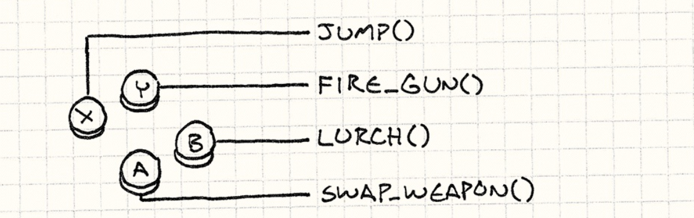
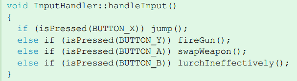
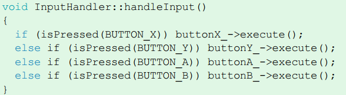

# Game Programming Patterns

前言 : 闲来无事, 刚刚学完了 CUDA 编程的知识, 但是暂时并没有动力去重构我的渲染器项目代码, 索性来尝试学一学设计模式. 问 Gemini 发现在游戏开发领域有更新的设计模式资源, 比 经典的 GoF 要更好啃. AI 建议后者仅仅用来查字典. 所以我就下载了这本 2014 年写好的书. 由 Nystrom Robert 撰写. (2026-4-5)

# Introduction

## Architecture

设计模式是有关**代码组织Organizing**而不是**写具体代码Coding**的艺术. 

而架构 Architecture 是与设计模式关联最强的概念.

### What is Software Architecture ?

作者分几个方面它对于**软件架构**好坏的判断标准. 第一个 : 

> The first key piece is that **architecture is about change**  

当我们需要修改代码时, 我们只需要动其中很小的一部分. 

修改软件代码的前提是**理解架构**. 所以代码各部分功能的**解耦Decoupling**十分重要.

- 解耦性强的代码, 开发者修改时不需要修改太多部分. 
- 项目交接时, 下一个人能快速**理解并修改**代码.

解耦的定义十分多, 作者的定义十分精辟 : 

> I think if **two pieces of code are coupled**, it means **you can’t understand one without understanding the other.** 

Decoupled 代码, 只需要修改你真的需要修改的部分, 而不必强行理解另一个功能模块的具体实现.

> The less coupling we have, the less that change ripples throughout the rest of the game .

所以, 作者给出了另一条架构好坏判断的标准 : 

> To me, this is a key goal of software architecture: **minimize the amount of knowledge you need to have in-cranium before you can make progress.**


### At What Cost ?

解耦性, 抽象程度高的架构让人们感到兴奋. 但是天下没有免费的午餐 free lunch.

- 你需要在整个开发周期中的数千次代码修改中, **保持架构的优美和秩序**. 

> You have to take great care to both **organize the code well** and **keep it** **organized** throughout the thousands of little changes that make up a development cycle.

这其实完全将任务交给了**架构设计**上. 设计师需要精心考虑每一处代码是否需要添加一层抽象. 这是在做**预测 Predicting**.  赌这里以后需要灵活性 Flexibility.

- Good Predicting : 未来的开发中真的用到了这层抽象, 良好的解耦提高了代码的可读性和维护效率.
- Bad Predicting : 冗余的抽象反而成为程序理解, 维护的额外负担. 

> You’ve got interfaces and abstractions everywhere. Plug-in systems, abstract base classes, virtual methods galore, and all sorts of extension points.

在 Debug 阶段, 你需要跨越重重的接口封装, 才能找到真的在**干活**的代码 (real code that does something), 并从中分析潜在的 bug.


## Performance and Speed

性能 (Performance) 对于游戏的重要性不必多说. 部分设计模式组织代码所使用的工具会损害性能. 例如 C++ 中 :

- Virtual Function
- Pointers (jump)

> 作者提到 Template metaprogramming 是 C++ 中一个不会损害性能的设计. 因为它的逻辑运行在**编译期**.

Flexibility 和 Performance 是一个 trade-off. 

- 越灵活的代码需要 "burning more time to put it on screen", and have some performance cost.

没有唯一答案.

> My experience, though, is that **it’s easier to make a fun game fast than it is to make a fast game fun**  

### The Good in Bad Code

Prototyping (原型) : 只能完成某个简单点子的简单代码. 真正落地需要重构


## Striking a Balance

对于项目的代码需求包括 :

1. Nice Architecture : 为了在项目周期中, 代码更容易理解和维护.
2. Fast Performance : 程序运行时更快.
3. Get today's features done quickly.

作者说这三者实际上都是关于**速度**的平衡 : 长期开发的速度, 程序执行速度, 短期开发速度.


## Some Suggestions

1. 除非你十分自信某处需要灵活性, 否则不要花费太多时间在设计抽象和解耦上.
2. 整个设计周期中, 考虑性能因素. 但是不要提前考虑那些**基于某种假设**的性能优化方法上. 否则这会锁死代码.
3. 平衡**探索游戏设计空间**和**收拾烂摊子**.
4. 若某段代码是注定被抛弃的, 就不要写得太完美.
5. If you want to make something fun, have fun making it.


# Design Patterns Revisited

## Command 命令模式

作者所精简 (Pithy) 定义的 Command 为 :

> A command is a **reified(具现化) method call.**

更具体一点, it's a method call wrapped in an object. 

将概念变为数据, 也就是**一个对象**. 并将方法存储于其中.


### Configuring Input

玩家所按下的键盘按键, 鼠标按键, 鼠标移动等, 都对应了游戏中的某种行为. 例如 : 



一个极其简单的实现方法是 :



但大部分游戏中的按键到行为的映射, 都是允许玩家自定义配置的. 这种硬编码方式并不可取. 

此时, 引入 Command 模式. 首先定义一个 `Command` 命令抽象基类 :

```cpp
class Command{
public:
    virtual ~Command() {}
    virtual void execute() = 0;
};
```

随后, 我们设置好几种命令所对应的行为 : 

```cpp
class JumpCommand : public Command{
public:
    virtual void execute() { jump(); }
};
class FireCommand : public Command{
public:
    virtual void execute() { fireGun(); }
};
// ...
```

然后在 `InputHandler` 中 :

```cpp
class InputHandler{
public:
    void handleInput();
    // other method to bind commands
private:
    Command* buttonX_;
    Command* buttonY_;
    //...
};
```

