# 0. 前言

参考书籍使用的是 MIPS 指令集

# 4. 处理器


## 4.3 数据通路

**数据通路**是指**指令执行过程中，数据所经过的路径以及对数据进行处理的部件**。

根据一个指令集中必须包含的指令/操作, 可以据此设计其数据通路的主要部件有哪些.

1. **取指令操作** : 处理器根据**PC计数器** (寄存器) 中的计数, 计算下一条指令的地址, 然后 从 **指令存储器** (主存放指令的一段区域) 中获取下一条指令内容, 随后 将 PC 计数器中的数值 += 4, (这是由于书中讨论的是 32 位 MIPS 指令集, 内存按字节寻址, 所以一个字对应4个内存单元.)  在 **ALU** 中完成.

   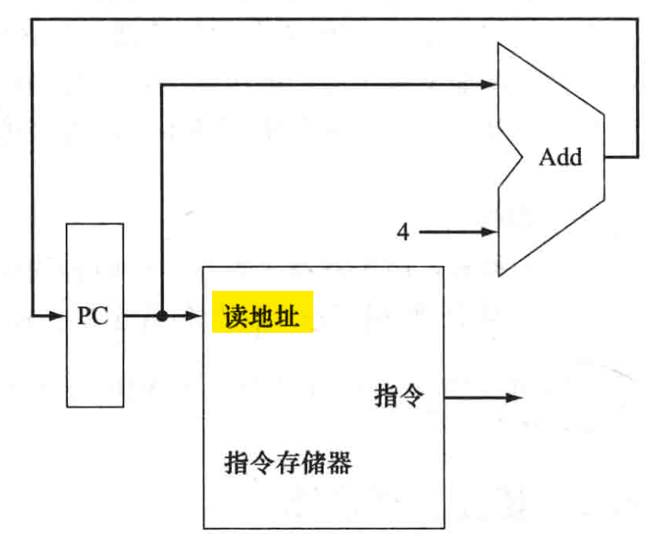

2. **算术逻辑操作** : 指代MIPS指令中 显然必须有**ALU** 负责完成计算. 根据被操作数据的来源, 还可以细分几种讨论情况 :

   1. **R型指令/算术逻辑指令** : 是指读**两个寄存器**, 进行 ALU 计算, 再写回结果. 见下图
      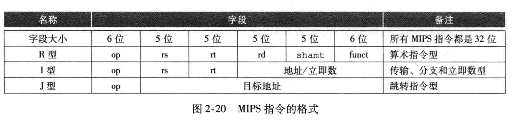

      > 补充 : R 型指令各部分含义如下 : 
      >
      > - `op` 指操作码, 
      > - `rs`, `rt` : 第一, 二个源操作数的寄存器号 (寄存器文件包括32个寄存器, 编号从0~31)
      > - `rd` 目标操作数的寄存器, 存放结果.
      > - `shamt` : 位移量
      > - `funct` : 指令功能码 (决定具体使用同一操作码`op`下的哪个子方法)

      加法的汇编指令格式为 `add r3, r1, r2`, 将 `r1` 和 `r2` 中的值相加后保存到 `r3` 中 

      R型指令与加法指令类似, 都涉及几种操作 : 根据寄存器号 (5位二进制) 从**寄存器堆**取两个数据; 将某个数据写入寄存器堆中的特定寄存器. 所以为了支持R型指令实现, 数据通路必须包括==寄存器堆, ALU==. 寄存器堆的设计结果如下图

      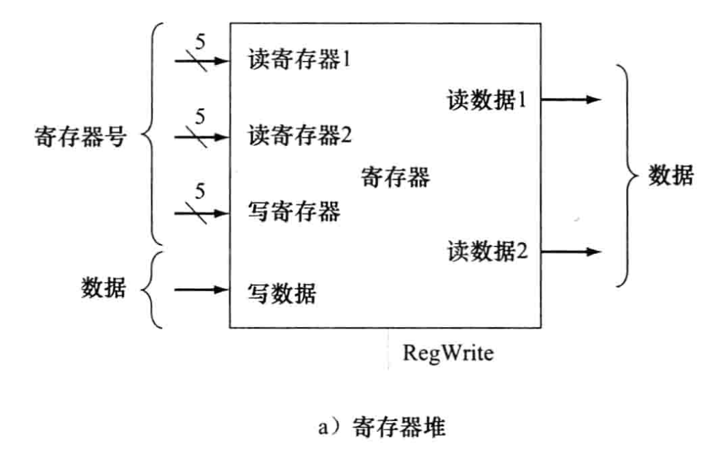

   2. **存取指令** : 指 `lw` , `sw` 等在寄存器, 主存之间交换数据的指令. 

      ```MIPS
      lw $r1, 4($t1)			
      ```

      第一个操作数是寄存器号, 暗示了需要**寄存器堆**, 第二个操作数是内存地址, 需要使用**ALU**计算 `$t1 + 4`. (寄存器堆和 ALU 仍然需要)

      注意到这个过程使用的是 **I型指令**, 有 16 位数可以用来表示**立即数/偏移量**. 

      另一个问题是, 寄存器是 32 位的, 而立即数只有 16 位. 二者相加需要通过**符号拓展**来实现二进制位数同步. 

      > 符号拓展 : 将一个16位数 符号拓展为 32 位带符号值. 
      >
      > 实现方法是, 将 原来的 16 位数的**最高位**填充到扩展后32位数的高16位, 低16位 保持不变. 因为整数使用的是**补码**进行存储, 上面这步操作可以使得原来的 16 位补码和 拓展后的 32 位补码代表的是**同一个数**. 
      >
      > 实现的部件可以是 处理器或者 ALU 中的一块部件完成.

      符号扩展单元单独用一个组件表示. (见下图)

      至此, 能够支持 R 型指令和存取指令的合并数据通路如下

      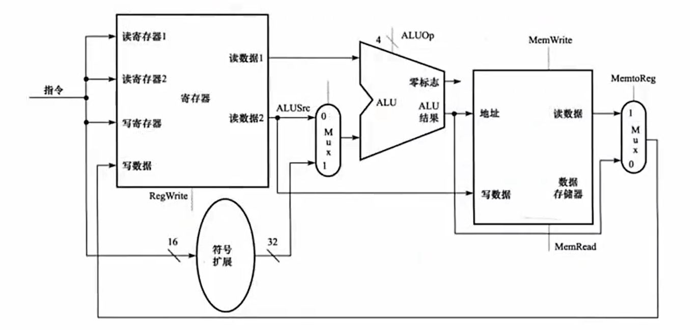

      建议手搓对照.

   3. **分支跳转指令** : 诸如 `beq $t1, $t2, offset` 这种指令. 其两个操作数为 `$t1, $t2` 寄存器号, 以及`offset` 表示偏移量 (与存取指令相同, 用16位0/1表示, 计算时需要**符号扩展单元**).

      指令的具体含义可以回顾汇编格式的指令 : ` beq r1, r2, L1` 汇编情况中, `L1`是一个标签(label), 如同 C 语言中的label, `beq` 的作用是当 `r1` 与 `r2` 中的值相等时, 就跳转 (同 C 中的`goto L1`). 

      在机器码的视角下, `beq` 中的 `offset` 含义是==跳转到`PC + offset`== 表示的指令. 这种见有一些容易混淆的地方 :

      - 当处理器走过一次取指令通路, 获得 `beq $r1, $r2, offset` 时, PC 计数器已经被自动增4了. 上述`offset`是与这个增4后的PC计数器进行相加. (比较容易实现)
      - 偏移量`offset`需要先**左移两位**. 因为一条指令 32 位, 在主存中的跨度是 4 个单元, 例如 `offset` 为 `000...01` 表示跳转到 (下一条指令的 PC 计数) + 1 处的指令, 此时内存单元的跨度应当是 `$PC + 00...0100`. 这个值会覆盖 PC 计数器中原有的值来实现跳转效果.

      其他的部分与存取指令相当, 最终需要涉及的部件有 **寄存器堆, ALU, PC, 符号扩展**.

综上, 合并所有的数据通路, 得到下图电路:

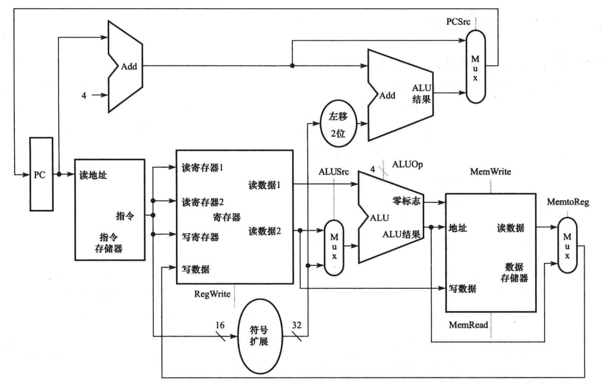

已经实现了 MIPS 指令集中最核心的几个步骤.

> 注意到零标志 Zero Flag 可以结合组合逻辑电路用来判断 `beq` 分支条件是否成立.

## 4.4 控制单元

在上面的数据通路的基础上, 还剩下控制单元对于各个部件的输出结果控制. 如下图, 黄色部分是尚待确定的控制信号.

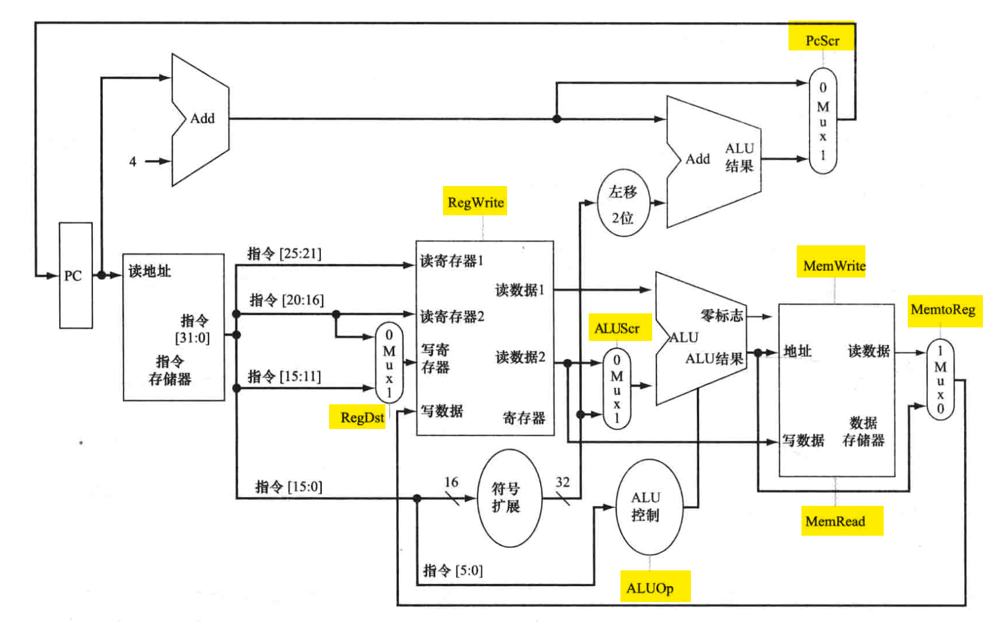

这些控制信号由 `op` 操作码字段 (6 位) 和 `funct` 字段  (R 型指令下) 共同决定.

MIPS 的子集的具体 `op` , `funct` 关于控制信号的真值表可以具体查阅文档或书, 这里直接给出其电路实现.

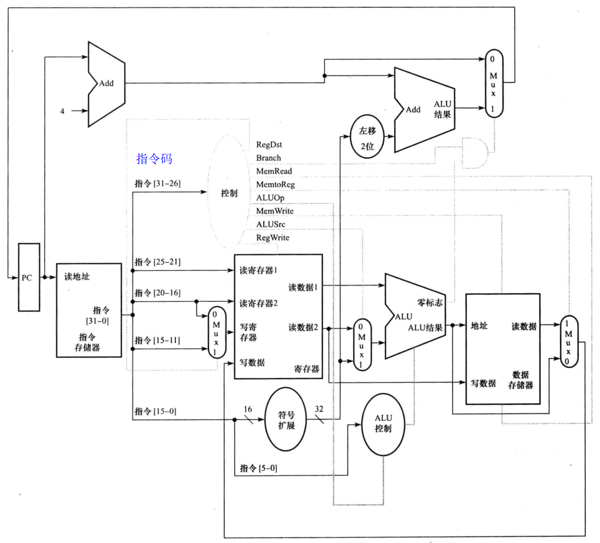

虚线部分是完整的电路结构. 除开 `PCScr` 这个信号需要两个条件 (判断值相等 + 分支指令) 以外, 其他信号都可以由 `op`和`funct`的值唯一确定.


## 4.5 流水线

**流水线** 是多条指令重叠实现的技术. 目前已广泛使用来提升性能.

以宿舍洗衣系统为例, 假设宿舍中每个人洗衣服需要经历四步: 1.洗衣机; 2. 烘干机; 3.折叠; 4. 收拾. 

目前为止, 没有应用流水线技术的洗衣过程是 :

- 一个人依此使用洗衣机, 烘干机, 然后叠衣服, 收拾进衣柜. **完成这些步骤后**, 另一个人便可以开始用洗衣机.

但是生活中人们会不自觉地应用流水线技术 : 明明前一个人把衣服放入烘干机以后, 下一个人就可以使用洗衣机了.虽然每个人洗衣服的时间没有缩短, 但是整个宿舍洗衣服的时间大大的缩短了. **吞吐率提高了**. 下图可见, 执行效率提升了一倍多. 理论上, 当宿舍的人数足够多, 使得流水线长时间处于满载状态, 流水线的效率将十分接近顺序执行的4倍.

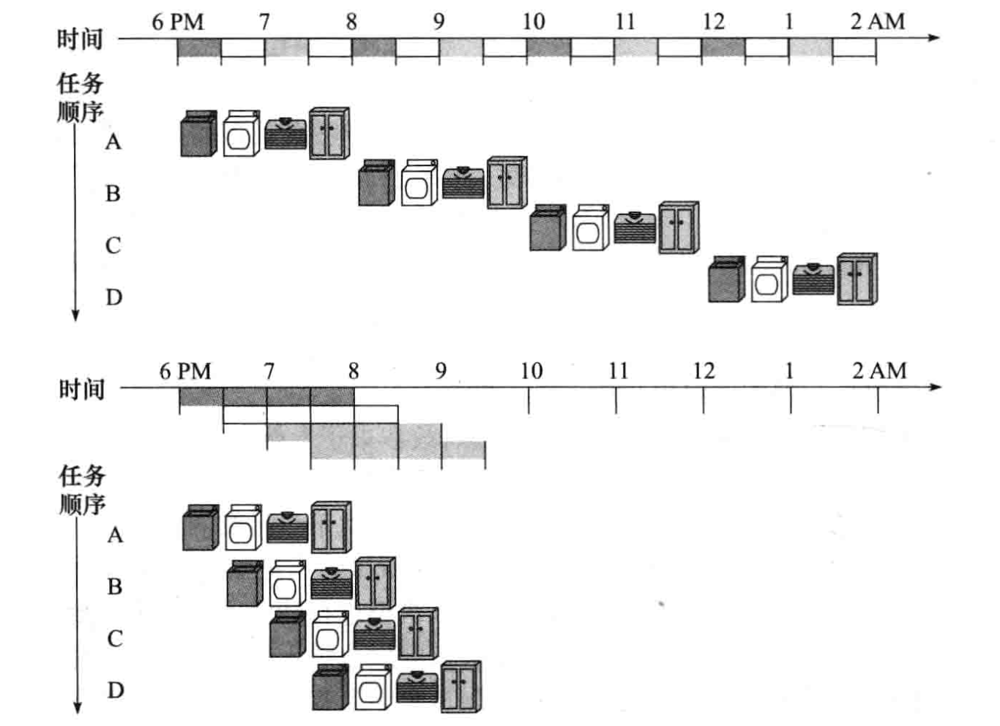

把这一套理论放到 CPU 执行指令是相同的. 此即流水线指令执行方式. 执行一条指令可以划分为 5 个步骤 :

1. **从指令存储器读取指令**
2. **指令译码, 同时读取需要的数据寄存器**.
3. **执行操作或计算地址**
4. **从数据存储器中读取操作数** (感觉这个描述不精确, 这一步是为`lw`和`sw`预留的步骤)
5. **将结果写回寄存器**

看一个简单的例子

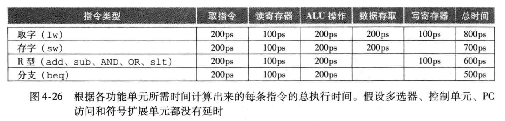

下面比较单周期模型和流水线模型的区别. 

单周期中执行时间最长的是 `lw`, 一个时钟周期必须是 $800$ ps.  

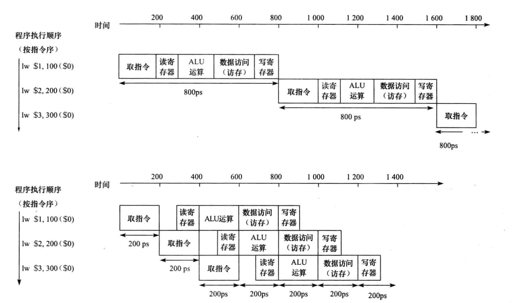


在第二张流水线指令执行过程中, 一个时钟周期应当是**耗时最长的步骤**所占用的时间.

在访问寄存器 (第2步的读, 第5步的写)的步骤, **下文假设前100ps用来写寄存器, 后 100 ps 用来读寄存器**.  (防止前面执行的写和后面执行的读冲突)

用 5 个步骤执行一条指令, 这称为**5级流水线**.

分析一下性能. 单周期模型的时钟长度是 800ps, 流水线的周期长度是 200ps. 各个步骤执行的时间都没有变. 单周期模型 1条指令的时间 = 流水线 4 条指令的时间. 

理想情况下, $n$ 级流水线的执行效率应当是 单模型效率的 $n$ 倍. 而上面所述的 $5$ 级流水线只有 $4$ 倍, 这是因为**各个步骤之间的执行时间不一致**. 前面的分析过程可见, 提升执行效率最核心的因素是**时钟周期**.  若每个步骤的执行时间是平衡的, 那么 $5$ 级流水线理论最高可以将时钟周期缩减到 $160$ 秒, 从而带来原有的 $5$ 倍效率. 所以通常而言, $n$ 级流水线的执行效率小于 单模型效率的 $n$ 倍.

再次强调, 流水线带来的性能提高是通过**增加指令的吞吐率, 而不是减少单条指令的执行时间实现的**.

### 流水线冒险 Hazard

流水线技术的正确实现需要许多部分一起配合. 若因为某种原因, **导致流水线执行模式在进入下一个时钟周期时, 下一条指令无法执行**, 这称为**流水线冒险(风险)(hazard)**.

"某种原因"包括 : 

1. **结构冒险** : 硬件不支持流水线. 这种问题需要在设计系统的时候就解决.

   1. 例如, 若 MIPS 并不是把数据存储器和指令存储器分开的话, 第4条指令取指的过程会与第1条指令的写入存储器冲突. 

2. **数据冒险** : 无法提供指令所需的数据, 导致指令无法在预定的时钟周期内完成执行.

   1. 一种非常频繁发生的情况是, 下一条指令需要的数据依赖于**前一条还在流水线中执行的指令**.

      这种冒险的一种解决方案是**前推/旁路**. 以这两条指令为例:

      ```
      add $s0, $t0, $t1
      sub $t2, $s0, $t3
      ```

      第 2 条指令用到的 `$s0` 是前一条指令的运算结果, 按照原来的流水线, 需要等到 `add` 指令的第 5 个周期写入寄存器, 才能被 `sub` 指令读取, 中间浪费了 3 个时钟周期. 注意到, 在 `add` 指令的第 3 个周期, ALU 计算出 结果后, 就已经可以直接送给 `sub` 的 ALU 输入了, 不必先写回寄存器. 这就是**旁路** 的解决思想.

      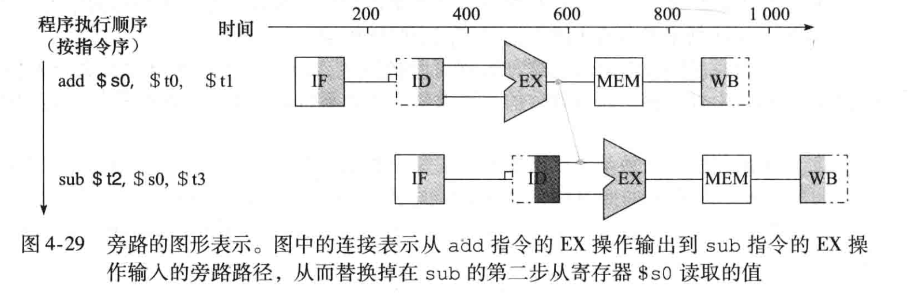

      此时, 流水线就不需要阻塞来等待 `add` 指令将结果写回寄存器了.

      但有一些情况, 尽管仍然无法避免阻塞, 但是旁路仍能加快一些时间. 例如

      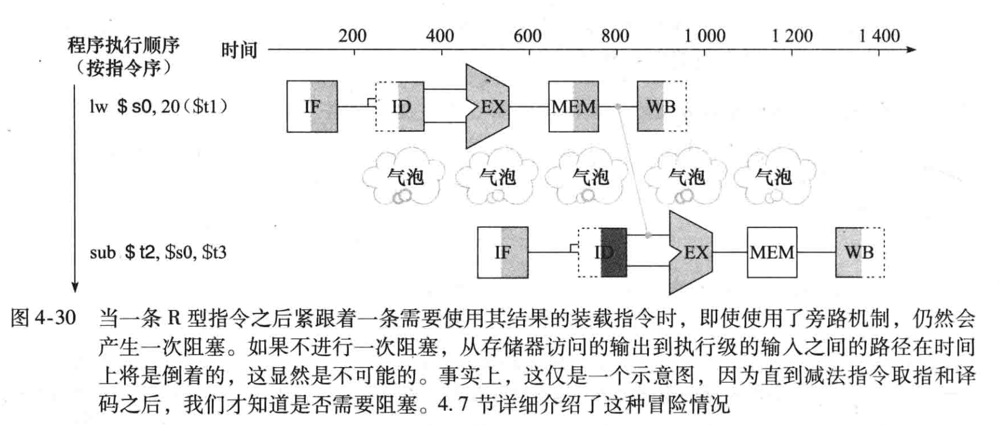 

   2. 有时, 我们可以通过**调换部分指令的执行次序**来避免部分数据冒险. 例如在以下代码中

      ```C
      // 假设 所有变量的值都在内存中
      a = b + e;		// 汇编代码需要先 lw 加载 b, e 变量的值到寄存器, 才能执行 add a, b, e...
      c = b + f;
      ```

      从内存中加载完 `b`, `e` 的值后, 立刻执行 `add a, b, e` 会导致数据冒险, 即使有旁路也会有1个时钟周期的阻塞. 此时可以先加载 `f` 的值到寄存器中, 顶掉一个时钟周期, 然后再计算 `a`, 避免数据冒险.

3. **控制/分支冒险** : 这种冒险出现在**分支指令**中, 因为流水线**不知道自己取的下一条指令是否要被执行**.

   1. 一种最简单的解决方法是**阻塞** : 直到分支指令的结果能确定了, 再继续执行指令. 当然, 这相当于分支指令独占了 5 个时钟周期, 比原来少执行了 4 条指令. 当分支语句比例上升时这会带来巨大的性能下降.

   2. 而另一种方法是**预测** :  即以某种方法预测分支的方向, 继续全力执行流水线. 倘若预测正确, 那么流水线不会有任何性能损失. 若预测错误, 则流水线会阻塞, 调头回去重新执行另一分支的指令.

      1. 简单预测方法是**永远预测分支不发生**. 
      2. 更成熟的方法是**动态预测** : 例如在循环结构中发生分支跳转十分常见. 具体实现上, 可以保存每次分支的历史记录供预测器参考.

      较长的流水线会带来预测准确率的下降, 提升预测错误的代价.


# 5. 存储器

## 5.1 引言

引入一些术语.

- 众所周知存储器具有多级层次结构. 本节最重要的 Cache 技术将特别研究**两级存储结构之间的关系**. 主要是研究 Cache 和 主存之间的关系.
- **块** 或 **行** 指**两级层次结构中存储信息交换的最小单元**.
  - 在 Cache 和主存之间说的话, 是 Cache 中存储的主存信息的**最小**单元.


## 5.2 存储器技术

### SRAM

待补充

### DRAM

待补充

### 闪存

待补充

### 磁盘存储器

待补充

## 5.3  cache 的基本原理

关于 Cache 有两个问题需要解决

1. CPU 怎么知道一个数据项在 Cache 中?
2. CPU 怎么找到在 Cache 中所需要的数据?


最简单的方法是将主存中的每个字, 都放在 Cache 中确定的位置. (有点像 Hash 映射)

这种方法称为 **直接映射** direct mapped.

几乎所有的直接映射 Cache 都使用 以下映射方法 :

$$

块地址 \mod (cache 中的块数)

$$

- 例如, Cache 的块数是 2 的幂次 (如 $2^3 = 8$), 块大小是1个字 = 4B = 32bit. 那么对于地址为 $01001010$ 的块, 只需要考虑其最低 3 位 $010$ 即可知应该放到 Cache 中的第 2 块.

一个 Cache 块可能**对应多个主存块**. 所以每个 Cache 块中都需要保存**标记(tag)**来唯一对应到需要请求的主存块. 标记不一定是主存块的完整地址, 但是它能通过计算来判断出当前 Cache 所 存储的块是否为 CPU 要请求的块.

-  Cache 的块数是 2 的幂次 (如 $2^3 = 8$), 那么对于地址为 $01001010$ 的块, 其高位 $01001xxx$ 可以作为保存在 Cache 块 $010$ 中的标记.
- 所有具有 $xxxxx010$ 的主存地址块都会保存在 地址为 $010$ 的 Cache 块处.
- **主存地址可以被**划分为标记域 + Cache索引**.**

另外, 还需要一个**有效位(valid bit)** 来标识当前 Cache 的有效性. 在诸如 **系统刚启动, Cache所缓存的主存块被修改** 等情况发生时, Cache 中的值即使标记正确, 但是仍然不可使用.


>  总 : 
>
> Cache通过**直接映射**的方法来决定主存中的缓存块放在Cache哪里. 
>
> Cache 块包含 **标记tag** 来计算其对应的主存地址
>
> Cache 块包含 **有效位valid bit** 来标识 Cache 块的有效性.


### 5.3.1 访问 Cache

设 Cache 中可以存储 $2^n$ 个块. 

给定 32 bit 主存地址, 当块大小是一个字时, 主存的 32 位可以被分为几个部分 :

- 最低 2 位 : 用来索引**一个块(一个字)中的 4 个字节**.
- 中间 $n$ 位 : 用来作为 Cache 块的索引. 
- 高 $32- n - 2$ 位 : 用来作为 标记域 tag. 

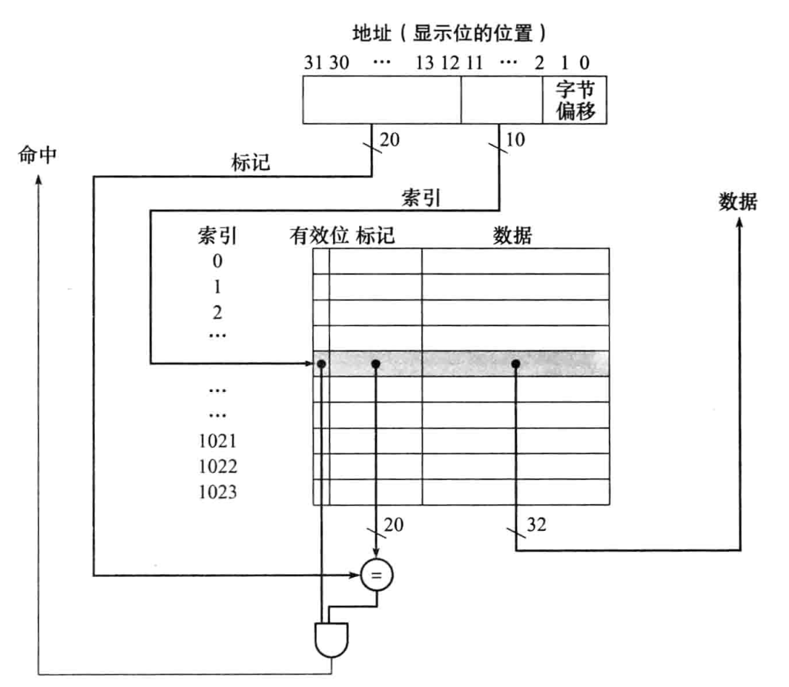

现在更进一步, **出于空间局部性原理, 块大小通常会包含多个字**.  (区别于前面的一个字), 假设每个块包含 $2^m$ 个字, 即 $2^{m+2}$ 个字节.

那么此时 32 bit 主存地址的各部分分划如下 :

- 最低 2 位 : 定位一个字中的 4 个字节
- 往前 $m$ 位 : 定位一个块中的字
- 再往前 $n$ 位 : 作为Cache索引值, 定位块
- 高 $32 - n - m - 2$ 位 : 标记域


Cache 中存储的总位数计算公式为

$$

2^n \times (块大小 + 有效位大小 + 标记域大小)

$$


选择不同的 Cache 块大小会有什么不同的影响 ?

- Cache 块过小会导致缺失率增加
- Cache 块过大会导致**缺失代价增大**. 而如果 **块大小上升** 换来 **块个数下降**, 那么缺失率也同样会增加.
- 通常表现为, 当块大小从0增大时, 缺失率先降后增.

### 5.3.2 Cache 缺失处理

当 CPU 执行某条指令时, 引起了**指令 Cache 缺失** (CPU请求缓存获取的数据是一条**指令**.)时, 基本处理方法如下 :

- 把 PC 值的原始值 (PC-4) 送到主存, 请求获取. 
  - CPU 获取指令的电路会不断将 PC += 4. 当访问 Cache 发现缺失时,  PC 指针已经指向了下一条指令. 所以需要 -4 再送到主存获取缺失的指令.
- 主存根据 PC 读取指令
- 将指令数据送到 Cache 中, 置有效位为1, 将标记域置为地址高位.
- 重启取指过程, 此时 CPU 可以从 Cache 中获取正确的指令.

而对于更一般的非指令型 Cache 缺失, 大体过程与上述一致 :

- 将请求的数据地址送到主存, CPU 阻塞, 等待主存将数据送入 Cache 并更新.


### 5.3.3 写操作处理

CPU 执行 `store` 命令向主存中写入新数据时, 应该用什么方案?

- **写直达 (write-through)** : 同时写入 Cache 和主存.
  - 能保证主存和 Cache 的信息一致性.
  - 缺点 : 访问主存的时间很长, 大约100个时钟周期. 性能差.
  - **写缓冲(write-buffer)** : 是==写直达的一种改进==. CPU负责将数据写入Cache 和写缓冲. **让主存中的控制器根据写缓冲的内容进行写操作**. CPU继续执行后续指令. 
    - 当写缓冲满了后, CPU 再执行写指令就要阻塞等待了. 这种情况在 CPU 产生写操作的速度远高于主存写入的速度时经常发生.
- **写回(write-back)** : CPU执行写操作时, **仅仅将数据写入 Cache**. 直到 Cache 块被替换时, 才写回主存.
  - 系统性能较好.
  - 缺点 : **实现的机制比写直达复杂得多**.

另一个问题 : 写操作时产生了 Cache 缺失怎么办? 

上述三种写操作处理机制都各自有不同的缺失处理方法. 很复杂, 略.


## 5.4 Cache 性能评估和改进方法

本节有关 :

1. Cache 性能评估
2. 两种 Cache 性能改进方法
   1. 减少竞争同一 Cache 块的主存块个数 (类似缓解 Hash 冲突).
   2. 多级高速缓存.


Cache相关的性能同样与 CPU 的有效利用时间相关. 我们希望尽可能最大化 CPU 执行指令的时间, 而**减少 CPU 阻塞等待其他部件完成工作的时间**.

由于 CPU 访问 Cache 的速度非常快, 认为当 Cache 命中时, 读写操作不占用额外 CPU 的时钟周期数.

总的说来

$$

CPU时间= 时钟周期 \times (CPU 执行指令的时钟周期数 + CPU 阻塞等待存储器的时钟周期数)

$$

存储器引起的阻塞时钟周期数又可以分为**写操作和读操作占用的周期数**.

$$

CPU 阻塞等待存储器的时钟周期数 = 存储器读操作占用的时钟周期数 + 存储器写操作占用的时钟周期数

$$

- 读操作比较简单, 阻塞的原因是**读缺失**. 可以定义为

  $$

  读操作占用的时钟周期数 = (读指令数 / 程序指令数) \times 读缺失率 \times 读缺失代价

  $$

- 写操作大体上一致, 但是写操作的处理有 2 种方案, 各自的计算公式不一样.

  1. 写直达 (with 写缓冲) : 阻塞的原因有 **写缺失 和 写缓冲区阻塞**.

     $$

     写操作占用的时钟周期数 = (写指令数 / 程序指令数) \times 写缺失率 \times 写缺失代价 + 写缓冲区阻塞

     $$

     写缓冲区阻塞难以用计算公式表达, 实验中发现, 当写缓冲区的深度合适, 其代价可以忽略.

  2. 写回 : 阻塞的原因有**写缺失, Cache块替换时写回主存的阻塞**. 5.8节会进一步讨论.


### 5.4.1 更灵活地放置块来减少 Cache 损失 (更多Cache组织方法)

目前研究的 Cache 映射方法都是 **直接映射**. 这种方法中, 一个块被精确的放到一个位置, 是**某种极端情况**.

另一种相反的极端方案是 : 一个块**被放在一个 Cache 的任意位置**. 这种机制也称为**全相联 (fully associative)**.

- 主存的一个块可能被放到 Cache 的任何一块, 所以需要 检索 cache 中的所有项.
- 为了提高效率, 检索过程是由一个硬件实现的并行比较器完成的, 加大了硬件开销. 因此这种方法适合**块数较少的时候**使用.

介于直接映射和全相联的设计方法是**组相联 set associative**. 每个块可以<font color='red'>被**有限制地**放在多个位置</font>. 

若每个块有 $n$ 个可放置的 Cache 位置 (一个组有 $n$ 个块), 则称为 $n$ 路组相联 cache.


与直接映射类似, 组相联组织方式的 Cache 对于 主存块, 通过计算

$$

主存块号 \mod (cache 中的组数)

$$

主存块只能被放到计算出的cache组中. 当请求数据时, 需要对组内所有的项进行检查. 

- 从这个角度看, **直接映射是1路组相联cache**, **全相联是组数为1的组相联.**


提高相联度可以降低缺失率, 代价是增加命中时间.


### 5.4.2 在 cache 中查找一个块

组相联cache在检索块时的过程与直接映射类似. 主存块地址依旧分为三部分

1. 标记
2. 索引
3. 块偏移

不同的是在根据地址确定了组号后, 需要对 Cache 中的所有项进行检索.


### 5.4.3 替换块的选择 (Cache块置换算法)

直接映射法中, 每一个块只能被放在一个cache块上, 替换对象不需要选择.

提高相联度的时候, 则需要从一个组中的多个项选择一个写回主存, 并将新的主存数据写入.

最常用的方法是**LRU算法 (Least Recently Used)**, 该算法将替换Cache组中**最久没有被使用的块**.

2 路组相联 Cache 实现 LRU 算法比较简单, 更多路时会复杂一些, 同时会有许多替代方案.


### 5.4.4 用多级 cache 结构减少缺失代价

如标题, 不多说.


## 5.5 可信存储器层次

### 5.5.1 失效的定义

提高性能的同时不能忽视可信性.

一个系统在提供服务时, 用户可以看到两种状态 :

1. **服务实现** : 交付服务与需求相符;
2. **服务中断** : ......不符

从状态 1 到 状态 2 的过程称为**失效**, 反之称为**恢复**.

失效又可以分为**永久性失效**和**间歇性失效**. 前者的诊断更容易.

基于上面的定义, 有以下两个重要的概念.

- **可靠性** : 从开始到失效的时间间隔, 是系统持续提供符合需求的服务的度量.
  - **平均无故障时间 MTTF**
    - **年失效率 AFR**.
  - 服务中断的**平均维修时间 MTTR**
  - **失效间隔平均时间 MTBF** : MTBF = MTTF + MTTR
- 可用性 : 系统的正常工作时间, 在两次服务中断间隔时间 中的比例.
  - 可用性 = MTTF / (MTTF+MTTR)

可靠性和可用性可以量化, 但是可信性不能.

提高系统的 MTTF 对于可靠性和可用性的影响很大. 可以通过

- 提高器件的质量
- 设计能在器件失效 (称为**故障**) 情况下继续工作的系统

来提高 MTTF. 具体而言, 有 3 种策略

1. 故障避免 : 避免故障出现
2. 故障容忍 : 利用冗余措施, 保证在故障发生时能尽快恢复正常工作.
3. 故障预报 : 预测故障, 在故障发生前完成器件替换.


### 5.5.2 Hamming 编码

一种被广泛使用在存储器中的**冗余技术**称为**Hamming 码**.

只叙述其核心思想 :

对于两个相同长度的二进制数$B_1, B_2$, 定义它们的 **Hamming 距离** 为 $B_1, B_2$ 不同位数的个数.

- 例如 $0101$ 和 $1101$ 的 Hamming 距离为 1

假设现在某种编码中, 有效码字之间的**最小Hamming距离为2**. 当检测到两个码字之间的Hamming距离为 1 时, 代表它们一定在某个部分产生了**1位**错误, 使得有效码字转化为了无效码字. 这种编码称为**1位错误检测编码**. (简称1位检错码)

遗憾的是, 虽然能检测出 1 位错误, 但是并不能检出是哪一位. (否则可以直接修正)

一种经典的 1位检错码是**奇偶校验码**. 具体原理从略.


进一步, 如果现在有某种编码, 有效码字之间最小的Hamming 距离为 3, 那么当有效码字中出现了 1 位的差错, 转换为无效码字, 就可以找到与其**Hamming距离最近的有效码字**, 从而达到**纠错**的效果. 

一种十分重要的纠错码是**Hamming纠错码**, 可以做到 2 位检错和 1 位纠错的效果. 原理从略.

这种技术更常应用在**计算机网络, 服务器与客户端的通信中.** 在这些场景中, 因为信息传输受到物理介质和环境的影响, 出错的概率更大.


## 5.6 虚拟机

略


## 5.7 虚拟存储器

前文所述, 在主存之上, 通常会有一层或多层 cache, 对程序最近访问过的主存数据和指令进行**快速访问**.

同理, 如果将主存视为更低一级存储器**磁盘**的 "cache", 就引出了**虚拟存储器技术**.

虽然不是很重要, 但是设计虚拟存储器的动机有两个

1. **云计算** : 允许云计算在**多个虚拟机之间有效而安全地共享存储器**. (相当于多个进程共享同一个计算机的资源.)
2. 消除主存容量对于程序设计开发造成的影响.


# 6. 总线

总线是计算机内数据传输的**公共路径**. 

计算机系统中有**多种**总线. 根据总线连接的对象, 可以分为两类

1. **内部总线/片内总线** : 存在于 芯片内部, 连接芯片的各个部件. 
   1. 例如 CPU 芯片的内部总线将CPU与各个寄存器/指令部件等元件相互连接, 确保元件之间的快速沟通.
2. **系统总线** : 跨越芯片之间, 连接计算机系统中的**主要部件**. **通常说的"总线"默认指系统总线**.
   1. 例如 CPU, 存储器, 显卡网卡声卡等等之间的数据通路, 是由系统总线完成的.
   2. 系统总线又可以**根据传输的信息内容**进一步划分为 **数据总线, 地址总线, 控制总线**.


- 数据总线
  - 用于 CPU 与主存/IO设备之间传输数据. 
- 地址总线
  - 用于传输地址信息, 
- 控制总线
  - 传输控制信号, 如读/写信号, 中断信号.

某些情况下, 为了节省芯片的引脚数或线路资源, 数据总线和地址总线会被复用. 这种设计称为**数据地址复用 D/A multiplexing**.  多路复用会增加潜在的信号干扰问题. 现代系统倾向于独立的地址和数据总线.


总线还可以**根据时序控制类型**分为

1. **同步总线** : 使用公共的**全局**时钟信号进行定时. 同步总线的传输协议非常简单. 数据传输的开始和结束都遵循严格的时钟脉冲节奏.
   1. 同步总线通常采用**并行传输**的方式, 即多条总线"并联", 同时传递多个数据位. 该方法可以**提高传输速率**, 也会面对
      1. **时钟同步限制 : 受到最慢速度设备的限制**
      2. **时钟偏移问题 : 时钟信号到达总线上不同位置的时间有偏移**
      3. **信号完整性与延迟** : 同时传输的信号会遭遇衰减和干扰, 导致波形变形.
   2. 为了解决上述问题, 下面几种类型的总线逐渐兴起
2. **异步串行总线** : 
   1. 结合了**串行通信**和**异步通信(数据以帧为单位传输, 没有统一时钟信号, 像计网中的传输一样)**的特点.
   2. **没有全局时钟, 数据封装成帧(由起始和终止位来标识开始和结束)**.
   3. 没有数据传输时 (**空闲状态**), 串行总线保持在高电平状态.


## 6.2 总线性能指标

1. 总线宽度
2. 总线工作频率
3. 总线带宽
   1. 带宽 = 宽度 * 工作频率
4. 总线寻址能力 : 总线能够访问的主存单元或IO端口的数量.
   1. 取决于地址线数量. $32$ 条地址线可以寻址 $2^{32}$ 个单元.
5. 总线的定时方式 : 同步定时 / 异步定时
6. 总线的传送方式 : 并行传送 / 串行传送
7. 总线负载能力 : 表示**总线能够连接的设备数量**以及它们对总线电气特性的影响.

## 6.3 基于总线的互联结构

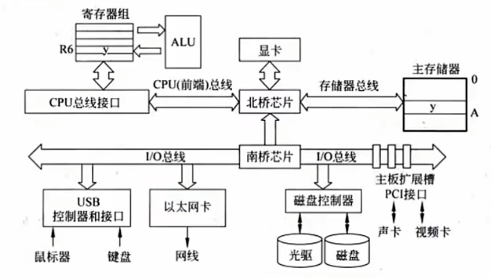

