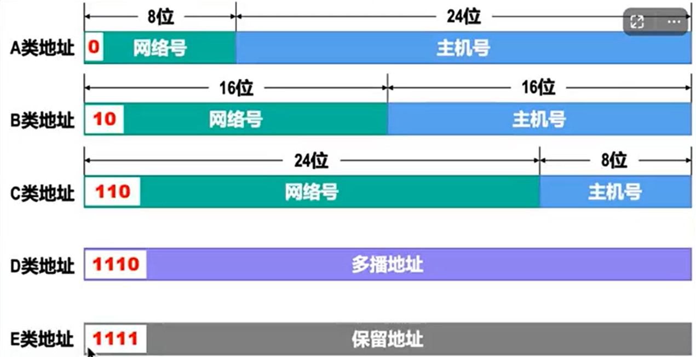
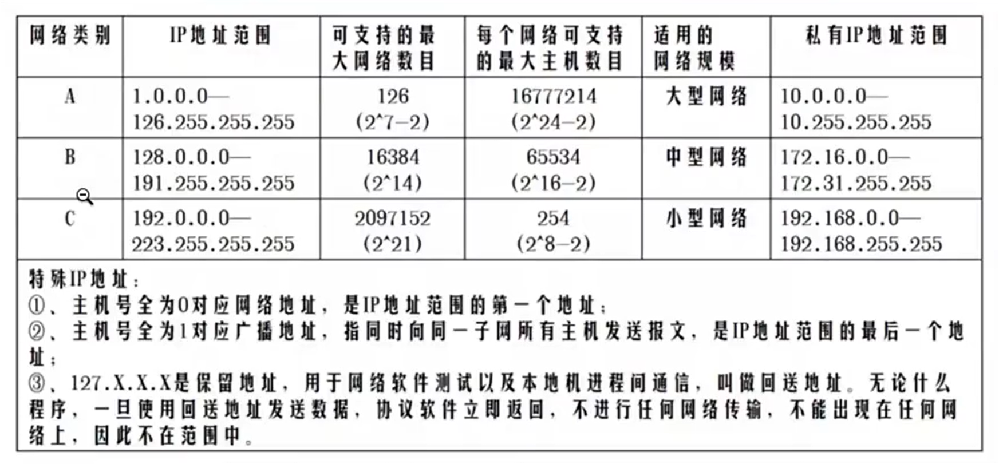
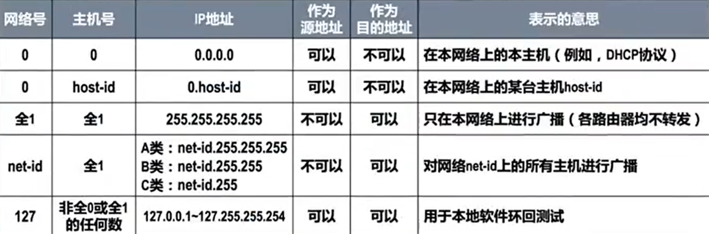

# 2. 互联模型

通信模型的发送端和接收端中间有几种通信线路 :

- 单工 : 发送端, 接收端设备只有一种能力 (发送端只有发送引脚, 接收端只有接受引脚)
  - 管道通信
  - 
- 全双工 : 发送端和接收端**都具有收发能力**. 拥有两条信道.
- 半双工 : 在双工的基础上, **信道只有一条, 不能同时双向通信**.
  - 单管道实现双工 : A发B 时 B不能发A.

## 两台计算机互联

- 两台相同的 PC 可以通过 ****交换线**** 直连

## 多台计算机互联

最早的解决方法是用 **T型连接器**, 相当于多个 终端直接并联.

- 半双工
- 不安全 (一断全断).

### 集线器

更现代一点的是使用 ****集线器**** : 

- 集线器有多个接口
- 一个接口收到数据后会发送给****其他所有接口****.
- 工作在 ****物理层**** : 
  - **纯硬件**, 无软件.
  - 没有存储数据的能力
- 没有任何地址等需要配置的信息, 类似于多分叉导线.
- 缺点
  - 同样是**半双工, 易冲突**, 且不安全 (但是在多集线器网络中, 安全系数比T型直连高)
  - 由于是不加判断的全转发, 链路占用率很高, 容易占线.

### 网桥

网桥又称为**桥接器**, 工作在**数据链路层** 

- 能运行软件, 有记忆能力. 
  - 称为****2层设备****.

特点 :

- 网桥只有**两个接口**, 连接起两端的信道.
- 网桥中有个表, 能够**记忆**两个接口分别存在哪些MAC地址(的终端), 从而减少**不必要的转发**.

### 交换器 SWITCH

SWITCH $\approx$ 集线器 + 网桥

- 有脑子的集线器

特点 :

- **全双工**
- 可以像集线器一样广播, 可以像网桥一样记忆.

### 路由器

工作在****网络层****

内部运行了一个 Linux 操作系统, 具有终端

需要配置 :

- 配置每个接口的 IP 地址, 例如 `192.168.1.1` . 可以接受所有的(同一网关) `192.168.1.xx` 的终端发来的数据包.

## MAC 地址

数据链路层识别的 **网卡硬件地址**.

- 计算机之间的通信至少需要指定 MAC 地址.
- 若不知道目标机器的 MAC 地址, 只知道 IP 地址 (网络层), 则使用****ARP****协议广播, 等待目标机器回应.
- MAC 地址规定为**6字节, 48bits**. 前 3 字节标识厂商, 由某机构同一分配. 后 3 字节供厂商使用, 标识自己生产的硬件网卡地址.

`FFFFFF` 是 广播包标识  : 发给网段内的所有机器.

### ARP 协议

全称是 Address Resolution Protocol, 用于实现从 IP 地址到 MAC 地址映射的协议, 在 IPv4 协议中十分重要.

当源机器第一次向指定 IP 地址 `192.168.1.11`的目标机器发送数据时,  源机器还不知道目标机器的 MAC 地址, 数据链路层工作前要先**广播 ARP 包**, 等待目标机器接受到 `192.168.1.11` 发现在找自己时, 向源机器返回信息.

此时源机器会缓存接收到的信息, 称为**ARP缓存**. 包括

- IP 地址 与 MAC 地址的映射关系

不同时间, 不同的设备可能被分配同一个 IP 地址, 所以 ARP 的缓存时间不应太长, 一般 2min 就会删除, 需要重新广播.

## IP 地址

用 MAC 地址能实现通信, 但是十分不便于管理和数据传输. 现实中也不可能依靠 MAC 地址和交换器将世界范围内的机器接在一起. 因而引入了 IP 地址.

- IP 地址是动态的, 它能标识当前通信终端所在的 "地理位置信息", 其中一个作用是供路由器判断, 转发数据包.
- IP 地址由 32 位 bit 组成, 常分为 4 组, 用**点分 10 进制**表示. (`192.168.1.10`)
- 一块网卡可以配置**至少一个**IP地址.

### IP 地址表示方法

32位 IP 地址不能随便取, 表示方法是说 IP 地址中, 点分 10 进制数的具体含义.

IP 地址的主流表示方法有 IPv4 和 IPv6 标准.

- IPv4 由 ICANN (因特网名字和数字分配机构) 进行分配.
- 若 取遍所有 32 位 2进制数, 也就 43 亿 个 IPv4 地址可供分配. 
  - 2011 年 2 月 3 日,  IANA 机构宣布 IPv4 已经分配完毕.

### 分类编址 

该方法不推荐使用, 但是仍有价值.

IPv4 的 32 位 bit 中, 有4个点分十进制数. 在单播地址 (A,B,C类) 中, 它们被分划为两个部分

1. ****网络号**** : 标志当前设备(主机或路由器) 接口  所连接到的**网络**.
   1. 同一个网络中, 设备/路由器的 IPv4 地址的**网络号必须相同**.
2. ****主机号**** : 标志当前设备接口.
   1. 同一网络中, 各个设备/路由器的**主机号必须互不相同**. 
   2. 主机号为**全1**时, 表示==广播地址==.
   3. 主机号为**全0**时, 表示==网络地址==.

**一个IPv4地址究竟属于哪一类, 由该地址的前1~4位的格式进行判断** (见上图).

单播地址可以被分配为网络中的主机, 接口. 

注 : A类地址的 127.x.x.x 作为发送地址时, 会在**网络层时直接返回, 不会进入链路层, 物理层等等**. 

- 用于调试, 测试.

多播地址和保留地址则不行, 它们用来表示**某种传播行为**. 

- 例如**多播 : 组播, 广播** 一台主机向网络中的其他主机都发送信息, 此时将用专有的/自定义的"目标地址"来表示这个行为.
  - 把某两个目标设备的IPv4地址 `c1, c2` 加到某个**自定义**的组播地址 (D类), 某个设备想向`c1,c2`发信息时, 将"目标地址"设为这个组.

下面的特殊 IPv4 地址具有特殊含义, 一般不会使用.

### 子网掩码

一个网络有大约 300 个主机.

- 若该网络选用 C 类编址, 无法满足需求. 
- 但如果选用 B 类编址, 提供了 65534 个 IPv4 地址, 远远超出了需求, **造成了大量 IPv4 地址的浪费**.

因此, ****子网掩码****是解决该问题的一个补丁.

现在想构建一个这样的网络 :

- x 网 : 5 个主机
- y 网 : 3 个主机
- z 网 : 9 个主机.

申请 3 个 C 类网络是十分不划算且大量浪费的做法. 划分子网的方法思路如下 :

- 一个 C 类网络有 24 字节表示网络号, 8 字节表示主机号. 既然主机号冗余, 那么可以借一些给网络号, 用来区分不同的网络. 这样, xyz网络就可以被视为一个 C 类网络的 3 个子网, 子网通过主机号的部分bit来区分.
- **子网掩码** : 标识从IPv4的主机号中**借哪几位**充当**网络号**. 其思路是通过另一个 32 位 bits 来表示.
  - 假设原来的 C 类 IPv4 地址为 `192.168.1.10`, 在**不分划子网的情况**下, 子网掩码应当是 `255.255.255.0`, 转换为 2 进制也就是 `1111 1111.(8个1).(8个1).0000 0000`.
  - 倘若现在要借一位 (假设为主机号的最高位) 来充当网络号划分子网, 那么子网掩码应当改为`255.255.255.128`, 第 4 个 字节从 `0000 0000` 变为 `1000 0000`. 若要借两位, 类似地就改为 `1100 0000`.
  - 借位**只允许从主机号的左侧开始**, 连续借 $n$ 位.

获取IPv4表示的子网的网络号只需要将 IPv4 地址与子网掩码作**与运算**, 获取主机号则作**反与运算**.

### 超网技术

超网与子网相对, 子网是对已有(分类编址)网络类型的**细分**, 超网是对已有网络的**扩充**.

- 子网 : 向主机号借位, 充当网络号
- 超网 : 向网络号借位, 充当主机号.

表示超网也可以使用**子网掩码**来表示. 

### 无分类编址

子网掩码缓解了 IPv4 地址不足的问题, 但是其仍然基于分类编址, 且 C 类网的需求十分巨大, 地址数量捉襟见肘.

结合子网和超网的共同点, 我们可以在子网掩码的基础上, 将分类编址给去掉了, 全部改为 : **网络号 + 主机号** 的格式, 且**没有固定位数的限制**. 两部分具体的位数**通过子网掩码(此时也称地址掩码)说明**.

- 网络号 = IP地址 & 地址掩码
- 主机号 = IP地址 & (!地址掩码)

现在有一种更简单的表示方法 : 将子网掩码从 32 位 bits 写成一个数 `1~31`用来表示**网络号前缀长度**.

- 例 : 192.168.1.10/24

1993 年, 推出了 CIDR, 消除了 ABC类和划分子网的概念,  使得 IPv4 地址的寿命和规模再次增长, 且地址更加有效.

**路由聚合** : 可以利用掩码, 合并**共同前缀, 共同下一跳**的项, 缩小路由表.

## 路由 Router

作用 : **不同网段的设备(IP地址网络号不同)之间数据转发**.

路由器是一个工作在网络层的"主机".

路由表 :

- 根据需要目标IP地址, 选择对应的接口进行转发.

## NAT 技术

Internet 因特网是一个基于 TCP/IP 协议族、将**全球**数百万个私人、学术、企业和政府网络互联而成的庞大计算机网络基础设施.

基本所有网络都可以看成是因特网的**子网**.

因特网中的子网分为两类

- 私网 : 对应边缘网络设备
- 公网 : 对应骨干网络设备 (许多路由器)
  - 此类设备**不准转发私网IP, 源和目的都不能包含私有IP**. 
    - 例 : `192.168.1.x` 是私有 IP.

想要从本地的私有 IP 经过骨干网访问某个网站, 则需要 ****NAT 服务(软件)**** (Network Address Translation), 将私有 IP 转为公网 IP.

NAT 运行在路由器中, 提供了私有IP到公网IP的一一映射.

- 隐藏内部真实IP
- 节约公网 IP 资源

这种方法目前被淘汰了, 更现代的方案是**PNAT**, 采用**端口多路复用技术**.

# 3. 链路层

一个节点到相邻节点的**物理线路(有线/无限)** 称为 **数据链路**.

计算机中的**网络适配器 (网卡)** 中的硬件, 软件实现了物理层和数据链路层的协议.

不同的数据链路有不同的通信协议

- 广播信道 : CSMA/CD协议 (现在不常用)
  - 由集线器/交换机组成的网络.
- 点对点信道 : PPP协议
  - 例如路由器与路由器之间

链路层主要研究, 解决三个问题

### 帧封装

MTU : 最大传输单元, 帧的数据部分bit数不能超过MTU, 否则拆包.

- **以太网的MTU是1500B**

### 透明传输

### 差错检测

