# 第一章 操作系统基本概念

## 操作系统的基本概念

### 操作系统的概念

OS 课程 中计算机系统从下到上分为4层

- 硬件
- 操作系统
- 应用程序
- 用户


OS的概念:

- **控制和管理整个计算机系统的硬件和软件资源**
- **合理地组织, 调度计算机的工作与资源分配.**
- **为用户和其他软件提供方便的接口与环境的<u>程序集合</u>**

OS 是计算机系统中最基本的软件.


### 操作系统的特征

1. 并发
   1. **并发** : 是指**两个或多个事件在同一时间间隔发生**. 
      1. 注意与并行的区别.
   2. **操作系统的并发性** : 是指计算机系统中同时存在多个运行的程序, 因此它具有处理和调度多个程序同时执行的能力. 操作系统的并发性是**通过分时实现的**.
2. 共享
   1. **共享** : 指 **资源共享**, 系统中的资源可供内存中多个并发执行的进程共同使用. 共享有两种形式 : **互斥共享** 和 **同时访问方式**
   2. **互斥式共享** : 一<u>段时间内只允许一个进程访问资源</u>的共享方式.
      1. **临界资源** : <u>一段时间内只允许一个进程访问</u>的资源 (废话, 就是互斥共享资源)
   3. **同时访问共享** : **宏观上**, 这类资源允许一段时间内由多个进程"同时访问" . **微观上**, 这些进程可能是交替地对资源进行访问, 即**"分时共享"**. (典型资源是**磁盘**)
3. 虚拟 :
   1. **虚拟** : 把一个物理上的实体变为多个逻辑上的对应物. 实现虚拟的技术称为**虚拟技术**.
   2. **时分复用技术** : 实例-虚拟处理器
   3. **空分复用技术** : 实例-虚拟存储器 (虚拟内存)
4. 异步
   1. **异步** : 由于程序的并发执行, 每个进程以不可预知的速度执行, 这就是**进程的异步性**.
      1. 操作系统必须保证在不同的环境下, 多次运行进程后都能得到相同的结果. (结果不因为程序并发执行的顺序而改变)


关于操作系统特征的表述

- **并发**和**共享** 是OS的**最基本特征**, 两者互为存在条件
  1. 资源共享是以程序并发为(前提?)条件的. 
  2. 系统不能对资源共享进行有效管理, 则一定会影响, 或根本无法执行程序的并发.


### 操作系统的目标和功能

1. 操作系统作为**计算机系统资源的管理者**.
   1. 管理处理器
   2. 管理存储器
   3. 管理文件
   4. 管理设备
2. 操作系统作为**用户 (这里指的是使用硬件的普通软件) 与计算机硬件系统之间的接口**.
   1. 命令接口
      1. 联机接口
      2. 脱机用户接口
   2. 程序接口 : 系统调用
3. 操作系统**实现了对计算机资源的扩充**.
   1. **裸机** : 无软件
   2. **扩充机, 虚拟机** : 被软件覆盖的裸机


## 操作系统的发展历程


### 手工操作阶段

无操作系统


### 批处理阶段

1. **单道批处理系统**
   1. **自动性**
   2. **顺序性**
   3. **单道性**
2. **多道批处理系统**
   1. 特点 : 
      1. **多道** 
      2. **宏观上并行**
      3. **微观上串行**
   2. 优点
      1. 资源利用率高
      2. 系统吞吐量大
   3. 缺点
      1. 用户相应时间长
      2. 不提供人机交互能力

### 分时操作系统


1. **分时技术 : ** 把处理器的运行时间切分成很短的时间片, 按时间片轮流把处理器分配给多道程序使用.
2. **分时操作系统** : 多个用户通过终端共享同一台主机, 这些终端连接在主机上, 用户可以与主机进行交互操作而互不干扰.

分时操作系统也是**支持多道程序设计的系统**. 但**不同于多道批处理系统**.

- 分时系统主要提供人机交互
- 多道批处理系统主要实现作业自动控制.

分时系统的特征:

- **同时性 / 多路性** : 允许多个终端用户同时使用一台计算机 , 终端上的这些用户可以同时或基本同时使用计算机  
- **交互性** : 用户能方便地与系统进行交互, 人机对话.
- **独立性** : 多个用户可以独立地进行交互操作, 互不干扰
- **及时性** : 用户的请求能很快得到响应.


### 实时操作系统

分为

- **硬实时系统** : 某个动作必须<u>绝对地在规定的时刻（或规定的时间范围） 发生</u>  
- **软实时系统** : 能够接受偶尔违反时间规定且不会引起任何永久性的损害 .

### 网络操作系统和分布式计算机系统

主要特点: 

- 网络中**各种资源的共享**
- **各台计算机之间的通信**

### 个人计算机操作系统

特点: 使用最广泛


## 操作系统运行环境


### 处理器运行模式

- **逻辑上** : 处理器运行两种性质的程序 : (1)操作系统内核程序; (2)用户程序. 前者是后者的管理者, 可以执行**特权指令**
  - **特权指令** : 不允许用户程序直接执行的指令
  - **非特权指令** : 允许用户直接执行的指令. 不能直接访问系统的软硬件资源, 限制用户程序访问的地址.
- **物理上** : 具体实现为, 将 CPU 的运行模式通过一位 0/1 二进制位划分为**用户态/目态** 和**内核态/管态/核心态**. 
  - 应用程序运行在用户态, OS 运行在内核态.
  - 当CPU处于用户态时, CPU只能执行非特权指令
  - 应用程序向 OS 请求系统调用时引起中断, 遁入内核态由操作系统代为执行.


处理器运行时还会涉及以下概念

1. **时钟管理** : 时钟是个硬件, 主要用来**计时**, **引起时钟中断**
2. **中断机制** : 
3. **原语** : 是内核中的一些小程序. 
   1. 特点 : 
      1. 处于OS最底层, 最接近硬件
      2. 程序运行具有**原子性** : 其操作要么不做, 要么做完.
      3. 原语的运行时间都较短, 调用频繁.
4. **系统控制的数据结构及处理**
   1. 进程管理
   2. 存储器管理
   3. 设备管理


### 中断和异常机制

- **中断 / 外中断** : 是指来自 CPU 执行指令外部的事件, 通常用于信息的输入输出. 属于**硬件中断**.
- **异常 / 内中断** : 来自 CPU 执行指令内部的事件. 程序的非法操作, 地址越界等引起的故障事件.
  - 特点 : **异常不能被屏蔽 (对的, 中断可以)**. 
  - 异常分为三类
    - **故障** : 属于**软件中断**.  指由指令执行引起的异常.
    - **自陷** : 属于**软件中断**. 这是一种提前安排的"异常"事件, 在用户程序请求系统调用时使用.
    - **终止** : 属于**硬件中断**. 指 CPU 出现了使得 CPU无法继续执行的硬件故障.

中断和异常的处理过程:

- CPU 在执行第 $i$ 条用户程序指令后 (1) 检测到一个异常事件; (2)发现一个中断信号, 则 CPU 打断当前程序, 跳转到中断/异常处理程序去执行. 具体代码在 OS 中完成.
- 处理程序的最后, 执行中断/异常返回指令, 继续执行原来用户程序的第 $i+1$ 条指令.


### 系统调用

系统调用 : 指用户程序中调用操作系统提供的一些子功能.

系统调用按功能分为几类

- 设备管理
- 文件管理
- 进程控制
- 进程通信
- 内存管理


用户程序通过**陷入指令/访管指令/trap指令** 发起系统调用.

-  (注意 trap 指令是用户态转核心态之前执行的, 是非特权的)
-  (同时用户态回核心态是特权的, 道理类似)


## 操作系统的结构 (待补充)

核心目的 : 降低复杂度, 提升安全性和可靠性.

结构设计方法

- **分层法**
- **模块化**
- **宏内核**
- **微内核**
- **外核**


## 操作系统的引导

操作系统的**引导** : 是指计算机利用 CPU 运行特定程序, 通过识别硬盘, 硬盘分区, 硬盘分区上的操作系统, 最后启动操作系统.

1. 激活 CPU :
   1. 读取 **ROM** 中的 Boot 程序, **将PC寄存器设置为 BIOS (Basic Input / Output System) 的第一条指令.**
2. 硬件自检
   1. 硬件自检是否出现故障
3. 加载带有 OS 的磁盘
   1. BIOS 开始读取 Boot Sequence , 把**控制权交给启动顺序排在第一位的存储设备**, 然后 CPU 将该存储设备引导扇区的内容加载到内存中.
4. 加载主引导记录 MBR :
   1. 硬盘会以某个标识区分 **引导硬盘** 和 **非引导硬盘** . MBR 会 **告诉 CPU 去硬盘什么位置找到 操作系统**
5. 扫描硬盘分区表
   1. 硬盘还会区分**活动分区** 和**非活动分区**.
   2. MBR 扫描硬盘分区表, 识别含有 操作系统的硬盘分区(活动分区). 找到以后将控制权交给活动分区
6. 加载分区引导记录 PBR : 
   1. 活动分区的第一个扇区是 **分区引导记录** PBR,  其作用是寻找, 激活分区根目录下用于引导 OS 的程序. (启动管理器)
7. 加载启动管理器
8. 加载 操作系统


## 虚拟机

- 第一类虚拟机管理程序
- 第二类虚拟机管理程序.


# 第二章 进程与线程


## 进程的概念与特征

多道程序并发执行的时候, 程序与程序之间失去封闭性, 程序执行具有**间断性**, **不可再现性**等特征.

每个进程都有一个对应的数据结构 PCB **进程控制块**

- 系统利用 PCB 来**描述进程的基本情况和运行状态**, 进而控制和管理进程.

**进程映像** : 下面三部分共同构成**进程映像/进程实体**

- 程序段
- 相关数据段
- PCB

进程映像是静态的, 像是进程在某瞬间被"拍照"定格成了映像.

**PCB 是进程存在的唯一标志**


**进程** : 进程是进程映像的运行过程, **是系统进行资源分配和调度的一个独立单位**


### 进程的特征

进程的特征是对比单个程序执行提出的.

1. **动态性** : 
   1. 进程是程序的一次执行, 具有**创建, 活动, 暂停, 终止**等过程. 具有生命周期.
   2. **动态性是进程的==最基本特征==**
2. **并发性**
   1. 多个实体进程同时存在于内存中.
   2. **并发性是进程的==重要特征==**
3. **独立性**
   1. 进程作为能作为**独立运行**, **独立获得资源** 和 **独立接受调度**的基本单位. 这个单位生成的标志是 PCB 的建立.
4. **异步性**
   1. 进程与进程**相互制约**, 使得进程按**独立的, 不可预知的速度向前执行**. 为了预防结果的**不可再现性**, 操作系统需要配置进程的**同步**机制.

## 进程的状态和转换

进程的状态有

1. **运行态**
2. **就绪态**
3. **阻塞态/等待态**
4. **创建态**
5. **终止态**

**运行态, 就绪态, 阻塞态**是三种基本的状态

进程的状态转换有下面几种

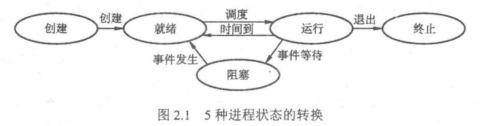

1. **就绪 $\to$ 运行**
2. **运行 $\to$ 就绪**
3. **就绪 $\to$ 阻塞**
4. **阻塞 $\to$ 就绪**


## 进程的组成

前文提及进程由下面三部分组成

- **PCB**
  - PCB 的重要性不言而喻. OS 只有通过 PCB 才能感受到 进程的存在, 从而进行进程管理.
  - PCB 包含的内容分类
    - **进程描述信息** : PID, PPID ...
    - **进程控制和管理信息** :  进程状态, 优先级, 代码运行入口地址, CPU占用时间, 信号量
    - **资源分配清单** : 代码段, 数据段, 堆栈段指针; 打开文件描述符.
    - **CPU相关信息** : 上一次执行暂停后CPU寄存器的值和CPU状态字.
- **程序段**
  - 能被**进程调度程序(在OS中)** 调度到 CPU 执行的代码片段.
- **数据段**
  - 进程代码操纵的**数据**.


PCB 的组织方法通常有

- 链接方式
- 索引方式


## 进程控制

**进程控制** : 对系统重的所有进程进行有效管理. 包括管理进程的**创建, 撤销, 转换**等等.

OS 中用来进程控制的**程序** 称为 **原语**, 具有**原子性**.


### 进程创建

**父进程**: 一个进程 $A$ 创建了进程 $B$, 那么 $A$ 就是 $B$ 的父进程, $B$ 是$A$ 的子进程.

- **子进程可以继承父进程的所拥有的资源**
- 子进程撤销时把资源还给父进程
- 父进程撤销时子进程也必须撤销.

典型应用是**终端程序**.


进程创建过程

- 收到进程创建请求后, 为新进程分配一个 PID, 申请一个空白 PCB. 若申请失败则创建失败(PCB空间有限)
- 为进程分配其所需资源. **如果资源不足, 则新进程会卡在创建态(而不是创建失败)**, 直到所需资源被分配完成.
- 初始化 PCB 中的所有信息.
- 将新进程转到就绪态, 进入就绪队列等待调度.


### 进程终止

引起进程终止的事件包括:

- **正常结束** : 进程完成代码执行主动退出.
- **异常结束** : 进程运行时发生了某种异常事件使得程序无法继续运行
- **外界干预** : 外界(例如其他进程, OS) 向进程发出终止信号.

程序终止的过程:

- 根据被终止进程标识符, 找到对应 PCB, 读出进程状态
  - 若进程是运行态, 则立即终止执行, 将 CPU 分配给其他进程.
  - 若进程还有子进程, 则终止其所有的子进程.
- 将该进程拥有的资源归还给父进程或OS
- 将其 PCB 从链表中删除

$$
a^2 + b^2 = c^2
$$


### 进程阻塞和唤醒

进程为了等待某些外部事件发生, **调用阻塞Block原语** 将自己**由运行态切换到阻塞态**

- 阻塞是进程主动行为, 因此**只有运行态才能转到阻塞态**.


阻塞过程 :

- OS 找到 被阻塞进程的 PCB
- 若进程为运行态, 则保护现场, 转为阻塞态, 停止运行 (通过修改 PCB 等操作实现)
- 把阻塞进程的 PCB 插入事件等待队列.

当进程期待的外部事件发生的时候, 有关进程或OS通过调用 `Wakeup`原语将等待该事件的进程唤醒.

唤醒过程 :

- 在发生事件的等待队列中找到相应进程 PCB
- 将该 PCB 从等待队列移出, 置其为就绪态 (不是直接置为运行态.)
- 将 PCB 插入就绪队列等待调度.


## 进程的通信


### 共享存储

两个需要通信的进程之间存在一个可以直接访问的**共享空间**, 对这块空间进行读写操作实现信息交换.

需要使用**同步互斥工具** 对共享空间的读写访问进行控制, 来**避免竞争条件** 的发生.

操作系统提供了控制工具, 具体怎么用需要交给用户来设计和安排.


### 消息传递

这种通信方式中, 进程之间的数据被**格式化为一个消息单位**, 利用**操作系统提供的消息传递方法**实现通信.

OS提供的原语主要是`SendMessage` 和 `ReceiveMessage`.


该方式是当前应用最广泛的进程间通信机制.

该机制也能很好的**支持多处理机系统, 分布式系统和计算机网络**.


可以细分为两种方式

- 直接通信方式
- 间接通信方式 : 多一个中间实体. 计算机网络常用这种


### 管道通信

该方式通信两个进程可以按照**生产者-消费者**模式进行通信.

- **生产者从管道的一端写, 消费者从管道的另一端读**
- 若管道空, 消费者阻塞. 若管道满, 生产者阻塞.

这种方式在并发执行的进程中会出现互斥问题, 出现两个进程同时阻塞的情况.  因此OS必须提供通信协调机制.

- **互斥**
- **同步**
- **确定对方存在**

这是并发编程的板块介绍内容.

> 在 Linux 中, 管道是最常使用的机制. **管道可以被视为一个文件(算是资源)**. 
>
> 管道只能由创建进程所访问, 当父进程创建一个进程后, 由于管道是一种特殊的文件(资源), 子进程会继承父进程打开的文件(继承管道), 使用它来与父进程通信.


## 线程和多线程模型

引入进程是为了管理**多道程序并发执行**, **提高资源利用率和系统吞吐量**

引入线程的目的是**减小程序在并发执行时所付出的时空开销, 提高并发性能.**


**线程** : 线程是进程中的一个实体, **是被系统独立调度和分派的基本单位**. 

- 线程本身**几乎不拥有资源** (资源的分配单位仍然是进程.) 但它可以使用它所在进程的资源. 因此同一个进程的多个线程可以资源共享.
- 线程之间相互制约, 使得线程在运行中呈现出间断性.

有线程模型的话, 进程就不再是CPU调度的基本单位了.


### 线程vs进程

- **调度**:
  - **线程的切换代价远低于操作系统**. 因为线程并不需要进行开销极大的 PCB 管理.
- **并发性** : 
  - 进程和线程都可以并发执行.
- **拥有资源**
  - 进程是资源分配的基本单位. 线程几乎没有自己的资源. 但是可以使用其隶属的进程资源.
  - **同一进程中的线程具有相同的地址空间**
  - 没有资源其实也导致线程的切换开销小.
- **独立性** : 
  - 同一进程中的线程不是竞争关系, 是为了提高并发性和相互配合所创建的. 
  - 同一进程的线程是共享资源的.
- **系统开销** :
  - 进程的创建, 切换开销远远大于线程的.
- **支持多处理机系统**
  - 多线程进程可以完美失配多CPU系统.


### 线程的属性

- 线程是轻型实体, 不拥有系统资源. 每个线程有一个**唯一标识符** 和**线程控制块**(类似PCB 的 TCB)
- 同一进程中的线程共享资源
- 多CPU系统中, 同一进程的多线程可同时占领不同的CPU
- 线程是CPU调度的基本单位.


### 线程的状态和转换

- 与进程基本一致.


### 线程的实现方式

- 用户级线程 ULT 
  - 线程的管理**全部在用户空间完成**. **内核不知道线程存在.** (也因此其调度单位仍是进程)
  - 普通程序可以通过**线程库** 来编程设计多线程程序.
  - 优点
    - 线程切换不需要进入内核, 开销极小
    - **不同进程中的线程调度可以用不同的算法**, 灵活
    - **用户级线程实现对跨平台友好**
  - 缺点 
    - 系统调用时**进程会被阻塞, 导致其他不需要阻塞的线程也被阻塞**
    - 多CPU系统中无法让不同线程在不同 CPU 上执行.
    - 
- 内核级线程 KLT
  - **线程的管理, 无论是用户进程还是系统进程, 都是在内核的支持下运行的**.
  - KLT 中内核会为每个线程设计 TCB, 利用 TCB 对线程进行感知.
  - 优点
    - 能发挥多 CPU 系统的优势
    - 不会出现一个线程被阻塞, 同进程下的其他线程都被阻塞的问题.
    - KLT 线程具有较小的数据结构和堆栈, 线程切换比 (用户空间中?) 较快?
    - 内核本身也可以用多线程技术设计, 提供系统的速度和效率.
  - 缺点
    - 线程切换需要遁入核心态进行, 系统开销大
- 组合方式
  - **内核支持多线程建立, 调度和管理. 也允许用户进程自行建立, 调度和管理用户级线程.**
  - 优点
    - 克服 KLT 和 ULT 各自的缺点, 结合各自优点.

目前主要使用的线程库是

- **POSIX Pthreads** : C语言最常用.
- **Windows API** :
- **Java**


## CPU 调度

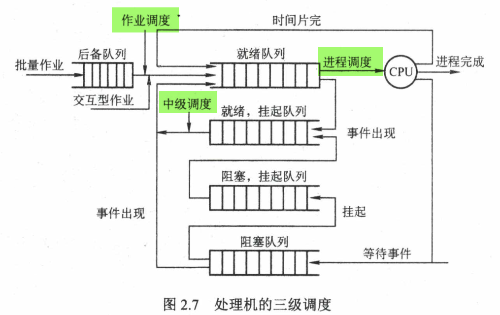

一个作业从提交后, 会进入**后备队列(在外存上)**. 直到作业完成, 要经历三级调度

1. **高级调度/作业调度** : 
   1. 按照**某种原则**从后备队列中挑选若干个,  为它们分配资源, 建立进程, 进入就绪队列, 使得它们可以竞争CPU的使用权.
   2. **作业调度 = 内存 $\iff$ 辅存**
   3. 每个作业只会调入一次, 调出一次.
2. **中级调度/内存调度** :
   1. 将那些暂时不能运行的进程**调度至外存等待**. 此时进程称为**挂起态**.
   2. 目的 : 提高内存利用率和系统吞吐量.
   3. 具体实现上, 就是内存的**对换**.
3. **低级调度/进程调度**:
   1. 按照某种算法**从就绪队列中选取一个进程, 将 CPU 分给它**.
   2. 是**最基本的调度**, 频率很高. OS 必须配置这种调度.


### 调度目标

评价调度算法有多种指标

- **CPU利用率** : 

  - 顾名思义. 应当使得 CPU 尽可能忙.
    $$
    CPU 利用率 = \frac{CPU有效工作时间}{CPU有效工作时间+等待时间}
    $$

- **系统吞吐量** :

  - **单位时间内CPU完成的作业数量**. 
    - **长作业太多会降低系统吞吐量**

- **周转时间** :

  - **从作业提交到作业完成的时间**. 
    $$
    周转时间 = 作业完成时间-作业提交时间
    $$

  - **平均周转时间** : 多个作业周转时间的平均值.

  - **带权周转时间** : 作业周转时间与作业实际运行时间的比值.
    $$
    带权周转时间 = \frac{周转时间}{实际运行时间}
    $$

  - **平均带权周转时间** : ...

- **等待时间** :

  - **进程处于等待CPU的时间和**.

- **响应时间**

  - **从用户提交请求到系统响应的时间**. (交互式系统常用)


### 调度实现

1. **调度程序** : 用于调度和分派CPU 的组件称为调度程序. 由三部分组成

   1. **排队器** : 

   2. **分派器** : 

   3. **上下文切换器** :

      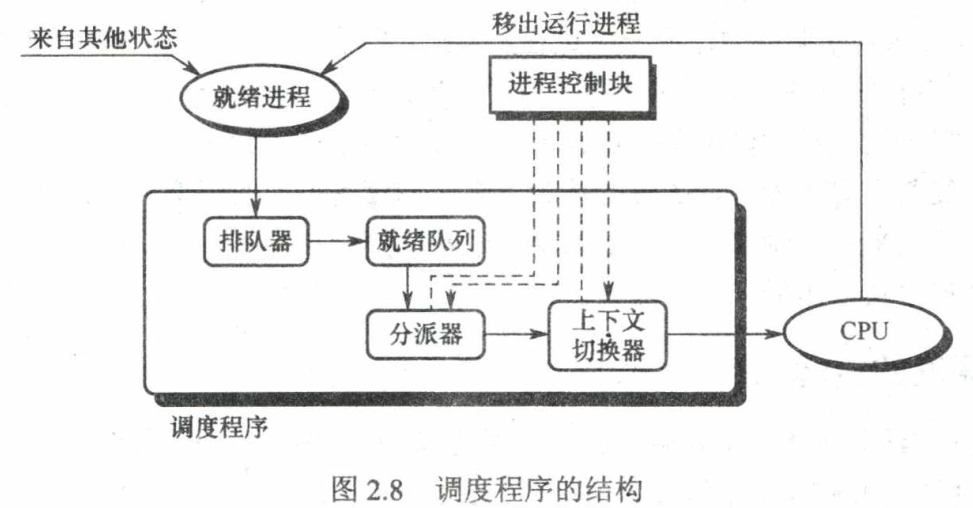

调度的时机 : **发生下面三种情况的时候不应该立刻执行调度**

- **正在处理中断**
- **进程在 OS 的内核临界区中**
- **其他需要屏蔽中断的原子操作**

调度分为两种

- **抢占式 :**
  - 若有更重要的进程进入就绪队列, 调度程序允许根据某种原则暂停正在进行的进程, 将CPU分配给这个更重要的进程.
  - 实例 : **分时系统(时间片用完后抢占)**
  - **可以提高系统的并发性和吞吐量**
- **非抢占式 :** 
  - 即使有更重要的进程进入就绪队列, 仍然让正在执行的进程完成或者进入阻塞, 才分配给其他进程.
  - 优点 : 简单, 开销小.
  - 缺点 : 不适合**分时系统, 实时系统**


**闲逛进程** : 就绪队列中没有需要运行的进程时会调度闲逛进程运行(难绷). [好好好 while(1){} 是吧].


### 调度算法

一些调度算法只能用在**作业调度**, 或者只能用于**进程调度**, 有些算法两者都可.

1. **先来先服务 FCFS** 

   1. 顾名思义. 
   2. 特点
      1. 可以用在**作业调度或进程调度**
      2. 非抢占式
      3. 长作业有利, **CPU忙作业有利**
   3. 优点
      1. 简单
   4. 缺点
      1. 效率低

2. **短作业优先 SJF / 短进程优先 SPF**

   1. 对执行时间短的作业优先调度. **运行时间通常是估计的**
   2. 特点 :
      1. 用在**作业/进程调度**
      2. 非抢占式 / 抢占式
   3. 优点
      1. **平均等待时间, 周转时间最少**
   4. 缺点
      1. 对长作业很不利
      2. 完全不考虑作业的重要程度
      3. 运行时间常常是估计的, 不能达到真正的 SJF

3. **优先级调度**

   1. 顾名思义
   2. 特点 : 
      1. **作业/进程调度**
      2. 可以抢占也可以非抢占, 看设计.
      3. 优先级可以动态变化, 看设计.
      4. 优先级设置常用原则:
         1. 系统进程 > 用户进程
         2. 交互 > 非交互
         3. IO忙 > CPU忙

4. **高响应比优先**

   1. 综合 FCFS, SJF. 同时考虑每个作业的等待和估计运行时间. 先计算响应比:
      $$
      R_p= \frac{等待时间+ 要求服务时间}{要求服务时间}
      $$
      等待时间相同, 则短作业优先. 作业运行时间相同, 则等待长的作业优先.

   2. **克服了 长作业饥饿的情况**.

   3. 抢占 or 非抢占.

5. **时间片轮转调度**

   1. 就是我们熟悉的那种. **分时系统常用**. 总体原则是 FCFS, 但是会有时间片剥夺机制.
   2. 一定是**抢占**

6. **多级队列调度**

   1. **多CPU系统**中, 该算法设置**多个就绪队列**, 将不同类型/性质的作业(例如优先级)分配到不同的就绪队列, 每个队列可以实施**不同的调度算法**.

7. **多级反馈队列调度算法**

   1. 综合时间片轮转和优先级调度.实现比前面的要复杂些
      1. 设置多个就绪队列, 每个队列有优先级. 第1级队列优先级最高, 其余的按顺序递减.
      2. **赋予各个队列的时间片大小不同**, 优先级越高的队列中时间片越短
      3. 每个队列采用 FCFS 算法.
      4. 一个作业准入后放入第1级队列末尾. 执行一次后, 如果未完成, 则放入第2级队列末尾, 依此类推. 直到某个第 $n$ 级, 进程队列不再改变, 而是使用**时间片轮转调度**.
   2. 优点
      1. 周转时间短
      2. 长作业可以得到部分执行, 不会饥饿.
      3. 对于交互性任务, 可以近似做到短作业优先
   3. 


### 进程切换


**上下文切换** : 切换CPU到另一个进程时, **需要保存当前进程的状态, 然后恢复另一个进程的状态.** 


## 同步与互斥

一些前置概念 : 

**临界资源** : 一次仅允许一个进程使用的资源

- 大部分**物理设备**是临界资源
- 部分**共享的变量, 数据**也是


对临界资源的访问必须**互斥地进行**

**临界区**: 进程中访问临界资源的代码.

临界资源的访问过程分为4步

1. **进入区** : 进入区检查**是否可以进入临界区**. 如果有其他进程在使用临界资源, 则阻塞. 若能进入临界区, 则设置访问临界区标志以阻止其他进程进入.
2. **临界区** : 又称**临界段**, 访问临界资源的代码 .
3. **退出区** : 将临界区标志清除. (其他进程可以进入临界区了.)
4. **剩余区** : 其他代码.


### 同步 和 互斥

**同步** : 也叫**直接制约关系**. 指为了完成某种任务而**建立的两个或多个进程**. 进程需要在某些位置上**为了协调工作次序** 而**等待, 传递信息**. 这产生了**源于相互合作的**制约关系.


**互斥** : 也叫**间接制约**关系.  **当一个进程进入临界区访问资源时, 另一个需要访问资源的进程需要等待.**


互斥机制设计需要遵循几种原则 :

- 空闲让进 : 临界区只要没有其他进程访问, 任何进程都可以**立即**访问.
- 忙则等待 : 临界区有其他进程访问时, 其他想进入临界区的进程**必须等待**
- 有限等待 : 等待的时间应该是**有限的**
- 让权等待 : 不能进入临界区时应**立刻放弃CPU**进入阻塞. (其实不放弃CPU在那里 while(1) 也是一种解决方案)

下面的一些互斥, 同步的实现方法都会用这四个准则进行评估.


**生产者-消费者模型**是个很重要的经典问题, 其中的**两个进程既需要解决同步问题, 也会有互斥的制约关系.**

- 同步问题 : 可以大体理解为 "**槽空阻塞消费者, 槽满阻塞生产者**" 以避免产生错误.
- 互斥问题 : "**消费者和生产者不能同时访问槽(临界资源**)"


### 临界区互斥实现


#### 1. 软件实现

临界区前的**进入区** 需要进行一些检查. 一种方法是通过软件设置一些变量来检查.

1. **单标志法** : 

   1. 设置一个公用整型 变量 `turn`, 指示被允许进入临界区的**进程编号**.
   2. `turn==0` 时, 允许 $P_0$ 进程进入临界区, 其他进程不给. 当$P_0$ 出临界区的时候设 `turn = 1`让其他进程进.
   3. 算法设计时**只考虑两个进程**的情况 : $P_0, P_1$. `turn` 变量在 `0` 和 `1` 来回变.
   4. 优缺点
      1. **能保证临界区只有一个进程访问**
      2. 但是 `turn == 0` 时, 如果 $P_0$ 不需要访问临界区, 那么它就无从变为 `turn == 1`, 从而 $P_1$ 无法进入
         1. 违反**空闲让进**
         2. 这个问题显然在进程更多的时候影响更显著.

2. **双标志法** : 

   1. 设置一个 `bool flag[]`,  `flag[i]`为`true` 表示第 $i$ 个进程正在访问临界区
   2. 还是考虑两个进程 $P_i, P_j$ 的情况. $P_i$ 在进入区检查 `flag[j]` 是否为 `false`. 若是则`while()`空转等待, 不是则进入临界区.
   3. 优缺点 :
      1. **不需要像单标志法那样交替进入**
      2. **但是可能出现`i`,`j`同时进入临界区的情况**
         1. 例如, $P_i$ 刚查完 `flag[j]` 为 `false`, 打算修改自己的 `flag[i]` , 但是在修改前被打断, 转去跑 $P_j$ 进程, $P_j$ 若刚好也在进入区检查发现 `flag[i]` 为 `false`, 然后准入临界区. 这时两个进程访问前都通过了检查, 发生了问题.
         2. 核心原因是 **检查别人的 `flag` 与 修改自己的 `flag` 不是原语, 不能一波做完**.
         3. 违反**忙则等待**

3.  **双标志法后检查** : 

   1. 为了双标志的问题, 对算法作改进. 
   2. 在 $P_i$ 检查别人的 `flag[j]` 之前, 先把自己的 `flag[i]` 改为 `TRUE`.
   3. 优缺点 :
      1. 不会同时进入临界区了. 但是**可能两个进程同时把自己设为 `TRUE` 而没开始检查**, 导致互相牵制, 谁都进不去临界区.
      2. 产生**饥饿**现象. 违反**空闲让进**.

4. **Peterson 算法** : 

   1. 依然是上一算法的改进.

   2. 引入了<u>单标志法</u>的公共变量 `turn`, 进程 $P_i$ 设置自己的`flag[i]` 为`TRUE` 后, 再加一步设置 公共变量`turn = j`.

   3. 进入临界区前, $P_i$ 循环判断 `flag[j] && turn==j` : 若轮到 $j$ 并且 $j$ 确实在临界区里, 那就空转等待.

      1. 只要有一个条件不满足, $P_i$ 就可以进入临界区 : 

         - 要么 `flag[j] != true` 表示 $P_j$ 不在临界区中
         - 要么 `turn = i` 表示 $P_j$ 刚想进临界区(也就是现在不在临界区里).

         

         

   4. 优缺点 :

      1. 彻底解决了**互斥和饥饿**的问题.


#### 2. 硬件实现

学习**信号量** 前建议看看这节.


**低级方法/元方法** : 用**硬件支持**实现临界资源问题的方法.


核心 : 计算机提供特殊的**硬件指令**, 允许对一个字的内容检测和修正, 或者交换两个字.

**硬件指令靠近底层, 通常是原语. 能够保证一些关键操作一起执行**.


下面的方法理解为主. 代码都是伪代码 (硬件指令实现, 通常不会有具体代码)

1. **中断屏蔽方法** : 

   1. 简称**关中断**, 即CPU将搁置中断信号 **(进程切换是由中断引起的**) , 先完成临界区资源访问的操作再开中断.
   2. 优缺点 :
      1. 并发执行效率明显降低.
      2. 将**关中断的权利交给用户程序是不稳妥的**. (若它不再开中断, 那整个系统就炸了)

2. **硬件指令方法** : 主要有两个

   1. `TestAndSet`指令, 是**原子操作**. (执行该代码的时候不允许被中断) 下面是其"逻辑"(等价伪代码, 但是物理上是由硬件直接完成的)

      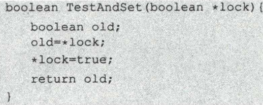

      1. 它的功能是 : (1)读出标志变量; (2)设标志为`true`. 
      2. 由此用一个`boolean`变量代表"临界区资源是否正在被使用"就可行了.

   2. `Swap` 指令, 也是原子操作 :

      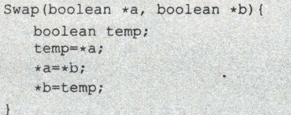

      1. 功能 : (1)交换两个字的内容.

      2. 用法 : 为临界资源设置 共享的`lock`变量, 初值为 `false`. 然后**每个进程内部** 设置一个局部变量`key`, 当想进入临界区时, 设 `key = true` 然后 执行 `Swap(lock, key)`; 当发现 `lock` 为 `false` 后进程就可以进入临界区了.

         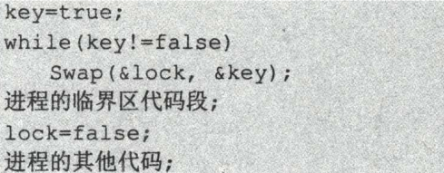

   3. 优缺点

      1. 优点 : **硬件方法稳定, 可靠. 适用任意数目的进程, 任意数目的临界区.**
      2. 缺点 : **仍然有忙等待问题** (CPU 空转等待) <u>其实前面的方法也有忙等待问题</u>.


#### 3. 互斥锁

进程进入临界区时用`acquire()`函数申请一个**互斥锁** (mutex lock), 若锁可用则申请成功, 锁不再可用 (通过设置锁的`avaiable` 变量实现), 直到进程退出临界区 `release()`.

显然上面的操作需要是**原语**, 通常也用**硬件机制**实现.

- 互斥锁依然有**忙等待**的问题. 
- 因此互斥锁常用在 多 CPU 系统, 让一个线程在一个处理器上等待, 其他线程继续执行.


 

前面的软硬件实现的方法在实现互斥的时候, 都让想进入临界区的进程**忙等待** (神秘 的 CPU 在 `while(1)` 上空转)

有其他类型的不同于忙等待的方法来解决互斥问题.

----

**注 : 学完信号量后就需要学习利用信号量进行并发编程来保证同步与互斥的实现, 从八股文的角度来看这一块需要背诵的内容不多. 所以下面内容的篇幅会大幅增长, 多是代码示例来促进理解, 无需记忆**

----

#### 4. 信号量

**信号量** : 是一种**特殊的变量**, 记为 `S`. 这个变量**只能被标准原语`wait(S)` 和 `signal(S)` 访问**, 通常也记为 "P 操作" 和 "V 操作", `down`操作 和 `up`操作.

根据信号量的**种类** 不同, 这两个操作的设计也不同 (但功能类似).

信号量很强, **同步和互斥** 都可以解决.


1. **整型信号量**

   1. `S` 被定义为 **可用资源的数目**, 是一个整型变量.

   2. 其 PV 操作 (伪代码) 为

      ```c++
      wait(s)
      {
          while(S <= 0);
          S = S - 1;
      }
      
      signal(s)
      {
      	S = S + 1;
      }
      ```

   3.  这个与前面的硬件实现方法区别不大. 当 `S<=0` 就会不断空转等待.

2. **记录型信号量**

   1. 通常说的 "信号量" 指这种.

   2. `S` 从功能上可描述 (不一定是这样) 成一个`struct`:

      ```c++
      typedef struct{
          int value;				// 可用资源的数目
          struct process *L;		// 是一个存放进程的链表
      }semaphore;
      ```

   3. PV 操作如下 (记得这两个操作是用原语实现的, 下面只是伪代码.)

      ```c++
      void wait(semaphore S)
      {
          // wait , P, down 操作都表示 "申请资源"
          S.value--;	
          // 若无可用资源, 则阻塞当前调用wait函数的进程
          if (S.value < 0)
          {
              S.L.insert(currentProcess);		// 伪代码, 把当前进程插入 S 的进程链表末尾
              block(S.L); 					// 阻塞当前调用的进程.
          }
      }
      
      void signal(semaphore S)
      {
          S.value++;
          if (S.value<=0)			// 仍有进程在请求该资源
          {
              S.L.remove(P);		// 移除 进程链表中的进程 (用 P 引用这个被移除的进程)
              wakeup(P);			// 唤醒 P
          }
              
      }
      ```

   4. 这种信号量**完全解决了忙等待问题**

      1. 当没有希望的资源的时候, 进程会主动放弃 CPU 转入阻塞态, 等待其他进程释放临界区唤醒.


**用信号量实现同步与互斥**是重点. 下面是两种基本方法.

- 信号量实现**同步** :

  - 假设 `P1` 和 `P2` 需要实现同步, 顺序为

    - `P1` 先执行语句 `x`, `P2` 才能执行 `y` 语句.

  - 用一个公共信号量 `S` 实现这个功能 :

    ```cpp
    semaphore S = 0; 
    P1()
    {
        x;				// P1执行完, 让信号量++ 唤醒 P2, 然后可以执行 y 语句
        signal(S)		// P 操作, 也可以写成 P(S)
    }
    P2()
    {
        //... 其他前面的代码
        wait(S)			// V 操作, 也可以写成 V(S)
        y;
    }
    ```

    

- 信号量实现**互斥** :

  - 进程 `P1`, `P2` 要访问同一个临界资源时, 也可以用信号量实现互斥

    ```cpp
    semaphore S = 1;
    P1()
    {
    	//...
        P(S);			// 访问临界区
    	access1();		
        V(S);			// 离开临界区 (有可能顺手唤醒 P2)
        //...
        
    }
    
    P2()
    {
    	//...
        P(S);			// 访问临界区
    	access2();		
        V(S);			// 离开临界区 (有可能顺手唤醒 P2)
        //...
        
    }
    ```


#### 5. 管程

信号量仍有缺点

- 大量**同步, 互斥操作**为<u>代码编写</u>带来了极大的难度, 稍有不慎就会使系统陷入死锁.

于是使用管程来解决.


**管程** : 指某种共享资源的**数据结构**, 以及对这种数据结构**实施操作的一组过程(函数)**, 一起组成的**资源管理程序**.

- 管程**定义了一个数据结构** 以及能**被并发的进程执行**的一组操作函数.

这个角度上看, **管程很像一个类class** (具体是不是不知道.)

具体说来, 管程包含4部分

- 管程的名称
- 管程内部的**局部数据结构说明**, (这个数据结构**指代一种临界资源**) .
- 对该数据结构操作的一组函数
- 管程内部的**局部的初始化函数** (对上面的数据结构进行初始化, 类似构造函数)

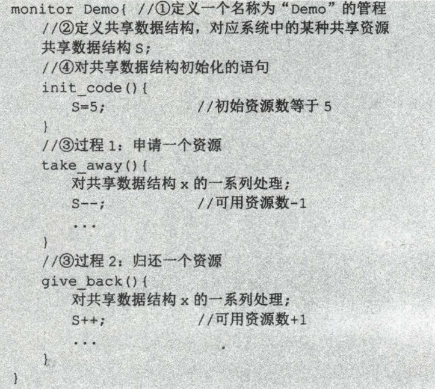


为了保证对资源访问的互斥和同步, 当一个进程使用管程中的函数时, **此时若另一个进程要调用管程中的函数, 它应当被阻塞直到前一个进程离开.**

实现这个机制的是**条件变量** :

- 条件变量是"**管程阻塞的原因**"

- 每个条件变量都包含一个"进程阻塞链表", 记录**有什么进程阻塞在该条件变量上**.

- 其操作与**信号量**很像, 只能对其使用 wait 和 signal 的操作, 但是有一些小区别.

  - `wait` 的功能 : **阻塞当前调用管程函数的进程**. (<u>没有值的加加减减</u>)

  - `signal` 的功能 : **唤醒一个被阻塞的进程**

  - 区别在于, **条件变量并没有"值", 而信号量有**. 

    - 条件变量调用 PV操作的时候, 是直接对进程进行阻塞和唤醒, 没有改值的步骤.

      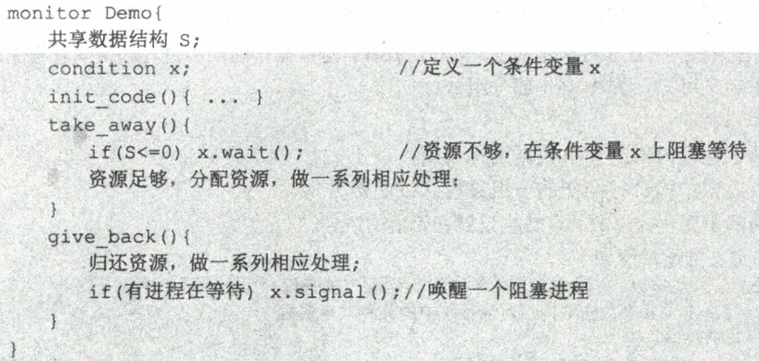


### 经典同步与互斥问题


#### 1. 生产者-消费者问题 Producer-Consumer

问题情景 :

- 两个进程并发执行, 分别是**生产者Producer 和消费者 Consumer**. **二者共享一个大小为 $n$ 的槽(缓冲区)**. 正常的工作流程是, <u>生产者往槽放数据, 消费者按顺序拿取数据</u>. **只有缓冲区未满时, 生产者才能写入缓冲区; 只有缓冲区非空时, 消费者才能拿取数据**. 

分析 :

- **同步问题 :** **槽空不能读, 槽满不能写**. 这是基本逻辑, 不发生错误的前提.
  - 为此需要一个`full` 信号量来**同步槽满不能写**, 用一个 `empty` 信号量来**同步槽空不能读**
- **互斥问题 :** 如果允许生产者和消费者同时访问缓冲区, 而不作互斥处理的话, **二者有可能因为实现同步, 最终同时阻塞.** 无法持续进行.
  - 为此需要一个`mutex` 信号量来保证**缓冲区访问互斥**.

可以如下设计伪代码实现同步与互斥.

```cpp
// 设缓冲区大小保存在 int n. wait/signal操作简记为 P/V 操作
semaphore empty = 0, full = n, mutex = 1;	// 信号量初始化
// empty 用来保证槽空不能读
// full 保证槽满不能放 : full 为 0 时说明槽满
void Producer()
{
    // 假设生产者源源不断地放数据
    // 槽满不能放
    P(full)	;
    
    // 互斥访问缓存区
    P(mutex);
    putObject();	// 放到缓存区中
    V(mutex);
    
    V(empty);		// 注意, 这里是把 empty++, 唤醒可能在阻塞的 Consumer
}
void Comsumer()
{
    // 槽空不能读
    P(empty);		// Consumer 可能因为槽空阻塞在这里. Producer 的 V(empty)操作能唤醒它
    
    P(mutex);		
    takeObject();
    V(mutex);
    
    V(full);
}
```


----

下面是另一个更复杂的变种

问题情境 : 有四个人物 分别是 爸爸, 妈妈, 儿子, 女儿. **他们共享一个盘子**. 各自对盘子的行动逻辑如下

- 爸爸专门放苹果
- 妈妈专门放橘子
- 儿子专门吃橘子
- 女儿专门吃苹果

**仅当盘子为空, 爸爸和妈妈才能放水果; 仅当盘子有自己需要的水果, 儿子和女儿才能拿水果.**


分析 :

- 四个人分别看成四个进程, 且两个是Producer, 两个是Consumer. 盘子是一个大小为 1 的缓冲区, 且能放两类数据 : 苹果/橘子
- **同步** : 题目加粗字已经标注. **爸爸-女儿, 妈妈-儿子 是同步关系.** 
  - 需要用信号量 `Apple` 同步爸爸-女儿, 用 `orange` 同步妈妈-儿子.
- **互斥 :** **爸爸和妈妈对缓冲区互斥, 他们不能同时访问盘子**. 
  - 用信号量 `mutex` 保证爸爸和妈妈互斥.

```cpp
semaphore Apple = 0, Orange = 0, mutex = 0;
void Father()
{
    // 持续放苹果
    P(mutex);
    putApple();
    // 注意这里没有 V(mutex) 因为缓冲区大小为1 , 
    // 不能增 mutex 唤醒 Mother 或者允许Father再次放苹果 ,
    // 除非 Daughter 把苹果拿走. 所以 V(mutex)放到了 Daughter中
    V(Apple);		// 能唤醒可能沉睡的女儿
}
void Mother()
{
    P(mutex);
    putOrange();
    // 这里同理
    V(Orange);
}
void Daughter()
{
    P(Apple);		// 可能阻塞
    takeApple();
    V(mutex);		// 唤醒可能阻塞的 Father 和 Mother .
}
void Son()
{
    P(Orange);
    takeOrange();
    V(mutex);
}
```


#### 2. 读者-写者 

问题情景 : 有**两组(每组多个)** 并发执行的进程, 分为**读者Reader**和**写者Writer**. 共享一个**文件**.  有以下要求

- 允许**多个Reader同时读访问**. 但**不允许<u>Writer</u>与其他进程(包括Reader和Writer)一起访问**. (实际中会产生数据不一致性) 具体而言 :
  1. Writer 访问文件时, 如果有其他进程访问文件, 则阻塞等待其全部退出;
  2. Reader 和 Writer 访问文件时, 如果 有某个(其他的) Writer 访问文件, 则阻塞等待其退出. 

分析 :

- 问题主要是写进程与其他进程访问文件的互斥关系.
- Writer 的互斥可以用一个信号量 `rw` 解决. 
- Reader 的同步互斥比较复杂.  **不能让每个 Reader 访问的时候, 都对 `rw` 进行 P操作/`down`操作.** 
  - 这里设计一个 `int count` 表示读者正在访问的数量. 如果是第一个访问文件`Reader`, 那么它需要`down(rw)`来阻止 Writer 进入. 而后面的 读者再进来就不需要, 否则它们就阻塞在`rw`上了. 这可以通过判断`conut == 0` 来实现.
  - **关键** : 对 `count` 的修改操作和`down(pw)`**必须是连续执行的**, 需要保证各个Reader 在`count` 访问上互斥, 否则会出现数据不一致的问题. 因此加一个 `mutex` 信号量保证这一点.

```cpp
int count = 0;
semaphore mutex = 1, rw = 1;
// 感觉 PV, wait/signal 的写法都不够直观.
// 下面都用 down() 和 up() 来描述对信号量的操作. down() 一个值为0的信号量会引起阻塞.
writer()
{
    down(rw);
    writeAccess();
    up(rw);
}
reader()
{
    // 读者要访问前, 要先改conut
    down(mutex);
    if (count == 0) down(rw);		// 若没有其他reader在访问, 则需要阻止writer访问
    count++;		// 读者访问加一
    up(mutex);
    
    readAccess();
    
    // 访问结束修改 conut
    down(mutex);
    count--;
    if(count == 0) up(rw); 			//没有其他reader了. 允许 writer 操作.
    up(mutex);
}
```

显然这种实现**有利于 Reader**. **Writer** 有可能饥饿. 想写有利于**Writer** 的代码可以多加一个信号量 `w` . 使用逻辑为

- Writer 想访问的时候, `down(w)` 来说明存在 Writer 想访问.
- Reader 在进入前, 需要尝试 `down(w); //改count// ; up(w)` 来确认没有 Writer 来访问. 如果有, 那么后来的` Reader` 会被阻塞在 `w` 上, 直到 Writer 解除 `up(w)`.

**从读者写者问题中, 可以学习的东西是利用**<u>互斥访问计数器等额外计数变量</u>**来帮助实现互斥同步. 并且注意额外变量的访问修改也需要实现互斥即可.**


#### 3. 哲学家进餐问题

略. (偏重要 & 经典, 建议了解)


## 死锁

多道程序并发执行提升了效率的同时, 也带来了**死锁**的问题.

**死锁:** 多个进程因争夺资源而**造成互相等待的僵局**, 没有外力的干预则无法继续运行.


死锁产生的原因

1. **系统资源的竞争**
2. **进程推进顺序非法** : 请求 和 释放 资源不当.
   1. 信号量本身也是一种使用不当会造成死锁的资源.


死锁产生的4个必要条件

1. **互斥条件** : 进程要求对所分配的资源进行排他性使用.
2. **不剥夺条件** : 进程获得的资源在未使用完成前, 不能被其他进程强制夺走.
3. **请求并保持条件** : 进程获得了至少一个资源, 请求其他资源的时候被阻塞, 自己的资源又无法释放.
4. **循环等待** : 存在一种**进程资源的循环等待链** (通常通过画图判断)

注意区分两组概念 (书上有写, 这里省略)

- **循环等待**和**死锁定义**.
- **不剥夺条件** 和 **请求并保持条件**


死锁处理策略

**核心** : 

1. **死锁预防** : 破坏4个必要条件之一.
2. **避免死锁** : 通过资源分配过程中添加一定限制来保证不产生死锁.
3. **死锁检测及解除** : 隔一段时间检测是否有进程发生死锁, 并进行外力干预.

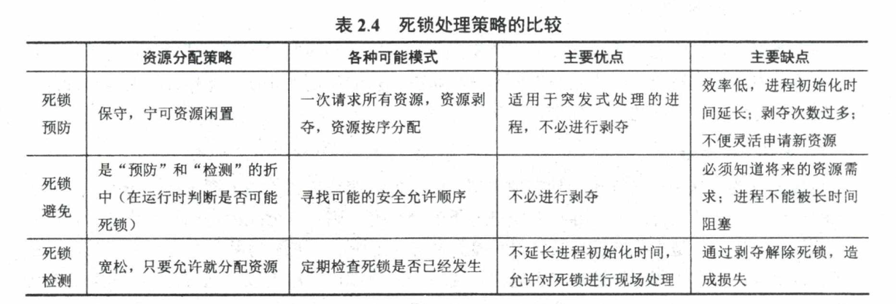


### 死锁预防

**死锁预防** : 破坏4个必要条件之一.

1. 破坏**互斥条件** : 让所有资源都能共享使用.
   1. 通常不可行 : (1)很多资源根本无法共享使用; (2)无法保证应该互斥时互斥.
2. 破坏**不剥夺条件** : 让进程已经持有的资源在无法请求更多需要的资源时**能够被剥夺**.
   1. 实现复杂
   2. 会导致反复的申请和释放, 导致**增加系统开销, 降低吞吐量**.
   3. 可用于**内存资源**, 不可用于诸如**打印机** 这种**状态不易保存和恢复的**.
3. 破坏**请求并保持条件** : 让进程一次性请求完所有的资源.
   1. 实现简单.
   2. **系统资源可能被严重浪费**. 因为很多资源使用的时间仅仅占进程的一小部分.
   3. **容易导致饥饿现象**.
4. 破坏**循环等待条件** : 给系统的资源编号, 每个进程必须按编号递增的顺序请求资源, 同类资源一次申请完.
   1. 编号必须稳定, 所以限制设备资源的扩展性
   2. 编程难度大
   3. 实际上也容易造成浪费资源


### 死锁避免

**避免死锁** : 通过资源分配过程中添加一定限制来保证不产生死锁.

1. **系统安全状态** : 如果能<u>按照某种方法</u>分配资源, 记这个分配进程的序列为 $(P_1, \cdots, P_n)$,  使得**所有进程都能够执行完毕(进程有申请和释放资源的动作)**, 那么此时称系统为**安全状态**.
   1. 只要系统还是安全状态, 就不可能产生死锁.

**银行家算法 :**

略 (后面有空补充.)


### 死锁检测和解除

**死锁检测及解除** : 隔一段时间检测是否有进程发生死锁, 并进行外力干预.


**资源分配图** : 

- 资源分配情况可以用资源分配图来描述. 

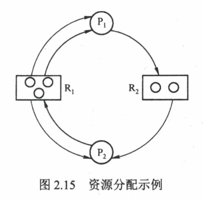

**死锁定理** : (略)


**死锁解除** :

一旦检测出死锁, 就可以采取外力干预.

1. **资源剥夺法** : 挂起某些死锁进程, 并剥夺其资源.
2. **撤销进程法** : 强制撤销部分进程, 释放其资源.
3. **进程回退法** : 让进程回退到没有发生死锁的时刻, 这种方法需要保持进程的历史信息和还原点.


# 第三章 内存管理


## 内存管理概念

**背景** : 程序使用的内存量已经远远超出了硬件技术的发展. 操作系统需要对内存空间进行合理的划分和有效的动态分配.

**内存管理** : 操作系统对内存的**划分和动态分配**

内存管理的**主要功能** :

- **内存空间分配和回收**
- **地址转换**
- **内存空间的扩充**
- **内存共享**
- **存储保护**


> 关于**进程的完整生命周期** :
>
> 创建进程的时候, 要将代码和数据装到内存中, 供CPU访问,执行. 具体还有几个步骤 :
>
> - **编译** : **编译器(也是进程)**将用户的源代码编译为若干模块
> - **链接** : 由**链接程序**(进程) 将上述模块链接到一起, 包括其中引入的库, 形成一个完整的可装入模块. 
> - **装入** : 将上述链接结果装入内存
>
> 
>
> 而链接方案又分为几种 :
>
> - **静态链接** : 将所有模块打包到一个完整模块, 不再修改. 
> - **装入时动态链接** : 编译后, 边装入内存边链接. 
>   - 优点是**便于修改, 更新** 和**便于共享**
> - **运行时动态链接** : 当程序中**需要用到某个模块时才把该模块链接装入到内存中**
>   - 优点是**不需要将完整的库装入内存**, **节省大量内存**.
>   - 装入速度快
>
> 
>
> 装入模块也有几种方案
>
> - **绝对装入** : 编译产生的结果直接作为内存物理地址的引用, 不进行变换.
>   - 只适用于**单道程序系统**.
> - **可重定位装入(静态重定位)** :  装入过程会对模块中的地址进行修改.
>   - 相比下面的动态重定位, 这种装入必须一次性把程序全部装入内存, 且后续不再修改
> - **动态运行时装入(动态重定位)** : 程序如果在内存中的位置发生改变, 装入时需要修改.
>   - 优点 : 可以将程序分配到不连续的存储区域. 并且程序只需要装入部分代码就能运行. 下面也会有基于此出现的虚拟内存技术.


**逻辑地址** : 也叫**相对地址**. 链接程序会在连接过程将各个编译模块链接为**一个具有逻辑上的虚拟地址空间 中的程序**.

- 人话 : 如果计算机是32位系统, 写程序代码的时候你可以对 $0 \sim 2^{31}-1$ 地址空间进行操作. **仿佛你写的这个程序独占整个内存.** 但只是写代码的时候的感觉, 操作系统帮你料理了所有的与实际地址对应的后事.

**物理地址** : 内存空间中物理单元的实际地址. **逻辑地址**最终都要转化为 **物理地址** 才能真正被 CPU 操作.

操作系统内部实现 逻辑地址 $\to$ 物理地址转换 的是 **内存管理部件(MMU)**. 


进程的**内存映像** :  进程在内存中拥有的数据结构, 包括

- 代码段
- 数据段
- PCB : 放在系统区, 被 OS 管理.
- 堆 : 存放动态分配的变量. C 语言中 用 `malloc` 分配的部分.
- 栈 : 实现函数调用

下面是示例. 箭头表示分配方向.

> 个人认为下面这张图描述的是**逻辑地址空间**. 但是书上没明说. 物理地址空间是不是下面这样要看是否使用虚拟内存等技术.

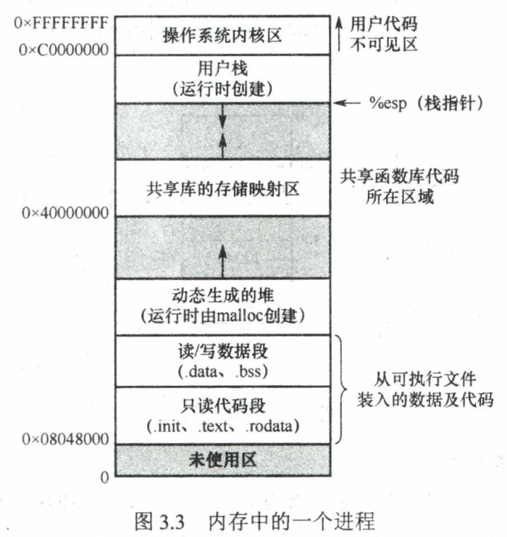


**内存保护** : 确保每个进程都有一个独立的内存空间. 是一种需要被实现的目标.

- 人话 : 其他进程不能动你的进程的东西.

方案 :

- **CPU** 中设立 **上限, 下限寄存器** 来防止对超出这个范围的内存进行访问. 
  - 不那么好用.
- **基址寄存器 + 限长寄存器** : 基址寄存器记录 最小物理地址值, 限长寄存器记录逻辑地址最大值.
  - 例 : 基址 1000 和 限长 50 时 , 若 CPU 获得了指令中的一个逻辑地址 34 (从0开始), 那它能判断应该访问真正的地址 1034. 如果获取了一个逻辑地址 67, 超过了限长 50, 会引发访问错误.


**可重入代码** : 又叫**纯代码**. 是一种**只读**的代码, **允许多个进程同时访问.**

**内存共享** : 顾名思义. 允许多个进程访问的内存空间.


### 覆盖与对换

考研新大纲已删除, 此略.


### 内存连续分配方案

内存**连续分配** : 为一个用户程序分配一整段连续的内存空间.

与之相对的是离散分配, 通常也称为**页式管理**.

具体方案

1. **单一连续分配** : 
   1. 内存只分为系统区(给OS) 和**一个**用户区, 只能实现**单道程序**.
2. **固定分区分配** :
   1. 将内存分划为系统区以及**若干用户区**, 每个分区只装入一道作业. 分区可以**相同大小** 和**不同大小**.(但是是固定的)
3. **动态分区分配** :
   1. 根据程序需要分配内存空间. (常用)
   2. 会遇到**内存碎片化**的问题. 内存中会产生越来越多小的内存块, 称为**外部碎片** .
   3. 所以操作系统需要一些算法, 找到合适的内存块给新的进程使用.
      1. **首次适应 First Fit** : 用链表管理空闲内存块. 从链表首部开始往后, 找到大小满足要求的第一个内存块分配给进程.
         1. 性能比较好.
         2. 查找过程的头部小分区容易多次冗余遍历, 增加开销.
      2. **邻近适应 Next Fit** : **循环首次适应算法**. 与 First Fit 类似. 不同的是每次寻找是从上次找到的位置开始, 不是链表头部.
         1. 尝试解决 First Fit 的不足, 但是性能通常差一点.
      3. **最佳适应 Best Fit** : 按空闲块大小递增顺序维护链表, 从小到大寻找, 找到的第一个能满足要求的最小空闲分区. 该方法会增加维护链表的开销.
         1. 通常性能很差, 会留下**最多的外部碎片**.
      4. **最坏适应 Worst Fit** : 按空闲块大小递增顺序维护链表, 从大到小找. 通常会找到**块最大的那一个**, 从中分割一部分出来给作业.
         1. 性能也很差, 容易导致大内存块不足.


连续分配已经逐渐跟不上计算机对内存大小的要求. 所以现在通常采用**非连续分配方式.**

- **分页存储管理**
  - 基本分页存储管理
  - 请求分页存储管理
- **分段存储管理**


## 分页存储管理

分页思想 : 将**内存划分为大小相等的块**, **进程也将自己的逻辑地址划分为相同大小的块.**  进程在执行时, 以块为单位向主存装入.

**分页管理不会产生外部碎片** . 但是会有**内部碎片/页内碎片** (一个块内没用完的空间)


### 基本概念

基本概念 :

- **页面/页** : 进程中的块.
- **页框/页帧 (frame)** : 内存中的块
- **盘块** : 外存(例如硬盘) 按同样的大小划分得到的块. 

进程装入主存运行时, 基本逻辑是将**自己的一部分页面装入主存的某个页框中**, 这就产生了一个**页面与页框的对应关系.**

> 页面大小的分配 :
>
> - 页面大小通常是 2 的幂次个字节, 这样在二进制上是方便进行地址转换的. (将页面号转为页框号)
> - 页面太大会导致内部碎片增多.
> - 页面太小使得页面数量增多, 页面的信息存储在页表中, 页表增长会**占用过多内存去管理页面**.
>   - 增加管理开销
>   - 降低内存利用率

在分页存储的系统中, 地址 (逻辑或物理的) 可以被划分为两部分 (以32位地址为例)

1. **页号** : 高 20 位代表的二进制数
2. **页内偏移量** : 低 12 位代表的二进制数

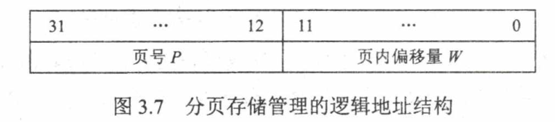

<u>划分方式可能有很多种, 不一定是 20 + 12.</u>

上面这种划分方式表示 一共有  $2^{20}$ 个页面, 每个页面大小为  $2^{12}$ 个字节 (通常 1 存储单元 存1字节 ), 也就是 $4$ KB .


### 页表

前面说过, 进程需要**将自己的部分页面装入页框中才能被 CPU 执行**. 

- 进程的逻辑地址非常大, 分块也很多. 内存中没有那么多页框容纳进程的所有页, 所以进程需要将当前需要使用的页装入内存供CPU使用.

这就存在了一个对应关系, **将哪些页面对应到内存中的哪个页框** (或者当前页面不在内存中)

**页表** 就是用来表示这个对应关系的.

**页表由页表项组成**. 操作系统为每个进程配置一张页表, **放在内存中**. 


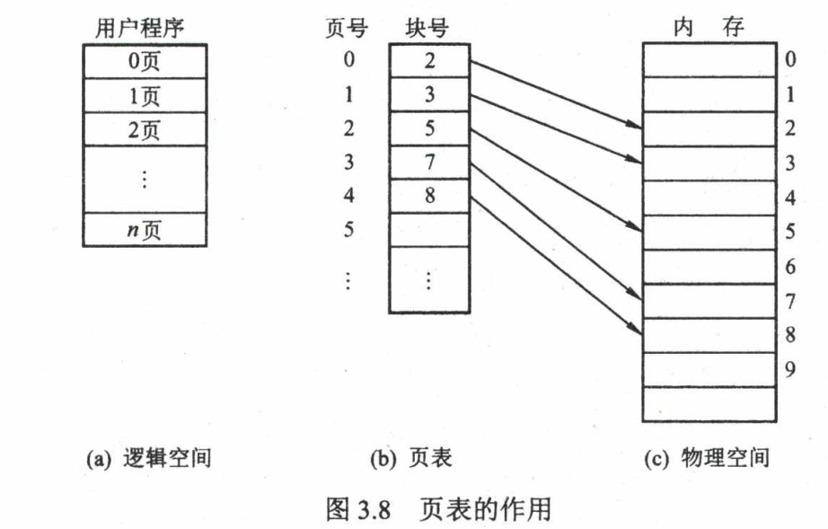

在进程执行时, 给 CPU 一个32位地址, 根据前20位确定页面编号以后,  通过查找页表, 可以知道**该地址所在的页面对应哪个页框.** 进而**完成逻辑地址到物理地址的转换**.

完成上述转换任务的组件称为**地址变换机构**. 基本结构如下

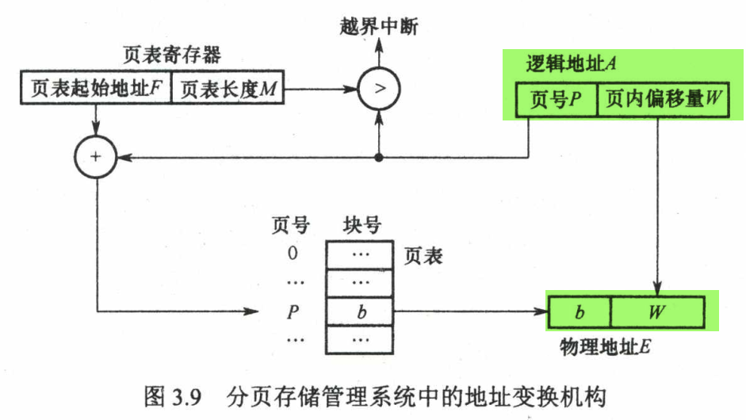

- 图中变换机构的任务是**根据页表信息**, 将右上角的**逻辑地址`A`** 中的**页号P** 映射到真实物理地址**页框号b**. 
- 由于页面和页框大小一致, **偏移量不需要改变**.


### 缺页中断

<u>当进程访问了一个不在主存中的页面时</u>, 系统发现页表中该页面没有对应任何页框号. 此时会引发一个**缺页中断**, 控制权交给操作系统, 将进程需要的那个页面移入主存.

- **如果此时主存中已经放满了页面, 则需要使用页面置换算法来决定将哪个页面淘汰**.


分页管理方式有几个问题需要解决

1. **访问内存的时候都需要进行逻辑地址到物理地址的转换**, 地址转换速度必须足够快.
2. **页表太大 (对应页面太小) 会影响内存利用率**.


### **快表** 

页表是放在内存中的, 这就导致 CPU 每次需要引用地址时, 都<u>需要先访问内存去看一眼页表应该怎么进行变换.</u> 也就是**存取一个数据, 或者获取一条代码都需要至少访问两次主存.** 相当于执行速度慢了一半. 

为了解决这个问题, 在地址变换机构中添加了一个**高速缓冲存储器 : 快表 / 相关联存储器(TLB)**. 用来对**页表项** 进行**缓存**, 以**加速地址变换过程**. 

- 对应地, 主存中的页表就被称为**慢表**.
- 注 : **快表是硬件支持的**, 是一个附在 CPU 上的缓存. 支持**并行查找**, <u>查找过程完全由硬件完成</u>.

示意图如下 : 

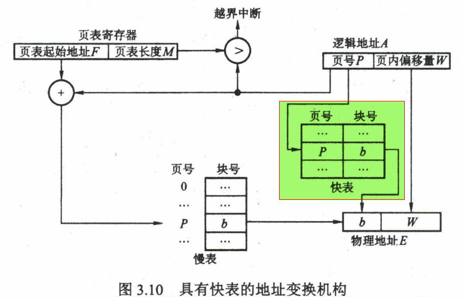

图中绿色高亮的部分就是增设的**快表**.  现在地址转换有两种途径

- CPU 给出逻辑地址后, 由硬件进行地址变换, 将页号送入高速缓存寄存器, 将此页号与快表中的所有页号进行(**并行**)比较.
  1. 找到匹配的页号, 且**确认该项有效**后, 直接从快表中取出页框号, 与偏移量一起构成物理地址.
  2. 若没有找到, 则需要访问主存中的页表. 像没有快表一样获取物理地址.

由于进程访问的地址范围通常十分集中 (**局部性原理**), 快表的命中率通常在 90% 上, 将速度随时降低到 10% 以下.


### **两级页表** 

随着地址空间越来越大, 页表的大小也越来越大, 内存的页表管理开销也越来越重. 

为了**压缩页表**, 进一步延伸映射的思想, 得到**二级分页**. 将地址划分为如下三个部分

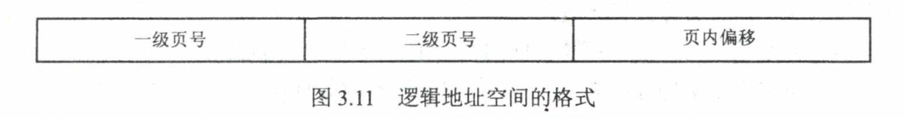

与一级页表的思路一模一样. 是在原来的一级页表上再附上一层页表. 相当于建立了一个**索引**.

- 二级页表中, 每一个表项存储的是 **一级页表号**. 
- 二级页表中的一项, 假设大小是 4KB, 就可以存储 1024 个一级页表号.

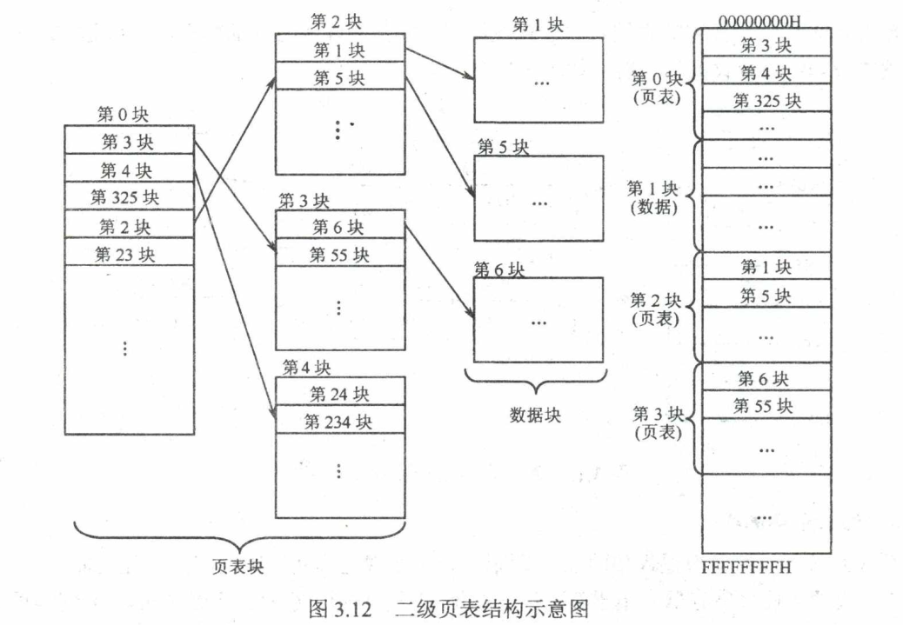

**使用二级页表, 就不必将一级页表全部装入内存**, 仅在需要时调入.

同理, 如果有需要, 还可以设计三级页表等等.


## 分段存储管理


### 分段

分段方式的提出是考虑了**程序员** 和**用户**的角度.

段式管理方式**按照用户进程中的自然段**划分**逻辑地址空间**.

记得前面连续分配时, 每个进程在内存中的**内存映像**包括以下几部分

- 代码段
- 数据段
- 堆栈段
- ...

于是, 可以把这些段全部划分开, **每个段从0开始编址**, 每个段配备一个连续的空间 (段内连续, 段间可以不连续).

与分页类似, 分段也将地址划分为两部分

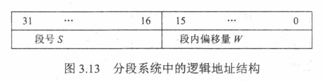

与分页管理中, 页号对用户透明相比,  **段式系统中, 段号和段内偏移量必须由用户显式提供**. 通常高级程序设计语言的编译器会完成这个工作.


### 段表

类似页表

每个进程在**内存的系统区中** 会保存一张段表.  每个段表项包括下面三部分

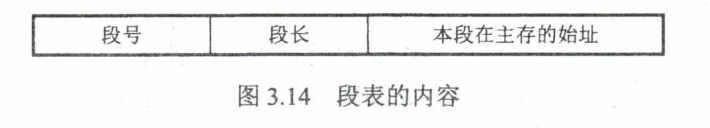

有了段表, 进程就可以找到每一段所对应的内存物理地址区域.

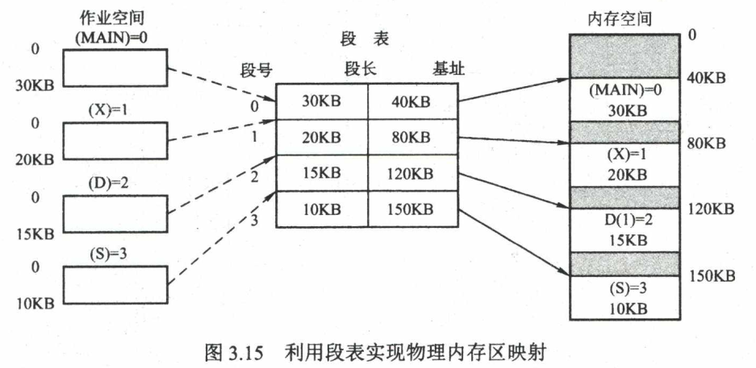

段式系统同样有**地址变换机构**. 与分页式类似.


### 段的共享和保护

段的共享 : **两个作业**的段表指向被共享段的同一个物理副本实现.


### 段页式存储管理

略

## 虚拟内存

前面的所有方法都具有以下几个特点

- **一次性** : 作业必须一次性全部装入内存后, 才可以运行. 
  - 当作业大到无法被装入内存时, 作业将无法运行
  - 大量作业要求运行时, 只有少数作业先运行, 导致系统并发性下降.
- **驻留性** : 作业被装入内存后, 其全部部分全都驻留在内存中, 任何部分都不会被换出. 
  - 一些暂时无法执行的进程也会一直占用内存.


**局部性原理:**

高速缓存技术的应用基于**局部性原理** :

- **时间局部性** : 程序中某条指令一旦执行, 不久后该指令很可能再次执行. 数据被访问后不久, 可能会被再次访问. 
  - 程序中存在大量的循环.
  - **将最近执行的指令和数据保存到高速缓存**中是在利用**时间局部性**.
- **空间局部性** : 一旦程序访问了某个内存单元, 不久后其附近的内存单元也将被访问. 
  - 指令通常是顺序存放, 数据通常是数组, 向量等簇聚存储的.
  - 使用较大的高速缓存, 使用**预取机制** 是在利用**空间局部性**.


**虚拟内存** :

基于局部性原理, 在程序装入时:

-  **仅将程序当前要运行的少数页面或段先装入内存, 而将其余部分暂留在外存(硬盘)上**, 便可启动程序执行.

- 当**所访问的信息不在内存中**时, 由操作系统将所需要的部分调入内存, 继续执行程序.
- 操作系统会将**暂时用不上的页面或段放到外存上**, 从而腾出空间存放其他内容.

这样, 系统好像为用户提供了一个**比实际内存容量大很多的**存储器, 即所谓**虚拟存储器**.


虚拟存储器的三个特征:

1. **多次性**  : 
   1. 允许作业被分多次调入内存运行. 只需将当前需要运行的部分程序和数据装入内存即可开始运行.
   2. **多次性是虚拟存储器的最重要特征**.
2. **对换性** :
   1. 作业无须在运行时一直常驻内存, 允许将暂时用不到的程序和数据从内存调到外存的**对换区**, 需要使用时再调入内存.
   2. 虚拟存储器得以正常运行是因为**对唤性**.
3. **虚拟性**
   1. 从逻辑上扩充内存容量, 使得**用户看到的内存容量远远大于实际的内存容量**
   2. 这是虚拟存储器表现出的**最重要特征** , 也是虚拟存储器的**最终目标**.


技术实现 :

虚拟存储器一定建立在**离散分配**的内存管理方式上.

- **请求分页**存储管理
- **请求分段**存储管理
- **请求段页式**存储管理

虚拟存储器需要的**硬件支持包括**:

- 一定容量的内存和外存
- **页表/段表机制** 作为主要数据结构
- **中断机构** : **缺页中断**
- **地址变换机构** : 逻辑地址转换到物理地址


## 请求分页

建立在基本分页管理的基础上. 增加了**请求调页功能** 和 **页面置换功能**.

请求分页是目前**最常用的一种实现虚拟存储器的方法**


### 页表

页表同样是放在内存中, 页表项增加了几个字段


- 状态位 $P$ : 标记**该页是否已经调入内存** 
- 访问字段 $A$ : 用一些指标, 表示**当前页面的使用频繁程度**. 例如记录**当前页面在一段时间内的被访问次数**  
  - 主要是给**页面置换算法参考**
- 修改位 $M$ : 标记该页在调入内存后**是否被修改过**
  - 用来确定**该页面被置换走的时候是否写到外存**. 
  - 如果没有被修改, 那么页面可以直接覆盖掉, 不必再IO到外存中影响开销.
- 外存地址 :
  - 外存上的物理地址, 调入页面的时候可以参考.


**缺页中断机构** :

当所在的页面不在内存中时, **缺页中断机构** 便产生一个 **缺页中断**. 请求操作系统将所缺的页调入内存.

- 若此时内存中没有空闲的页框, 则需要**页面置换算法**淘汰内存中的一个页面.


缺页中断与一般的中断有一些区别 :

- 一条指令执行期间可能**产生多次缺页中断**
- 缺页中断是在**指令执行期间**, 而非**一条指令执行完**后产生的信号.


**地址变换机构** :

在基本的分页地址变换机构基础上, 加了一点东西. 当拿到一个逻辑地址后, **地址变换机构的工作是**:

- 若在快表TLB中找到目标页表项, 则修改**快表中的**页表项的**访问位**, 利用页表项中的页框号组合得到物理地址.
- 若未找到页表项, 则到内存中去**查找慢表**.  从**慢表中**查看所需页面的**状态位P**, 看是否在内存中. 
  - 若在内存中, 则将**该页写入快表**, 此时同样会面临**快表的页表项置换问题**. 需要一个**置换算法**.
  - 若不在内存中, 则**产生缺页中断**, 请求从**外存调入内存**.


**驻留集合** : 操作系统给一个进程分配的页框集合


**页框分配策略** : 略


## 页面置换算法

当要使用的页面不在内存中时, 需要从外存中调取所需页面进入内存. 当没有空闲的页框时, 就需要**页面置换算法**来决定哪个页面被淘汰掉.


1. **最佳OPT置换算法**
   1. 淘汰**不再使用的页面, 或者最长时间内不再访问的页面**, 以保证获得**最低的缺页率**. 这是**<u>最佳的算法</u>**, 但是这两个选取标准都**无法实现**. 所以该算法实际中无法实现, 但是可以在实验中, 作为标准情况用来与其他算法的性能进行对比.

2. **先进先出FIFO页面置换算法**
   1. 淘汰**最早进入内存的页面**. 
   2. 特点
      1. 实现简单 : 设置一个指针指向最老的页面, 需要置换的时候直接淘汰即可.
      2. 是唯一一个会产生 **Belady异常**的算法 : **为进程分配的物理框页数增加时, 缺页数量反而增大.**

3. **第二次机会算法 (Second Chance)**

   1. 为内存中的页面设置**访问位R**, 页面被访问时访问位 **R 置1**. 在 FIFO 的基础上, 如果将要淘汰的页面的 **R位为1**, 就不淘汰该页面, 转而将它**视为最新进入内存的页面**.
   2. 实现上是可以通过链表, 指针来完成.
   3. 特点
      1. 经常要移动页面, 会增加开销.

4. **最近最久未使用算法(LRU)**

   1. 选择最近**最长时间未访问过的页面**淘汰.  该算法为每个内存中的页面**保存上次访问的时间**
   2. 特点
      1. **性能非常良好**, 但开销非常大 (下面的 CLOCK, Aging 算法就是为了改进开销问题而对 LRU 的近似)
         1. 性能好指缺页次数少.
         2. 开销大是指系统运行的时间开销大. 原因是**LRU精确保存了最久没有被使用的那个页面**. 但是精确的代价是维护开销很大.

      2. **需要寄存器和栈的硬件支持**
      3. 属于**堆栈类算法** (FIFO 是队列类). 不可能出现 Belady 异常.

5. **简单的时钟置换算法(CLOCK)**

   1. 为内存中的每个页面设置**访问位 R 位** (初值为0), 内存中被访问过的页面, 其R位会被设置为1. 现在用一个指针**指向最老的页面**. 当缺页中断发生时, 

      1. 指针指向的页面**R位不是1**, 则淘汰该页面. 
      2. 若已经被设置过, 则将**R位清零**, 暂时不将该页面换出, 把 R位指针向前移动到下一个页面.

   2. 算法只有1位访问位, 这个算法也称为**最近未使用(NRU)置换算法**

      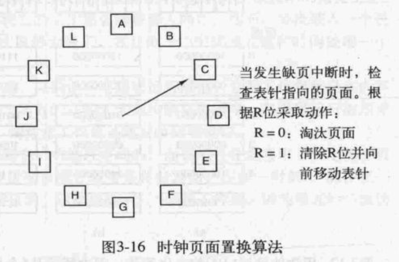

   3. 性能接近 LRU, 开销较小.

6. **改进型 CLOCK** 

   1. 在 NRU 的基础上, 除了**访问位R**以外还添加了一个**修改位 M**. 如果该页面在内存中**被写入修改过**, 那么它需要被写回磁盘, 即页面置换的代价会更大. 其他内容与 NRU 类似. 当缺页中断发生时, 有四种情况的页面
      1. $R= 0, M = 0$ : 未被访问也未被修改, 最佳淘汰页
      2. $R = 0, M = 1$ : 未被访问, 被修改. 
         1. 初看好像不可能发生被修改却未访问, 但是有可能**它是从第4类页面, R位置0后变过来的.**

      3. $R = 1, M = 0$ : 已被访问, 未被修改.
      4. $R = 1, M = 1$ : 已被访问, 已被修改.

   2. 细分了页面, 减少了 IO 数量. 但是算法想找到合适的淘汰页面需要更多时间.

7. **老化算法(Aging)**

   1. 为每个页面设计一个计数器, 保存 $8$ 位 bits. 每一次时钟滴答**都读取一次页面的访问位**, 将其插入计数器的最左端.

      1. 计数器记录了**8次时钟滴答中, 页面的被访问情况**. 计数器的值类似于 $11001010$, 为1的位置, 说明对应的时钟滴答间隔中该页面被访问过.

      2. 考虑5个页面, Aging 算法中计数器的变化情况如下

         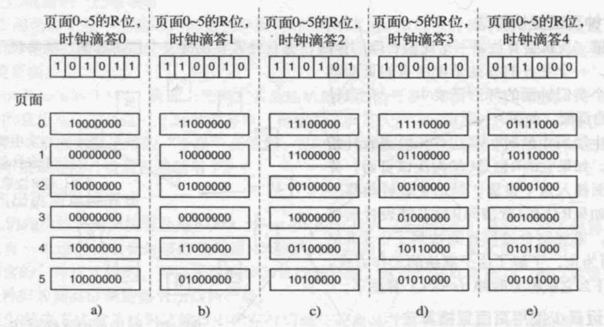

   2. 发生缺页中断时, 将**置换计数器代表的二进制数最小的那个页面**.

   3. 特点

      1. 是 LRU 一个非常良好的近似, 且开销很小.
      2. 


## 抖动

**抖动/颠簸** : 刚刚换出的页面马上又要换入内存, 刚刚换入的页面马上又要换出.

发生抖动的**根本原因**是

- 系统中**同时运行**的**进程太多了**.
  - 每个进程运行时频繁出现缺页, 时间全部用在页面置换的 IO 上了.
  - CPU 利用率几乎趋于 0.


**工作集** : 在某段时间间隔内, 进程要访问的页面集合.

工作集通常是近似得到的. 可以用**最近访问过的页面**来近似工作集.


若分配给进程的物理块个数小于工作集大小, 那么就很可能发生抖动现象.

该模型让 OS 追踪每个进程的工作集, 保证每个进程都能有足够的页框个数分配.

若内存中仍有空闲空间, 则可以**再调一个进程进入内存**工作.


## 内存映射文件

磁盘上储存的文件通常要IO调入内存才能访问.

**内存映射文件** : 对于某个进程而言, 可以建立一个**磁盘的部分内容到进程虚拟地址空间的某个区域** 的映射. 从用户程序的视角看来, 此时进程在虚拟空间中就可以直接**像访问内存一样**访问磁盘的内容.

- 建立映射后, 进程如果第一次想访问映射部分的内存, **会触发缺页中断**, 使得 OS 将 磁盘上对应位置的内容放到内存的页框中.
  - 第一次访问会有些卡顿, 因为在等 IO
- 核心原因是在请求分页管理机制下, **进程的虚拟空间实际上本来就是放在磁盘上的.** 磁盘上的其他文件可以通过合适的分页分块, 像页面一样放到内存中供进程访问.


**多个进程运行并发地内存映射同一文件**, 以实现数据共享. 


# 第五章 IO管理

待补充
